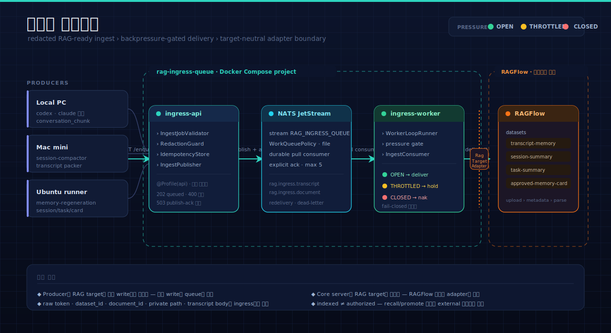
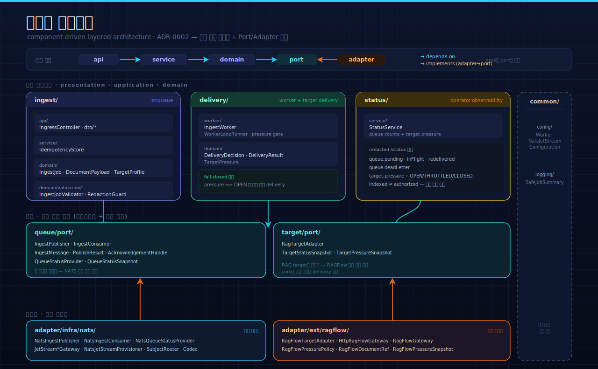
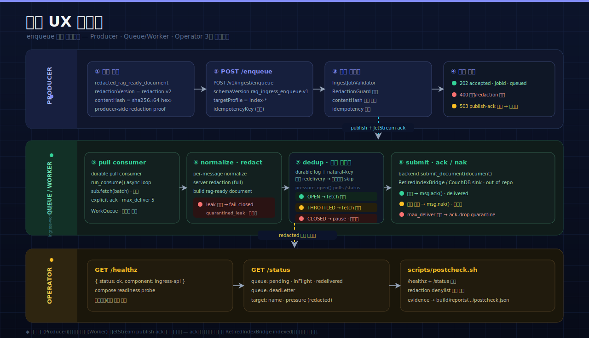

<!-- ──────────────── HERO BANNER ──────────────── -->
<div align="center">


<br/>

<!-- Project badges -->


<br/>

<!-- CI status (동적) — gradle-test는 gate, pmd는 advisory. pmd 배지는 pmd.yml이 main에 머지된 뒤 resolve. -->
<a href="https://github.com/pureliture/neurons/actions/workflows/test.yml"></a>
<a href="https://github.com/pureliture/neurons/actions/workflows/pmd.yml"></a>

<br/><br/>

<!-- Tagline -->
<h3>
  <code>neurons</code>는 LLM-brain의 <b>server-side authority</b>다.<br/>
  ledger · session/native-memory · brain query · GC safety lane을 소유하고,<br/>
  <code>dendrite</code>가 보낸 redacted payload를 ingress lane으로 받는다.
</h3>

<br/>

<!-- Tech stack -->
<p>
  
  
  
  
  
</p>

<br/>

<!-- Quick navigation -->
<p>
  <a href="#-시스템-아키텍처"></a>
  <a href="#-백엔드-아키텍처"></a>
  <a href="#-전체-ux-시각화"></a>
  <a href="#-빠른-시작"></a>
  <a href="#-api-참조"></a>
</p>

</div>

<br/>

## Neurons Boundary

`neurons`는 LLM-brain의 server/brain repo다. 역사적 `rag-ingress-queue`
surface는 이 저장소 안의 ingress service/runtime lane으로 남아 있지만, repo
identity는 Mac thin-client가 아니라 server-side authority다.

Owned here:

- ingress queue/runtime, worker, durable state DB, and RAG target adapters
- `ledger.py`, transcript ingest worker, replay/reconcile/backfill server state
- session-memory/project-memory build and read surfaces
- brain query, MemoryCard, native-memory mirror/sync/reconcile
- user-level MCP stdio read surface:
  `neuron-knowledge mcp-stdio` exposes `knowledge.search`, `brain.query`,
  `brain.resolve`, and read-only Brain MCP tools such as
  `brain_context_resolve`; Codex and Claude Code are the first agent E2E
  targets for this stdio surface
- production LLM-Brain projection/bootstrap:
  `neuron-knowledge brain-project` imports dendrite public SourceRef catalogs
  into the Ledger catalog and projects canonical artifacts, MemoryCards, and
  SourceRefs into the derived graph index
- GC safety planners and fail-closed GC command surfaces:
  `session-memory-gc`, `transcript-memory-gc`, `transcript-session-gc`,
  `transcript-volume-gc`, `session-memory-quarantine-terminal-skipped`, and
  `session-memory-repair-zombie-snapshots`

Not owned here:

- provider hook installation on Mac
- locator-only local capture spool/outbox
- Mac thin shipper ergonomics
- `POST 18080` client-side enqueue command surface

Those client responsibilities belong to `dendrite`.

`worker/tests/test_server_boundary.py` guards this direction by rejecting
Python and Java imports from the `dendrite` client surface.
`neuron-knowledge` also owns fail-closed pending server commands for monolith
subcommands whose full implementation is still being extracted.

> 📖 **이 README의 범위.** 아래 아키텍처 · 빠른 시작 · API 심화는 **ingress lane
> (`rag-ingress-queue`)** 을 기준으로 한다. ledger · brain query · session/native-memory ·
> GC safety surface는 위 Boundary 목록과 코드(`worker/`, `neuron-knowledge`)를 1차 출처로 본다.

<!-- ────────────── SECTION DIVIDER ────────────── -->


<br/>

## 🏛️ 시스템 아키텍처

> Producer가 RAG target을 직접 write하지 않는다. 모든 write는 `rag-ingress-queue`를 통과하고,
> queue는 redacted RAG-ready payload만 받아 **backpressure가 허용할 때만** downstream으로 전달한다.

<p align="center">
  
</p>

<br/>

### 🎨 핵심 설계 포인트

<table>
<tr>
<td width="50%" valign="top">

#### 🟦 Target-Neutral Core

Core server는 RAG target을 모른다.<br/>
`RagTargetAdapter` contract만 의존하고 RAGFlow-specific
dataset ID·parser status·credential은 adapter 안에 격리된다.
새 RAG 솔루션은 adapter 추가만으로 붙는다.

</td>
<td width="50%" valign="top">

#### 🟩 Fail-Closed Backpressure

worker는 target pressure가 `OPEN`일 때만 신규 delivery를 만든다.<br/>
`THROTTLED`는 backlog를 늘리는 요청을 멈추고,
`CLOSED`는 delivery를 중단·`nak`한다. MVP 기본값은 fail-closed.

</td>
</tr>
<tr>
<td width="50%" valign="top">

#### 🟪 Redaction Boundary

raw token·`dataset_id`·`document_id`·private path·transcript body는
ingress에서 거부된다. log·status·postcheck 출력은
공유된 denylist scanner를 통과해야 한다.

</td>
<td width="50%" valign="top">

#### 🟧 Compose 격리

`rag-ingress-queue`는 RAGFlow와 **분리된 별도 Compose project**다.<br/>
`nats-jetstream` · `ingress-api` · `ingress-worker`만 정의하며
기존 RAGFlow stack·volume은 수정하지 않는다.

</td>
</tr>
</table>

<br/>

> 💡 **상태는 절대 뭉개지 않는다.** `queued` → `delivered` → `indexed`는 queue/worker의 상태이고,
> `authorized` · `recall/promote eligible`은 external document 상태표가 소유한다.
> JetStream publish ack는 큐 수용을 뜻할 뿐 RAGFlow indexed를 보장하지 않는다.

<br/>


<br/>

## 🧩 백엔드 아키텍처

> [ADR-0002](docs/adr-0002-component-driven-layered-architecture.md)의 component-driven layered
> architecture를 따른다. 기능 단위로 패키지를 묶고, Port/Adapter로 기술·외부 서비스를 격리한다.

<p align="center">
  
</p>

<br/>

### 📐 레이어와 의존 규칙

의존은 한 방향으로만 흐른다 — `api → service → domain → port ← adapter`. **core는 port만 의존하고
adapter를 절대 역참조하지 않는다.**

<table>
<thead>
<tr><th>레이어</th><th>패키지</th><th>책임</th></tr>
</thead>
<tbody>
<tr>
<td></td>
<td><code>ingest/</code> · <code>delivery/</code> · <code>status/</code></td>
<td>enqueue·worker delivery·observability를 기능 단위로 패키징. 각 컴포넌트는 api / service / domain 레이어를 가진다.</td>
</tr>
<tr>
<td></td>
<td><code>queue/port/</code> · <code>target/port/</code></td>
<td>기술 중립 계약. <code>IngestPublisher</code>·<code>IngestConsumer</code>·<code>RagTargetAdapter</code>와 계약 타입만 둔다.</td>
</tr>
<tr>
<td></td>
<td><code>adapter/infra/nats/</code> · <code>adapter/ext/ragflow/</code></td>
<td>포트 구현체. NATS JetStream(기술 인프라)과 RAGFlow(외부 서비스)를 도메인 방식으로 감싼다.</td>
</tr>
<tr>
<td></td>
<td><code>common/</code></td>
<td>config·logging·공통 타입. <code>SafeJobSummary</code> 등 redacted 로깅 유틸과 Spring 설정 조립 루트.</td>
</tr>
</tbody>
</table>

<details>
<summary><b>📂 패키지 트리 펼치기</b></summary>

```text
com.local.ragingressqueue
├── ingest/                      # enqueue 기능
│   ├── api/        IngressController · dto/*
│   ├── service/    IdempotencyStore
│   └── domain/     IngestJob · DocumentPayload · TargetProfile
│       └── validation/  IngestJobValidator · RedactionGuard · ContentHashVerifier
├── delivery/                    # worker + target delivery 기능
│   ├── worker/     IngestWorker · WorkerLoopRunner
│   └── domain/     DeliveryDecision · DeliveryResult · TargetPressure
├── status/                      # operator observability 기능
│   └── service/    StatusService
├── queue/port/                  # 큐 포트 (기술 중립)
│       IngestPublisher · IngestConsumer · IngestMessage · PublishResult
│       AcknowledgementHandle · QueueStatusProvider · QueueStatusSnapshot
├── target/port/                 # 타깃 포트 (기술 중립)
│       RagTargetAdapter · TargetStatusSnapshot · TargetPressureSnapshot
├── adapter/infra/nats/          # NATS JetStream 어댑터
├── adapter/ext/ragflow/         # RAGFlow 어댑터
└── common/                      # config · logging · 공통 타입
```

</details>

<br/>


<br/>

## 🎬 전체 UX 시각화

> enqueue 요청 하나의 생애주기를 **Producer · Queue/Worker · Operator** 세 스윔레인으로 본다.
> 동기 경로와 비동기 경로는 JetStream publish ack로만 연결된다.

<p align="center">
  
</p>

<br/>

<table>
<tr>
<td width="33%" valign="top">

#### 🟣 Producer 경로

redacted 문서를 만들어 `POST /v1/ingest/enqueue`로 넣는다.
검증·redaction guard를 통과하면 `202 queued`,
거부되면 `400`, publish ack가 없으면 `503`을 동기로 받는다.

</td>
<td width="33%" valign="top">

#### 🟢 Queue/Worker 경로

JetStream이 메시지를 durable하게 보존하고, worker는
durable pull consumer로 bounded batch를 가져온다.
pressure gate가 `OPEN`일 때만 `RagTargetAdapter.deliver()`를 호출한다.

</td>
<td width="33%" valign="top">

#### 🟡 Operator 경로

`GET /healthz`로 readiness를, `GET /status`로 queue counts와
target pressure를 본다. `postcheck.sh`는 출력을
denylist로 자체 스캔하고 evidence를 남긴다.

</td>
</tr>
</table>

<br/>


<br/>

## 🚀 빠른 시작

### ⚡ 요구사항

<table>
<thead>
<tr><th>의존성</th><th>필수 여부</th><th>용도</th></tr>
</thead>
<tbody>
<tr>
<td></td>
<td>✅ 필수</td>
<td>build · test 실행 (Java 25 toolchain)</td>
</tr>
<tr>
<td></td>
<td>✅ 필수</td>
<td>Spring Boot 4.x 빌드</td>
</tr>
<tr>
<td></td>
<td>🟡 런타임</td>
<td>compose 스모크 검증 시</td>
</tr>
</tbody>
</table>

<br/>

### 🧪 로컬 빌드·검증

```bash
# 단위 / Web MVC / worker / compose-config 테스트
JAVA_HOME="$(/usr/libexec/java_home -v 25)" gradle test

# offline postcheck — 출력 redaction 스캔까지 검증
bash scripts/postcheck.sh --offline --timeout 30 \
  --evidence build/reports/rag-ingress-queue/postcheck.json
```

> ⚠️ 위 검증은 local test와 offline evidence redaction만 증명한다.
> Docker daemon/Compose 런타임과 live RAGFlow 검증은 **별도 gate**다.

<br/>

### 🐳 Compose 런타임 스모크

```bash
docker compose -f compose.yaml up --build -d
bash scripts/postcheck.sh --timeout 30 \
  --evidence build/reports/rag-ingress-queue/postcheck.json
docker compose -f compose.yaml down
```

`api` profile은 JetStream publish ack를 받은 경우에만 `enqueue accepted`를 반환한다.
`worker` profile은 durable pull consumer를 쓰되, live RAGFlow delivery는 별도 승인 전까지
`rag-ingress.target.ragflow.delivery-enabled=false`로 닫혀 있다.

<br/>


<br/>

## 🎯 사용 시나리오

<table>
<thead>
<tr>
<th align="center" width="33%"></th>
<th align="center" width="33%"></th>
<th align="center" width="33%"></th>
</tr>
</thead>
<tbody>
<tr>
<td valign="top">

**🎬 상황**
코드 변경 후 회귀 없이 통과하는지 확인

**📋 단계**

```diff
+ ① Java 25 toolchain으로 테스트
  gradle test

+ ② offline postcheck 실행
  bash scripts/postcheck.sh --offline

+ ③ evidence JSON 확인
  build/reports/rag-ingress-queue/
```

**✨ 결과**
unit·API·worker·compose-config 테스트 green, redaction 스캔 통과

</td>
<td valign="top">

**🎬 상황**
별도 compose project로 큐 동작을 검증

**📋 단계**

```diff
+ ① compose 기동
  docker compose up --build -d

+ ② NATS·API readiness 확인
  bash scripts/postcheck.sh

+ ③ 정리
  docker compose down
```

**✨ 결과**
`nats-jetstream` 기동, `/healthz` 응답, stream/consumer 가시화

</td>
<td valign="top">

**🎬 상황**
enqueue 한 건을 넣고 큐 상태를 확인

**📋 단계**

```diff
+ ① redacted 문서로 enqueue
  POST /v1/ingest/enqueue

+ ② 동기 응답 확인
  202 { accepted, jobId }

+ ③ 큐 상태 조회
  GET /status
```

**✨ 결과**
queue counts·target pressure가 redacted 형태로 노출

</td>
</tr>
</tbody>
</table>

<br/>


<br/>

## 📡 API 참조

<table>
<thead>
<tr><th align="center">엔드포인트</th><th>목적</th><th>응답</th></tr>
</thead>
<tbody>
<tr>
<td align="center"></td>
<td>redacted RAG-ready document를 검증 후 JetStream에 publish</td>
<td><code>202</code> queued · <code>400</code> 거부 · <code>409</code> idempotency 충돌 · <code>422</code> ref 미지원 · <code>503</code> ack 없음</td>
</tr>
<tr>
<td align="center"></td>
<td>compose readiness probe</td>
<td><code>{ status, component }</code></td>
</tr>
<tr>
<td align="center"></td>
<td>operator-facing redacted 상태</td>
<td><code>{ queue:{pending,inFlight,redelivered,deadLetter}, target:{name,pressure} }</code></td>
</tr>
</tbody>
</table>

<details>
<summary><b>📥 enqueue 요청 예시 펼치기</b></summary>

```json
{
  "schemaVersion": "rag_ingress_enqueue.v1",
  "source": { "type": "local_pc", "provider": "codex", "project": "workspace-ragflow-advisor" },
  "payload": {
    "kind": "redacted_rag_ready_document",
    "redactionVersion": "redaction.v2",
    "document": { "filename": "chunk.md", "contentType": "text/markdown", "body": "‹redacted›" }
  },
  "contentHash": "sha256:‹64 lowercase hex›",
  "targetProfile": "ragflow-transcript-memory",
  "kind": "conversation_chunk"
}
```

</details>

### 🎯 Target Profiles

`TargetProfileRegistry`가 유효 `targetProfile`의 SSOT다 — 현재 **7개**. 각 profile은 logical
`datasetRole`로 매핑되고, **물리 RAGFlow dataset id는 adapter-private config**에만 존재한다.

| targetProfile | datasetRole (logical) |
|---|---|
| `ragflow-transcript-memory` | `transcript-memory` |
| `ragflow-session-memory` | `session-memory` |
| `ragflow-session-summary` | `session-summary` |
| `ragflow-project-memory` | `project-memory` |
| `ragflow-task-summary` | `task-summary` |
| `ragflow-approved-memory-card` | `approved-memory-card` |
| `ragflow-procedural-memory` | `procedural-memory` |

> raw dataset ID는 adapter-private이며 generic API 출력·log·docs 예시에 나타나지 않는다.
> 전체 계약(status enum · idempotency · DLQ 포함)은 [ingress-contract.md](docs/contracts/ingress-contract.md) §3을 SSOT로 본다.

<br/>


<br/>

## 🗂️ 산출물

<table>
<tr>
<td width="50%" valign="top">

### 📘 설계 문서

- [요구사항](docs/requirements.md)
- [ADR-0001 · architecture](docs/adr-0001-rag-ingress-queue.md)
- [ADR-0002 · layered architecture](docs/adr-0002-component-driven-layered-architecture.md)
- [ADR-0003 · ledger engine seam + PG cutover](docs/adr-0003-ledger-engine-seam-postgres-cutover.md)
- [Ingress contract (profile SSOT)](docs/contracts/ingress-contract.md)
- [MVP spec](docs/superpowers/specs/2026-05-17-rag-ingress-queue-mvp-spec.md)
- [MVP implementation plan](docs/superpowers/plans/2026-05-17-rag-ingress-queue-mvp.md)

</td>
<td width="50%" valign="top">

### 📗 운영·검증 문서

- [Operator runbook](docs/runbooks/rag-ingress-queue-operator-runbook.md)
- [Ubuntu runtime smoke](docs/runbooks/2026-05-17-ubuntu-runtime-smoke.md)
- [Spec review summary](docs/superpowers/reviews/2026-05-17-rag-ingress-queue-spec-review.md)
- [Plan review summary](docs/superpowers/reviews/2026-05-17-rag-ingress-queue-plan-review.md)

</td>
</tr>
</table>

### 🔖 핵심 원칙

1. Producer는 RAG target을 직접 write하지 않는다.
2. transcript parsing·redaction·packing은 producer-side boundary에 둔다.
3. Queue는 redacted RAG-ready payload만 받고 delivery·backpressure·retry·status polling을 담당한다.
4. ack·retry·redelivery·dead-letter는 NATS JetStream에 맡긴다.
5. Core server는 RAG target을 모른다 — target-specific 처리는 adapter에 격리한다.
6. `RAGFlowAdapter`는 첫 adapter일 뿐이다.
7. indexed 상태여도 external 상태표의 authorization pass 전에는 recall/promote에 쓰지 않는다.

<br/>

### 📚 참고 공식 문서

- [Spring Boot system requirements](https://docs.spring.io/spring-boot/system-requirements.html)
- [Spring Boot virtual threads](https://docs.spring.io/spring-boot/reference/features/spring-application.html)
- [NATS JetStream streams](https://docs.nats.io/nats-concepts/jetstream/streams)
- [NATS JetStream consumers](https://docs.nats.io/nats-concepts/jetstream/consumers)

<br/>


