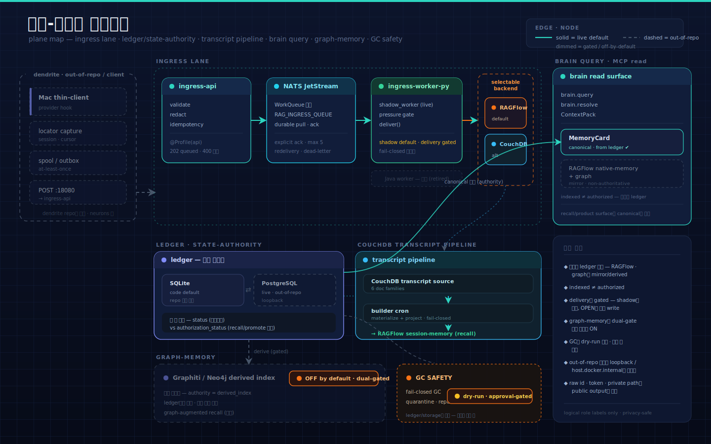

<!-- ──────────────── HERO BANNER ──────────────── -->
<div align="center">


<br/>

<!-- Project badges -->


<br/>

<!-- CI status (동적) — gradle-test는 gate, pmd는 advisory. pmd 배지는 pmd.yml이 main에 머지된 뒤 resolve. -->
<a href="https://github.com/pureliture/neurons/actions/workflows/test.yml"></a>
<a href="https://github.com/pureliture/neurons/actions/workflows/pmd.yml"></a>

<br/><br/>

<!-- Tagline -->
<h3>
  <code>neurons</code>는 LLM-brain의 <b>server-side authority</b>다.<br/>
  ingress lane · ledger/state authority · CouchDB transcript pipeline ·<br/>
  session/native-memory · brain query · GC safety lane을 소유하고,<br/>
  <code>dendrite</code>가 보낸 redacted payload를 ingress lane으로 받는다.
</h3>

<br/>

<!-- Tech stack -->
<p>
  
  
  
  
  
</p>

<br/>

<!-- Quick navigation -->
<p>
  <a href="#-시스템-한눈에--plane-지도"></a>
  <a href="#-시스템-아키텍처"></a>
  <a href="#-ledger--상태-권위"></a>
  <a href="#-brain-query--memorycard--recall"></a>
  <a href="#-빠른-시작--배포-토폴로지"></a>
  <a href="#-api--cli--mcp-참조"></a>
</p>

</div>

<br/>

## Neurons Boundary

`neurons`는 LLM-brain의 server/brain repo다. 역사적 `rag-ingress-queue`
surface는 이 저장소 안의 ingress service/runtime lane으로 남아 있지만, repo
identity는 Mac thin-client가 아니라 server-side authority다.

Owned here:

- ingress queue/runtime, worker, durable state DB, and RAG target adapters
- `ledger.py`, transcript ingest worker, replay/reconcile/backfill server state
- CouchDB transcript source plane and session/project-memory build/read surfaces
- brain query, MemoryCard, native-memory mirror/sync/reconcile
- optional Graphiti/Neo4j derived graph index (OFF by default)
- user-level MCP stdio read surface:
  `neuron-knowledge mcp-stdio` exposes `knowledge.search`, `brain.query`, and
  `brain.resolve`
- GC safety planners and fail-closed GC command surfaces:
  `session-memory-gc`, `transcript-memory-gc`, `transcript-session-gc`,
  `transcript-volume-gc`, `session-memory-quarantine-terminal-skipped`, and
  `session-memory-repair-zombie-snapshots`

Not owned here:

- provider hook installation on Mac
- locator-only local capture spool/outbox
- Mac thin shipper ergonomics
- `POST 18080` client-side enqueue command surface

Those client responsibilities belong to `dendrite`.

`worker/tests/test_server_boundary.py` guards this direction by rejecting
Python and Java imports from the `dendrite` client surface.
`neuron-knowledge` also owns fail-closed pending server commands for monolith
subcommands whose full implementation is still being extracted.

Public/private split:

- `neurons` public is product source, local bootstrap, sample adapters,
  contract tests, and sanitized docs.
- `neurons-ops` private is production config, live rollout evidence, secret
  loading policy, backup/restore, GC approval records, and private authority
  ledger evidence.
- The boundary contract lives in
  [`docs/public-private-separation.md`](docs/public-private-separation.md).

> 📖 **이 README의 범위.** 아래는 ingress lane만이 아니라 server-brain **전체
> plane**(ingress · ledger/state authority · CouchDB pipeline · session/native-memory ·
> brain query · graph-memory · GC safety)을 다룬다. 단, 계약·SSOT·enum 세부는
> 코드와 ADR을 1차 출처로 본다 — README는 정합된 overview이며 내부 규칙을 그대로
> 복제하지 않는다. **live vs gated 구분**은 각 섹션의 상태 배지를 따른다.

<!-- ────────────── SECTION DIVIDER ────────────── -->


<br/>

## 🗺️ 시스템 한눈에 — plane 지도

> `neurons`는 단일 서비스가 아니라 **서로 다른 plane**의 묶음이다. 각 plane은 자기 권위와
> 자기 gate를 가지며, 아래 지도는 한 번에 그 전체를 본다. **상태 배지를 먼저 읽어라** —
> 무엇이 기본 live이고 무엇이 env/profile gate 뒤에서 꺼져 있는지가 이 시스템 이해의 핵심이다.

<p align="center">
  
</p>

<br/>

| plane | 역할 (한 줄) | owner | 상태 |
|---|---|---|---|
| **Ingress lane** | redacted enqueue → 검증/redaction → NATS WorkQueue → delivery | neurons (Java api + Python worker) | 🟢 live · delivery gated |
| **Target-profile SSOT** | 7개 logical `targetProfile` → `datasetRole` (물리 id는 adapter-private) | neurons (Java) | 🟢 live |
| **Ledger / state authority** | knowledge item lifecycle + `authorization_status` 단일 권위 | neurons (`ledger.py`) | 🟢 live · 🟡 SQLite/PG env seam |
| **CouchDB transcript pipeline** | redacted transcript source(6 doc family) → builder → recall projection | neurons (worker) | 🟢 live |
| **Session/project-memory** | session-memory build + RetiredIndexBridge recall projection | neurons (worker) | 🟢 live (project-memory는 deferred view) |
| **Brain query · MemoryCard** | ledger의 accepted card를 canonical로 read; MCP read surface | neurons (worker) | 🟢 live (read-only) |
| **Graph-memory** | Graphiti/Neo4j 파생 인덱스 (authority=derived_index) | neurons (worker) | ⚫ **OFF by default** (dual-gated) |
| **GC safety lane** | fail-closed GC/quarantine/repair planner | neurons (worker) | 🟡 dry-run 기본 · approval-gated |
| **neuron-knowledge / MCP** | server-owned command router + read-only MCP stdio | neurons (worker) | 🟢 live |

<table>
<tr>
<td width="50%" valign="top">

#### 🟢 기본 live

`nats-jetstream` · `ingress-api`(127.0.0.1:18080) · Python `ingress-worker-py`
(단, **SAFE shadow 모드** — 격리 stream, delivery OFF) · `neuron-knowledge`
read/resolve · MCP stdio 10 tools(ledger read-only) · boundary guard.

</td>
<td width="50%" valign="top">

#### 🟡 / ⚫ gate 뒤

live queue consume(별도 compose project) · `INGRESS_DELIVERY_BACKEND`(retired_index_bridge|couchdb) ·
ledger **PostgreSQL**(`NEURON_LEDGER_PG_DSN`) · **graph-memory**(`LLM_BRAIN_GRAPH_ENABLED`
+ profile `llm-brain-graph`) · live write/GC(`--execute` + approval JSON + API key).

</td>
</tr>
</table>

> ⚠️ **정직한 단서들.** ledger PG는 라이브 brain-server의 default지만 ADR-0003 본문은 아직
> "SQLite-until-flip"으로 적혀 있다(둘 다 링크). `transcript-memory`는 데이터상 은퇴했으나
> 코드에 상수·read helper가 잔존한다. session-memory builder는 **두 경로**(CouchDB-native /
> legacy shadow-log)가 공존한다 — 아래 각 섹션에서 분리해 설명한다.

<br/>


<br/>

## 🏛️ 시스템 아키텍처

> Producer가 RAG target을 직접 write하지 않는다. 모든 write는 `rag-ingress-queue`를 통과하고,
> queue는 redacted RAG-ready payload만 받아 **backpressure가 허용할 때만** downstream으로 전달한다.

<p align="center">
  
</p>

<br/>

> 🔧 **live runtime 사실.** 배달을 실제로 수행하는 worker는 **Python `ingress-worker-py`
> (`shadow_worker`)** 다. Java `IngestWorker`/`WorkerLoopRunner`는 **retired**(compose
> `profiles:["retired"]`) — WorkQueue가 같은 durable consumer를 둘로 두는 걸 금지하기 때문이다
> (single-consumer invariant). 배달 backend는 `INGRESS_DELIVERY_BACKEND`로 `retired_index_bridge`(코드 기본)
> 또는 `couchdb`를 고른다. bare `compose up`은 **격리 shadow stream + delivery OFF**가 기본이고,
> live consume은 별도 env(`RAG_INGRESS_ALLOW_LIVE_QUEUE=1` + `RAG_INGRESS_DELIVER=1`)가 필요하다.

<br/>

### 🎨 핵심 설계 포인트

<table>
<tr>
<td width="50%" valign="top">

#### 🟦 Target-Neutral Core

Core server는 RAG target을 모른다.<br/>
`RagTargetAdapter` contract만 의존하고 RetiredIndexBridge-specific
dataset id·parser status·credential은 adapter 안에 격리된다.
새 backend는 adapter 추가만으로 붙는다 (Python worker는
`INGRESS_DELIVERY_BACKEND=couchdb`로 sink를 바꾼다).

</td>
<td width="50%" valign="top">

#### 🟩 Fail-Closed Backpressure

worker는 target pressure가 `OPEN`일 때만 신규 delivery를 만든다.<br/>
`THROTTLED`는 backlog를 늘리는 요청을 멈추고,
`CLOSED`는 delivery를 중단·`nak`한다. MVP 기본값은 fail-closed.

</td>
</tr>
<tr>
<td width="50%" valign="top">

#### 🟪 Redaction Boundary

raw token·`dataset_id`·`document_id`·private path·transcript body는
ingress와 worker 양쪽에서 거부된다. leak이 발견되면 fail-closed로
`quarantined_leak` 처리하고, 출력은 공유 denylist scanner를 통과해야 한다.

</td>
<td width="50%" valign="top">

#### 🟧 Compose 격리

`rag-ingress-queue`는 RetiredIndexBridge와 **분리된 별도 Compose project**다.<br/>
root compose는 `nats-jetstream` · `ingress-api` · `ingress-worker-py`만
정의하며 기존 RetiredIndexBridge stack·volume은 수정하지 않는다.

</td>
</tr>
</table>

<br/>

> 💡 **상태는 절대 뭉개지 않는다.** `queued` → `delivered` → `indexed`는 queue/worker의 상태이고,
> `authorized`(= ledger `authorization_status=active`)는 ledger 상태 권위가 소유한다.
> JetStream publish ack는 큐 수용을 뜻할 뿐 RetiredIndexBridge indexed를 보장하지 않는다.

<br/>


<br/>

## 🧩 백엔드 아키텍처

> [ADR-0002](docs/adr-0002-component-driven-layered-architecture.md)의 component-driven layered
> architecture를 따른다. 이 레이어 뷰는 **Java ingress 서비스**를 기술한다 — Python worker와
> ledger/brain plane은 각자의 모듈 경계를 따르며 아래 plane 섹션에서 설명한다.

<p align="center">
  
</p>

<br/>

### 📐 레이어와 의존 규칙

의존은 한 방향으로만 흐른다 — `api → service → domain → port ← adapter`. **core는 port만 의존하고
adapter를 절대 역참조하지 않는다.** 이 규칙은 `ArchUnit`(`ArchitectureRulesTest`)으로 CI에서 강제된다.

<table>
<thead>
<tr><th>레이어</th><th>패키지</th><th>책임</th></tr>
</thead>
<tbody>
<tr>
<td></td>
<td><code>ingest/</code> · <code>delivery/</code> · <code>status/</code></td>
<td>enqueue·worker delivery·observability를 기능 단위로 패키징. 각 컴포넌트는 api / service / domain 레이어를 가진다.</td>
</tr>
<tr>
<td></td>
<td><code>queue/port/</code> · <code>target/port/</code></td>
<td>기술 중립 계약. <code>IngestPublisher</code>·<code>IngestConsumer</code>·<code>RagTargetAdapter</code>와 계약 타입만 둔다.</td>
</tr>
<tr>
<td></td>
<td><code>adapter/infra/nats/</code> · <code>adapter/ext/retired_index_bridge/</code></td>
<td>포트 구현체. NATS JetStream(기술 인프라)과 RetiredIndexBridge(외부 서비스)를 도메인 방식으로 감싼다.</td>
</tr>
<tr>
<td></td>
<td><code>common/</code></td>
<td>config·logging 공통 타입. <code>SafeJobSummary</code> 등 redacted 로깅 유틸과 <code>NatsJetStreamConfiguration</code> 등 Spring 설정 조립 루트.</td>
</tr>
</tbody>
</table>

<details>
<summary><b>📂 패키지 트리 펼치기</b></summary>

```text
com.local.ragingressqueue
├── ingest/                      # enqueue 기능
│   ├── api/        IngressController · dto/*
│   ├── service/    IdempotencyStore
│   └── domain/     IngestJob · DocumentPayload · TargetProfile · TargetProfileRegistry
│       └── validation/  IngestJobValidator · RedactionGuard · ContentHashVerifier
├── delivery/                    # worker + target delivery 기능 (Java worker는 retired)
│   ├── worker/     IngestWorker · WorkerLoopRunner   # @Profile("worker"), 현재 미가동
│   └── domain/     DeliveryDecision · DeliveryResult · TargetPressure
├── status/                      # operator observability 기능
│   └── service/    StatusService                     # /status는 IngressController가 위임
├── queue/port/                  # 큐 포트 (기술 중립)
│       IngestPublisher · IngestConsumer · IngestMessage · PublishResult
│       AcknowledgementHandle · QueueStatusProvider · QueueStatusSnapshot
├── target/port/                 # 타깃 포트 (기술 중립)
│       RagTargetAdapter · BackendKind · TargetStatusSnapshot · TargetPressureSnapshot
├── adapter/infra/nats/          # NATS JetStream 어댑터
├── adapter/ext/retired_index_bridge/         # RetiredIndexBridge 어댑터
└── common/                      # config · logging 공통 타입 + IngestStatus
```

</details>

<br/>


<br/>

## 🎯 Target Profiles & 라우팅

`TargetProfileRegistry`(Java)가 유효 `targetProfile`의 logical SSOT다 — **7개**. 각 profile은 logical
`datasetRole`로 매핑되고, **물리 RetiredIndexBridge dataset id는 adapter-private config**에만 존재한다.
`TargetProfile` record는 물리 id 필드를 의도적으로 갖지 않는다(reflection guard로 강제).

| targetProfile | datasetRole (logical) |
|---|---|
| `index-transcript-memory` | `transcript-memory` *(retired projection target)* |
| `index-session-memory` | `session-memory` *(live recall surface)* |
| `index-session-summary` | `session-summary` |
| `index-project-memory` | `project-memory` |
| `index-task-summary` | `task-summary` |
| `index-approved-memory-card` | `approved-memory-card` |
| `index-procedural-memory` | `procedural-memory` |

> 🔎 **7 vs 9, 그리고 무엇이 live인가.** enqueue 계약이 받는 logical profile은 Java registry 기준
> **7개**다. worker-side `dataset_contract`는 `smoke`·`runtime-evidence` 등을 포함해 더 많은 role 문자열을
> 선언하지만, **live build+recall 경로를 가진 target은 `session-memory` 하나**다. 동시에
> `document_model`은 `session-memory`만 projection/recall 대상으로 허용하고 `transcript-memory`는
> fail-closed로 거부한다(`assert_index_target_allowed`). raw dataset ID는 generic API 출력·log·docs
> 예시에 나타나지 않는다. 전체 계약은 [ingress-contract.md](docs/contracts/ingress-contract.md) §3을 SSOT로 본다.

<br/>


<br/>

## 🗄️ Ledger & 상태 권위

> ledger는 각 knowledge item의 **단일 진실원**이다. RetiredIndexBridge는 검색 가능한 mirror일 뿐, 권위가 아니다.

`ledger.py`는 두 개의 **직교 축**을 소유한다:

<table>
<tr>
<td width="50%" valign="top">

#### 🔵 lifecycle `status`

`prepared` → `queued` → `uploaded_unparsed` → `metadata_applied` →
`parse_requested` → `indexing` → `indexed`
(+ `index_timeout` · `parse_failed` · `quarantined` · `disabled`).
delivery/index 진행 상태를 표현한다.

</td>
<td width="50%" valign="top">

#### 🟢 `authorization_status`

`active` / `disabled`. **recall/promote 가능 여부**는 이 축이 소유한다.
`indexed`여도 `active`가 아니면 brain query 결과에 들어가지 않는다.
status와 절대 뭉치지 않는다.

</td>
</tr>
</table>

#### ⚙️ engine seam (SQLite ↔ PostgreSQL)

ledger는 `ILedgerCoreDbAdapter` 뒤에 격리된다. 엔진 **선택**은 `Ledger.__init__`이
env `NEURON_LEDGER_PG_DSN`를 보고 정하고, **연결**은 `Ledger._connect` chokepoint에서 일어난다:

- **SQLite** — 코드/테스트 레벨 default (`NEURON_LEDGER_PG_DSN` 미설정).
- **PostgreSQL** — **라이브 brain-server의 default**. as-built note 기준 live env-file이
  `NEURON_LEDGER_PG_DSN`을 설정해 PG로 flip된다. *(이 repo의 `build-once.sh`는 SQLite argv를
  넘기므로 in-repo만으로 PG를 증명하지 못한다 — PG 가동은 live env에 달려 있다.)*

> ⚠️ **문서 긴장(정직 고지).** as-built note는 "라이브 PG cutover 완료"라 말하고,
> [ADR-0003](docs/adr-0003-ledger-engine-seam-postgres-cutover.md) 본문은 아직
> "SQLite-until-flip(operator-gated 대기)"으로 적혀 있다. README는 어느 한쪽으로 덮지 않고
> 둘 다 링크한다. PostgreSQL은 **이 repo의 compose service가 아니다** — 별도 out-of-repo
> `~/ledger-pg`가 loopback(`127.0.0.1:5432`)으로 떠 있고, 이 repo는 `NEURON_LEDGER_PG_DSN`을
> 전달하고 `psycopg`만 설치한다. read-only one-shot migrator(`ledger-pg-migrate`)가 SQLite→PG를
> rowcount/byte parity로 복사하며, **rollback은 env var 해제**(원본 SQLite는 불변)다.

36개 테이블은 4-area in-process 경계(Modular Monolith, lint 강제)로 묶이며 **네트워크 분리가 아니다.**

<br/>


<br/>

## 🧬 CouchDB 파이프라인 & session/project-memory

> CouchDB는 **redacted transcript source/evidence plane**을 소유하고, 거기서 session-memory가
> 파생되어 RetiredIndexBridge recall로 projection된다.

<table>
<tr>
<td width="50%" valign="top">

#### 📥 transcript source (6 doc family)

`transcript_session` · `conversation_chunk` ·
`tool_evidence_bundle` · `coverage_manifest` ·
`projection_state` · `retention_manifest`.
모두 sha256-keyed, idempotent upsert, write 시 deep secret/leak screen.
multi-file session은 coverage reconcile로 합쳐진다.

</td>
<td width="50%" valign="top">

#### 🏗️ build → project → recall

builder cron이 per-session **session-memory**를 materialize한다
(full chunk body + tool-evidence 요약을 embed → recall에 CouchDB ref 불필요).
이를 RetiredIndexBridge `session-memory` dataset으로 projection하며,
완전 materialize 전에는 fail-closed(`materialization_loss`).

</td>
</tr>
</table>

> 🔧 **두 빌더를 혼동하지 말 것.** (1) CouchDB-native `couchdb-session-memory-build` CLI 와
> (2) legacy shadow-log/ledger 기반 `neuron_session_memory`. 컨테이너 cron(`build-once.sh`)은
> 현재 **legacy 경로**를 호출하고, CouchDB-native builder는 brain-server에 **별도 배포**된다.
> 또한 live shadow_worker의 sink인 `CouchDBRetiredIndexBridgeAdapter`와 drain 경로의
> `CouchDBDeliveryBackend`는 서로 다른 대상이다.

- **recall** — `brain.query`(`brain_id=/project/<project>`)가 RetiredIndexBridge hit을 ledger active-set과
  join한다. `status=active` card만 살아남고, RetiredIndexBridge는 mirror일 뿐 권위가 아니다.
- **project-memory** — 아직 별도 dataset이 없는 **deferred materialized-view candidate**다.
  현재는 read time에 session-memory를 project로 필터링한 view로만 실현된다.
- **transcript-memory** — projection/recall target에서 데이터상 은퇴(asserted-rejected).
  코드에 상수·read helper만 잔존(full purge 아님).

<br/>


<br/>

## 🧠 Brain query · MemoryCard · recall

> read-side product surface다. canonical은 항상 **local ledger의 accepted/current MemoryCard**이고,
> RetiredIndexBridge native-memory와 graph는 **second-class mirror**일 뿐이다(`winner=local_ledger`).

- `brain.query` · `brain.resolve` + `BrainReadService`의 ContextPack tool이 ledger에서 카드를 서빙한다.
  MCP stdio server는 ledger를 **read-only**로 연다.
- 모든 응답은 **public-safe redactor**(`ensure_public_safe` / `_safe_source_ref` whitelist)를 통과하며,
  raw path·Bearer·secret이 보이면 raise한다. MemoryCard는 forbidden-content 규칙을 가진다.
- augmenting mirror는 gate된다 — RetiredIndexBridge mirror는 `--dataset-id`, native-memory recall은
  `--native-memory-id` / `RETIRED_INDEX_BRIDGE_NATIVE_MEMORY_ID`, graph는 enable 시에만.

<details>
<summary><b>🔌 MCP read surface — 10 tools 펼치기</b></summary>

```text
knowledge.search
brain.query          brain.resolve
brain_context_resolve   brain_memory_search   brain_incident_search
brain_drift_explain     brain_persona_get     brain_persona_check
brain_evidence_get
```

모두 read-only. write/GC/migration subcommand는 flag+approval gate 뒤에 있고,
8개 monolith subcommand는 `blocked_pending_server_extraction` stub이다.

</details>

<br/>


<br/>

## 🕸️ Graph-memory (파생 인덱스 — 기본 OFF)

<div align="center">


</div>

<br/>

> Graphiti/Neo4j 기반 **파생 knowledge-graph 인덱스**다. `authority='derived_index'` —
> **절대 권위가 아니다.** canonical memory 위의 보조 색인일 뿐이며 기본적으로 꺼져 있다.

**DUAL gate (둘 다 충족해야 가동):**

1. **app gate** — `LLM_BRAIN_GRAPH_ENABLED` ∈ `{1,true,yes,on}`. 아니면
   `build_graph_adapter_from_env`가 `NullGraphMemoryAdapter`를 돌려준다(무동작).
2. **infra gate** — compose profile `llm-brain-graph`. 아니면 `llm-brain-neo4j` 컨테이너는
   **아예 뜨지 않는다**. bare `compose up`은 Neo4j를 시작하지 않는다.

enable되어도 Neo4j 연결 불가면 `UnavailableGraphMemoryAdapter`로 degrade한다. 기본 모드는
LLM 추출 없는 단일 `EpisodicNode` JSON 저장이고, entity extraction은
`LLM_BRAIN_GRAPH_EXTRACT_ENTITIES`로 한 번 더 gate된다.

**Metadata-first hybrid transition:** `MetadataFirstHybridGraphAdapter`는 graph에
opaque id, hash, lifecycle, scope 같은 metadata-first episode만 저장하고, 검색용 free
text는 선택적 `HybridTextMirror`에 둔다. read path는 mirror hit을 metadata episode에
episode-id exact lookup으로 public-safe hint join하지만, canonical winner는 여전히
artifact/MemoryCard ledger다. 이 전환 계층은 `GraphMemoryAdapter` 프로토콜을 그대로
구현하므로 기존 Graphiti/Neo4j, fake/null adapter 호출부를 깨지 않는다.

<br/>


<br/>

## 🧹 GC safety lane

> 저장소 lifecycle 권위다. **모든 planner는 dry-run이 기본**이고, mutation은 여러 gate를 동시에 통과해야 한다.

<table>
<thead>
<tr><th>gate</th><th>요구</th></tr>
</thead>
<tbody>
<tr><td>실행 플래그</td><td><code>--execute</code> / <code>--execute-disable</code> (없으면 dry-run)</td></tr>
<tr><td>operator approval</td><td>argv·dataset·url에 바인딩된 approval JSON</td></tr>
<tr><td>credential</td><td><code>RETIRED_INDEX_BRIDGE_API_KEY</code> (단일 토큰)</td></tr>
<tr><td>age floor</td><td>우회 불가 <code>86400s</code> 하한</td></tr>
<tr><td>정책/회귀</td><td>retention-policy allowlist · recall-regression 재인가 gate</td></tr>
<tr><td>되돌림</td><td>backup-before-delete · 단일 <code>hard_delete_documents</code> chokepoint</td></tr>
<tr><td>감사</td><td>append-only audit (doc-id **hash만** 저장)</td></tr>
</tbody>
</table>

`transcript-memory-gc` disable은 의도적으로 vendoring하지 않는다(`always blocked_live_execution`).
quarantine/repair는 ledger-only다. 컨테이너 GC orchestrator는 `RUN_MODE=cron`에서 standing
approval로 매일 `04:30 UTC` 한 번 발화한다. CouchDB hot-store retention도 같은 gate 철학을 공유한다.

<br/>


<br/>

## 🚀 빠른 시작 & 배포 토폴로지

### ⚡ 요구사항

<table>
<thead>
<tr><th>의존성</th><th>필수 여부</th><th>용도</th></tr>
</thead>
<tbody>
<tr>
<td></td>
<td>✅ 필수</td>
<td>Java ingress build · test (Java 25 toolchain)</td>
</tr>
<tr>
<td></td>
<td>✅ 필수</td>
<td>worker · ledger · brain · GC (Python 측)</td>
</tr>
<tr>
<td></td>
<td>🟡 런타임</td>
<td>compose 스모크 검증 시</td>
</tr>
</tbody>
</table>

<br/>

### 🧪 로컬 빌드·검증

```bash
# Java ingress: 단위 / Web MVC / worker / compose-config / ArchUnit 테스트
JAVA_HOME="$(/usr/libexec/java_home -v 25)" gradle test

# Python worker / ledger / brain / GC 테스트
cd worker && uv run pytest -q

# 서버 경계 자기기술 출력 (server worker -> state DB -> brain/session-memory -> GC)
cd worker && uv run neuron-knowledge --show-boundary

# offline postcheck — 출력 redaction 스캔까지 검증
bash scripts/postcheck.sh --offline --timeout 30 \
  --evidence build/reports/rag-ingress-queue/postcheck.json
```

> ⚠️ 위 검증은 local test와 offline evidence redaction만 증명한다.
> Docker daemon/Compose 런타임, live RetiredIndexBridge, live PG, live GC 검증은 **각각 별도 gate**다.

<br/>

### 🐳 배포 토폴로지 (두 compose project)

<table>
<tr>
<td width="50%" valign="top">

#### root `compose.yaml` — ubuntu-smoke

`nats-jetstream` + `ingress-api` + Python `ingress-worker-py`가 기본 가동.
단 worker는 **SAFE shadow** 기본값(격리 stream, `ALLOW_LIVE_QUEUE=0`,
delivery OFF). Java worker는 `profiles:["retired"]`, Neo4j는 profile
`llm-brain-graph`로 opt-in. 모든 포트는 loopback 바인딩.

</td>
<td width="50%" valign="top">

#### 별도 `session-memory-worker` project

`network_mode: host`로 builder cron + 3개 GC + backfill scheduler가 동작.
`SM_STATE_DIR` + `RETIRED_INDEX_BRIDGE_API_KEY` + `NEURON_LEDGER_PG_DSN`를 요구.
**RetiredIndexBridge와 ledger-PG는 out-of-repo**(loopback / `host.docker.internal`)이며
이 repo의 compose service가 아니다.

</td>
</tr>
</table>

```bash
# root compose 스모크 (격리 shadow, delivery OFF가 기본)
docker compose -f compose.yaml up --build -d
bash scripts/postcheck.sh --timeout 30 \
  --evidence build/reports/rag-ingress-queue/postcheck.json
docker compose -f compose.yaml down
```

<br/>


<br/>

## 📡 API · CLI · MCP 참조

### 🌐 Ingress HTTP API

<table>
<thead>
<tr><th align="center">엔드포인트</th><th>목적</th><th>응답</th></tr>
</thead>
<tbody>
<tr>
<td align="center"></td>
<td>redacted RAG-ready document를 검증 후 JetStream에 publish</td>
<td><code>202</code> queued · <code>400</code> 거부 · <code>409</code> idempotency 충돌 · <code>422</code> ref 미지원 · <code>503</code> ack 없음</td>
</tr>
<tr>
<td align="center"></td>
<td>compose readiness probe</td>
<td><code>{ status, component }</code></td>
</tr>
<tr>
<td align="center"></td>
<td>operator-facing redacted 상태 (backend-neutral)</td>
<td><code>{ queue:{pending,inFlight,redelivered,deadLetter}, target:{name,pressure} }</code></td>
</tr>
</tbody>
</table>

<details>
<summary><b>📥 enqueue 요청 예시 펼치기</b></summary>

```json
{
  "schemaVersion": "rag_ingress_enqueue.v1",
  "source": { "type": "local_pc", "provider": "codex", "project": "workspace-index-advisor" },
  "payload": {
    "kind": "redacted_rag_ready_document",
    "redactionVersion": "redaction.v2",
    "document": { "filename": "chunk.md", "contentType": "text/markdown", "body": "‹redacted›" }
  },
  "contentHash": "sha256:‹64 lowercase hex›",
  "targetProfile": "index-session-memory",
  "kind": "conversation_chunk"
}
```

raw `dataset_id`·`document_id`·token은 예시·log·output에 나타나지 않는다 — logical `targetProfile`만 쓴다.

</details>

### 🧰 neuron-knowledge CLI · MCP

`neuron-knowledge`는 server-owned command router다 — session-memory/brain/GC/migration subcommand로
fan-out하고, read-only MCP stdio server를 띄운다.

```bash
neuron-knowledge --show-boundary        # 서버 경계 자기기술 출력
neuron-knowledge mcp-stdio              # read-only MCP server (10 tools)
```

> 🔐 **단일 토큰 규칙.** credential은 `RETIRED_INDEX_BRIDGE_API_KEY` **하나만** 쓴다.
> `RETIRED_INDEX_BRIDGE_WRITE_TOKEN` / `RETIRED_INDEX_BRIDGE_READ_TOKEN`을 새로 만들지 않는다. write/GC/migration
> subcommand는 flag+approval gate 뒤에 있다.

<br/>


<br/>

## 🗂️ 산출물 · 원칙 · 참고

<table>
<tr>
<td width="50%" valign="top">

### 📘 설계 문서

- [요구사항](docs/requirements.md)
- [ADR-0001 · architecture](docs/adr-0001-rag-ingress-queue.md)
- [ADR-0002 · layered architecture](docs/adr-0002-component-driven-layered-architecture.md)
- [ADR-0003 · ledger engine seam + PG cutover](docs/adr-0003-ledger-engine-seam-postgres-cutover.md)
- [Ingress contract (profile SSOT)](docs/contracts/ingress-contract.md)
- [MVP spec](docs/superpowers/specs/2026-05-17-rag-ingress-queue-mvp-spec.md)

</td>
<td width="50%" valign="top">

### 📗 운영·검증 문서

- [Operator runbook](docs/runbooks/rag-ingress-queue-operator-runbook.md)
- [Ubuntu runtime smoke](docs/runbooks/2026-05-17-ubuntu-runtime-smoke.md)
- [worker/ — server/brain 측 README](worker/README.md)
- [Spec review summary](docs/superpowers/reviews/2026-05-17-rag-ingress-queue-spec-review.md)
- [Plan review summary](docs/superpowers/reviews/2026-05-17-rag-ingress-queue-plan-review.md)

</td>
</tr>
</table>

### 🔖 핵심 원칙

1. Producer는 RAG target을 직접 write하지 않는다.
2. transcript parsing·redaction·packing은 producer-side boundary에 둔다.
3. Queue는 redacted RAG-ready payload만 받고 delivery·backpressure·retry·status polling을 담당한다.
4. ack·retry·redelivery·dead-letter는 NATS JetStream에 맡긴다.
5. Core server는 RAG target을 모른다 — target-specific 처리는 adapter에 격리한다.
6. **ledger가 상태 권위다** — `status`(진행)와 `authorization_status`(recall 가능)를 분리하고,
   RetiredIndexBridge/graph는 mirror일 뿐 권위가 아니다.
7. **CouchDB가 transcript source SoT다** — recall은 거기서 파생된 session-memory를 통해서만.
8. **GC는 fail-closed다** — dry-run 기본, mutation은 다중 gate + approval + backup 후에만.
9. indexed 상태여도 ledger `authorization_status=active` 전에는 recall/promote에 쓰지 않는다.

<br/>

### 📚 참고 공식 문서

- [Spring Boot system requirements](https://docs.spring.io/spring-boot/system-requirements.html)
- [NATS JetStream streams](https://docs.nats.io/nats-concepts/jetstream/streams)
- [NATS JetStream consumers](https://docs.nats.io/nats-concepts/jetstream/consumers)
- [Graphiti](https://help.getzep.com/graphiti) · [Neo4j](https://neo4j.com/docs/)

<br/>


