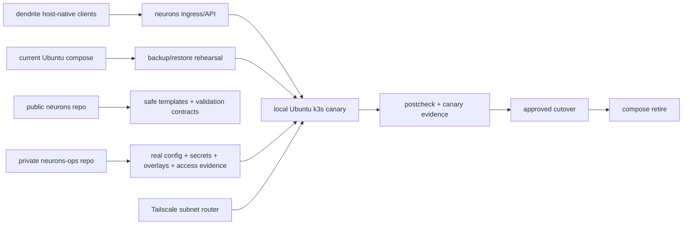

# Neurons k3s Migration Design Spec

## Overview

`neurons`의 repo-owned compose runtime을 local Ubuntu primary k3s로 이관하기 위한
승인-gated 설계다. public `neurons` repo는 safe contract와 validation surface를
소유하고, 실제 secret/config/production overlay는 private `neurons-ops` repo가 소유한다.

## Requirements Reference

- Phase 1 source: `requirements.md`
- 선택한 approach: public contract + private ops overlay
- Primary: local Ubuntu k3s
- Scope: `neurons` repo-owned compose surface 전체
- Excluded: removed legacy external-memory surface, `dendrite`, OCI staging/DR, architecture-modernization M1/M2
- Cutover: compose 유지 + k3s canary, 짧은 safety window 후 compose retire
- State: backup/restore rehearsal 선행
- Network: Tailscale subnet router + k3s route scope + personal-tailnet-wide owner risk evidence

## Official References

- [K3s requirements](https://docs.k3s.io/installation/requirements)
- [K3s basic network options](https://docs.k3s.io/networking/basic-network-options)
- [kubectl apply dry-run](https://kubernetes.io/docs/reference/kubectl/generated/kubectl_apply/)
- [Kubernetes Secrets](https://kubernetes.io/docs/concepts/configuration/secret/)
- [Tailscale subnet routers](https://tailscale.com/docs/features/subnet-routers)
- [Tailscale ACLs](https://tailscale.com/docs/features/access-control/acls)

## Architecture

### Public `neurons` Contract

- Owns redacted migration docs, workload inventory, env/config schema, validation expectations,
  and test hooks.
- May add safe templates after `design.md` approval, but must not contain real hosts, private
  paths, raw dataset/document ids, tokens, cookies, bearer strings, or API keys.
- Treats remaining legacy external-memory source references as cleanup/compatibility debt, not an
  active k3s runtime boundary.

### Private `neurons-ops` Overlay

- Owns real env files, k3s overlay values, Tailscale route/access evidence, host-specific paths,
  backup/restore runbooks, and approval records.
- Provides the production binding from public contract to live runtime.
- Is the long-term source of truth for target k3s config.

### k3s Target Shape

- One local Ubuntu primary cluster target.
- Workload families map from current compose services:
  ingress/NATS, Python worker, API/MCP, CouchDB, Postgres ledger, Neo4j, Qdrant, graph/semantic
  worker lanes, vertex wrapper/tooling where still required.
- Stateful services require explicit PVC/storage, backup, restore, readiness, and rollback gates.
- k3s live apply is blocked until dry-run, backup/restore rehearsal, postcheck plan, and user
  approval are present.

### Tailscale Boundary

- Use subnet router for the k3s pod/service route scope.
- The approved migration model is `personal-tailnet-wide`: all approved owner devices in the
  personal tailnet may reach the k3s route scope during migration.
- Public internet exposure is forbidden.
- Raw DB/stateful service direct access is not the normal operator path, but the owner accepts the
  residual risk of broader tailnet reachability for productivity.
- kube-apiserver access requires an explicit private ops allowlist for operators, source devices,
  route lifetime, and audit evidence.
- Service ingress and service egress require NetworkPolicy expectations before promotion.
- Stateful stores remain protected by service design and NetworkPolicy expectations, not by a
  least-privilege tailnet ACL in this migration model.

### Canary Isolation

- k3s canary must not share the live WorkQueue durable with the compose worker.
- Worker canary uses one of three modes: shadow stream, separate durable, or worker disabled with
  health-only validation.
- Any configuration that starts a compose worker and a k3s worker against the same live durable is
  an abort condition.
- Read/write canary requires public-safe synthetic payloads and an approved isolated route.

## Data Flow

1. Inventory current compose-owned workload and volume surface.
2. Define public safe contracts in `neurons`.
3. Define private overlay contract expected from `neurons-ops`.
4. Validate k3s objects with dry-run gates before live apply.
5. Rehearse backup/restore for CouchDB, Postgres ledger, Neo4j, and Qdrant.
6. Launch k3s canary only after explicit approval.
7. Run redacted health, API/MCP, worker, state readiness, and read/write canary checks.
8. Approve cutover only with evidence.
9. Keep compose as short safety net, then retire compose after postcheck approval.

## Component Details

| Component | Input | Output | Dependency |
| --- | --- | --- | --- |
| Workload inventory | `compose.yaml`, worker compose | approved migration map | repo source |
| Public contract | approved requirements/design | safe templates, validation hooks, docs | `neurons` repo |
| Private overlay | public contract | real k3s config, secrets, ACLs, runbooks | `neurons-ops` |
| k3s validation gate | generated manifests/values | dry-run result, schema result | k3s/Kubernetes tools |
| Backup rehearsal | compose state | redacted restore proof | stateful stores |
| Canary gate | k3s canary | redacted behavior evidence | approved live access |
| Cutover gate | canary + rollback proof | approval or abort | user approval |

## Error Handling

- Dry-run failure: block live apply and fix contract/template drift.
- Missing secret/config: fail closed; do not synthesize secrets in public repo.
- Tailscale route outside the k3s pod/service scope or public internet exposure: block promotion
  until the route/access evidence is corrected.
- Backup failure: block stateful migration and keep compose primary.
- Restore rehearsal failure: block cutover; preserve compose as source of recovery.
- Read/write canary failure: abort promotion and keep compose primary.
- Removed legacy external-memory reference appears in target artifacts: block promotion and keep it
  as cleanup debt rather than reintroducing a runtime dependency.
- Evidence contains sensitive data: discard/redact and rerun evidence capture before approval.

## Testing Strategy

- Static inventory check for compose-to-k3s workload coverage.
- Template/schema validation for public safe artifacts.
- Secret/config redaction checks for generated docs and examples.
- Kubernetes client dry-run before any cluster submission.
- Server dry-run only after explicit live-cluster approval.
- Backup/restore rehearsal with redacted counts, readiness, and representative query behavior.
- Canary checks for health, API/MCP, worker behavior, state readiness, and approved synthetic
  read/write flow.

## TDD Strategy

Implementation uses manifest-validation-first rather than live-deploy-first.

- Red: add validation/check that fails for missing workload, unsafe config, missing rollback gate,
  or sensitive output.
- Green: add the minimal safe contract/template/runbook content to satisfy the check.
- Refactor: reduce duplication and keep public/private boundaries explicit.

Live apply, secret mutation, compose stop, and primary cutover remain approval-gated and are not
part of the first green loop.

## Milestones

- M1: Inventory and public/private boundary contract — all compose-owned workload families and
  exclusions are represented without secrets.
- M2: Validation gate scaffold — static validation and redaction checks fail closed.
- M3: k3s contract artifacts — safe templates and ops overlay expectations are present, with no
  real secrets or host-specific data.
- M4: Backup/restore rehearsal runbook — stateful store rehearsal criteria are documented and
  validation-ready.
- M5: Canary/cutover runbook — canary, promotion, rollback, and compose retire gates are explicit.

## Open Questions

- 없음. 구현 중 live evidence가 현재 요구사항과 충돌하면 `agentic-execution`에서 임의 수정하지
  않고 `grill-to-spec` 요구사항/설계로 되돌린다.
