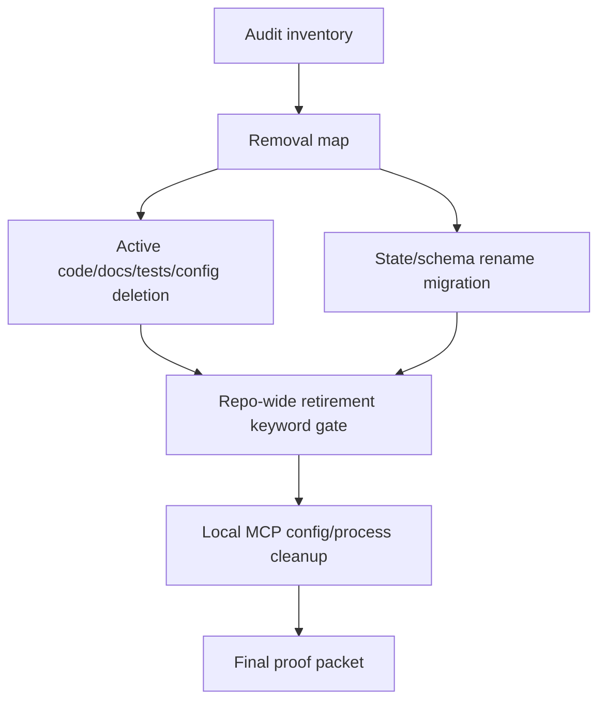
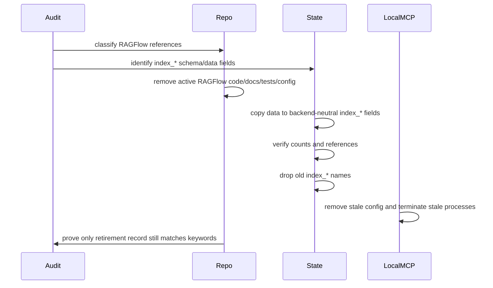

# RAGFlow Retirement Cleanup Design Spec

## Overview

RAGFlow is retired from the active `neurons` product/runtime surface. The campaign removes active RAGFlow code, CLI/config/docs/tests, migrates old `index_*` state names to backend-neutral index names, preserves existing data, and cleans stale local MCP surfaces after approval.

## Requirements Reference

- Phase 1 source: `requirements.md`
- Preview companion: `requirements.html`
- Approved requirement: RAGFlow search keywords may remain only in `docs/retired/index-retirement.md`
- Approved execution order: audit -> delete -> migration -> local cleanup

## Approach Proposal

Selected approach: staged hard retirement.

Other viable approaches were softer deprecation or surface-only hiding, but both preserve confusing RAGFlow affordances. The selected approach removes active references, preserves a single retirement record, migrates state names without data loss, and keeps process termination behind an execution checklist.

## Architecture

## Data Flow

## Component Details

### Audit Inventory

- Input: repo-wide keyword scan, schema scan, local MCP process/config scan.
- Output: approved inventory table with `remove`, `rename`, `migrate`, `kill`, `keep-as-retirement-record`.
- Dependency: read-only file/process/config inspection.

### Active Surface Removal

- Input: approved inventory rows marked `remove`.
- Output: RAGFlow active code, CLI flags, env docs, tests, examples, and runtime config removed.
- Dependency: repo edit phase after design approval.

### Schema Migration

- Input: approved inventory rows marked `rename` or `migrate`.
- Output: backend-neutral schema names and preserved data.
- Naming policy: vendor/backend names are forbidden in active names. Use `index_*` or `ragflow_*`.
- Initial mapping:

| Old name | New name |
| --- | --- |
| `index_target_id` | `index_target_id` |
| `index_document_id` | `index_document_id` |
| `index_run_id` | `index_run_id` |
| `index_progress` | `index_progress` |
| `index_targets` | `index_targets` |

### Retirement Record

- Path: `docs/retired/index-retirement.md`
- Purpose: explain why RAGFlow was removed and why Qdrant/graph is the live runtime baseline.
- Constraint: this is the only allowed repo-wide keyword match for the approved keyword set.

### Local MCP Cleanup

- Input: approved kill/edit list.
- Output: local stale `neuron-knowledge mcp-stdio` processes and config references removed.
- Stale criteria: local process/config combines `neuron-knowledge mcp-stdio` with any forbidden RAGFlow keyword.
- Excluded: Kubernetes live service, remote SSH exec, `workspace-index-advisor`, ops/private overlay.

## Error Handling

- If audit finds current live runtime dependence on RAGFlow, stop and return to requirements.
- If migration row counts or reference values mismatch, abort migration and restore from backup/snapshot.
- If old schema names remain after migration, block completion.
- If keyword scan finds matches outside `docs/retired/index-retirement.md`, block completion.
- If stale MCP process termination would affect a non-target workspace, skip it and report as blocked.

## Testing Strategy

- Unit tests for schema migration mapping and read/write compatibility after rename.
- Focused CLI tests proving removed RAGFlow flags/commands are no longer accepted.
- Repo instruction tests proving active docs describe Qdrant/graph runtime, not RAGFlow.
- Search gate test or script proving approved keyword set appears only in the retirement record.
- Local cleanup dry-run proof listing stale MCP process/config targets before kill/edit execution.

## TDD Strategy

Use red -> green -> refactor for code-changing work.

- Red: add failing tests/search gate for forbidden active RAGFlow references and schema naming.
- Green: remove active references and implement backend-neutral migration.
- Refactor: simplify dead code left by removal and tighten docs/tests around the Qdrant/graph runtime baseline.

Local process cleanup is operational, not unit-testable. Substitute evidence is a dry-run target list before execution and a post-cleanup process/config scan after execution.

## Milestones

- M1: Audit inventory — done when every approved keyword hit, schema reference, local MCP process, and MCP config target is classified as `remove`, `rename`, `migrate`, `kill`, or `keep-as-retirement-record`.
- M2: Active surface deletion — done when active code/docs/tests/config no longer expose RAGFlow as a runtime, CLI, env, or backend option.
- M3: Schema/data migration — done when old `index_*` names are replaced by backend-neutral names and existing data is preserved with rollback evidence.
- M4: Local MCP cleanup — done when stale local MCP config is edited and stale local processes are terminated according to the approved target list.
- M5: Final proof — done when the approved keyword set matches only `docs/retired/index-retirement.md` and live `neurons` runtime proof still shows Qdrant/graph baseline.

## Open Questions

None. If implementation discovers live RAGFlow dependence or non-migratable data, return to Phase 1 requirements before changing the source of truth.
