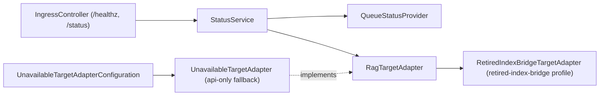
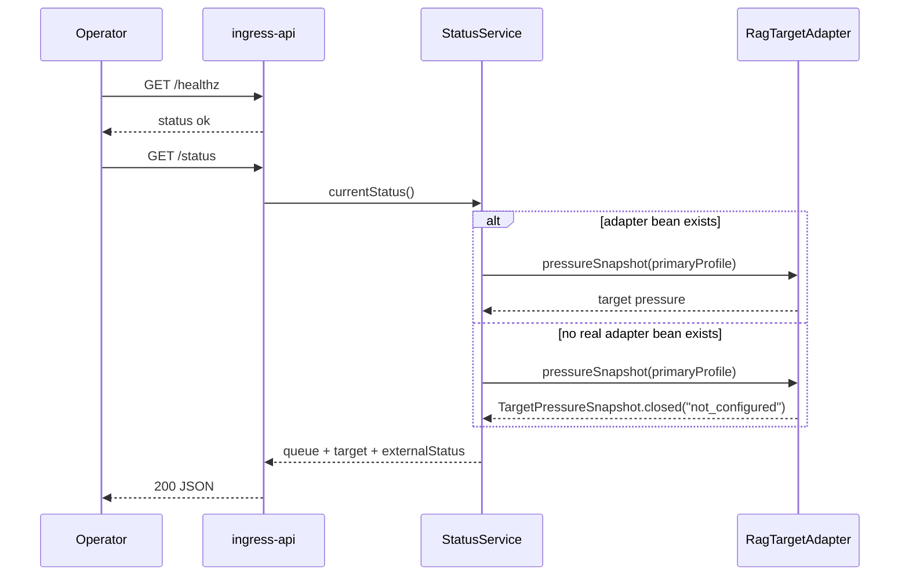

# Ingress API Profile Startup Design Spec

## Overview

`ingress-api`가 `api` profile 단독으로 시작되도록 `api` 전용 fallback `RagTargetAdapter`를 추가한다. adapter 부재는 process failure가 아니라 `/status`의 fail-closed degraded 상태로 노출한다.

## Requirements Reference

- Phase 1 source: `requirements.md`
- Preview companion: `requirements.html`
- 핵심 요구사항: `SPRING_PROFILES_ACTIVE=api` startup 보장, adapter 부재 시 `not_configured`, `/healthz` 독립성, worker delivery 위장 금지.

## Approach Proposal

추천안: `@Profile("api & !worker & !retired-index-bridge")` configuration에서 `@ConditionalOnMissingBean(RagTargetAdapter.class)`가 붙은 fallback `RagTargetAdapter` bean을 추가한다.

장점은 `StatusService`의 Spring constructor 계약을 유지하면서 bean graph 결핍을 해결한다는 점이다. fallback은 `api & !worker & !retired-index-bridge` profile에만 묶어 worker delivery 경로에는 들어가지 않는다. 실제 adapter profile이 켜지면 fallback 자체가 비활성화된다.

대안 1: `StatusService` Spring constructor에서 `ObjectProvider<RagTargetAdapter>`를 받아 optional 처리한다. service-local 변경은 작지만, bean graph 결핍을 port 수준에서 방어하지 못한다.

대안 2: profile별 `StatusService` 구현을 분리한다. 구조는 명확하지만 현재 단일 service가 이미 null-safe status contract를 가지고 있어 과하다.

## Architecture

## Data Flow

## Component Details

### `UnavailableTargetAdapter`

- 입력: target profile id
- 출력: `TargetPressureSnapshot.closed("not_configured")`, failed delivery, failed status
- 의존성: none
- package: `adapter.ext.unavailable`

### `UnavailableTargetAdapterConfiguration`

- 출력: missing `RagTargetAdapter`일 때만 `UnavailableTargetAdapter` bean 등록
- profile: `api & !worker & !retired-index-bridge`
- bean condition: missing `RagTargetAdapter`

### `StatusService`

- 입력: `RagTargetAdapter`, `QueueStatusProvider`, `TargetProfileRegistry`
- 출력: queue summary, target summary, document placeholder, authorization placeholder, `externalStatus`
- 의존성: Spring constructor injection

### Tests

- `ApiProfileStartupSmokeTest`: NATS collaborator를 mock한 실제 `api` profile component scan에서 fallback adapter와 `/healthz` 독립성을 검증한다.
- `UnavailableTargetAdapterContextTest`: `api` profile status context runner가 fallback adapter로 `StatusService`를 만들 수 있음을 검증한다.
- `UnavailableTargetAdapterContextTest`: adapter bean, `worker`, `retired-index-bridge` profile이 있으면 fallback이 등록되지 않음을 검증한다.
- `UnavailableTargetAdapterContextTest`: `api,retired-index-bridge` profile에서 실제 `RetiredIndexBridgeTargetAdapter`가 `RagTargetAdapter`로 선택됨을 검증한다.
- `IngressControllerTest`: `/status`가 adapter 없는 상태에서 `not_configured` reason과 `externalStatus`를 반환함을 명시한다.

## Error Handling

- real adapter bean 없음: fallback adapter가 `TargetPressureSnapshot.closed("not_configured")`
- adapter pressure read 실패: 기존처럼 `pressure_read_failed`
- queue status read 실패: 기존 `QueueStatusProvider` 구현이 unavailable snapshot 반환
- `/healthz`: target/queue dependency를 조회하지 않음
- NATS 연결/프로비저닝 실패: 기존 runtime failure policy를 유지한다. 이번 설계는 target adapter 부재만 degraded로 바꾼다.

## Testing Strategy

- 먼저 context runner test를 추가해 현재 constructor injection 실패를 재현한다.
- 구현 후 fallback adapter test와 targeted Java test를 통과시킨다.
- 전체 root Java test를 실행한다.
- `bootJar`를 실행해 artifact packaging을 확인한다.

## TDD Strategy

code-changing milestone은 red -> green -> refactor로 진행한다. 먼저 adapter 없는 `api` profile status context test와 `/status` contract assertion을 추가하고 실패를 확인한 뒤 `api` 전용 fallback adapter를 추가한다.

## Milestones

- M1: Requirements/design artifacts 생성 — source와 preview companion, 설계가 repo 안에 존재한다.
- M2: Red test 추가 — adapter 없는 `api` status context가 현재 구현에서 실패함을 확인한다.
- M3: API fallback adapter 구현 — targeted tests가 통과한다.
- M4: Regression verification — root Java tests와 boot jar build가 통과한다.

## Open Questions

- live canary/production rollout은 이 design의 자동 실행 범위 밖이다. 별도 운영 승인과 canary-first 절차가 필요하다.
