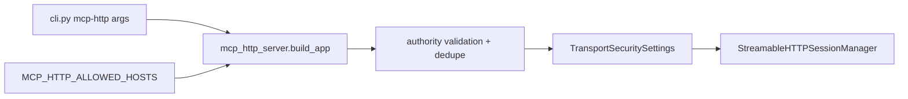
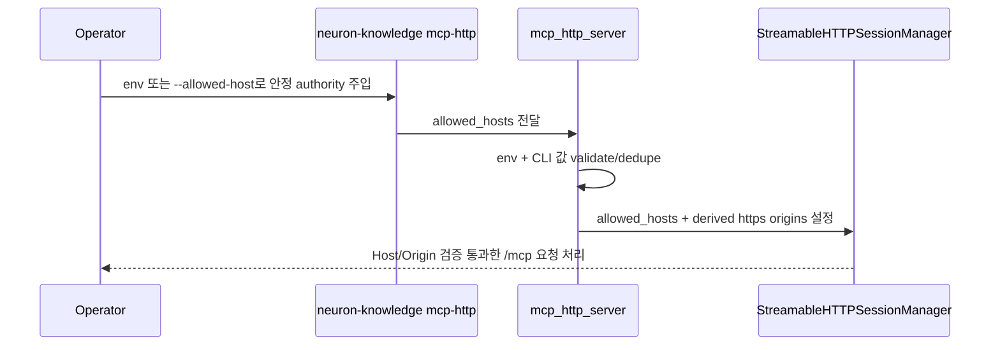

# MCP HTTP Allowed Hosts Design Spec

## Overview

MCP HTTP transport의 DNS rebinding 보호를 유지하면서 Pod IP와 별개의 안정 외부 HTTPS authority를 명시 allowlist로 추가한다. 변경은 `neurons` worker의 HTTP transport/CLI 표면과 테스트에만 한정한다.

## Requirements Reference

- Phase 1 source: `requirements.md`
- Preview companion: `requirements.html`
- 핵심 기능 요구사항:
  - 반복 가능한 `--allowed-host`
  - comma-separated `MCP_HTTP_ALLOWED_HOSTS`
  - `TransportSecuritySettings.allowed_hosts` 확장
  - 추가 allowed host의 HTTPS origin 자동 추가
  - DNS rebinding 보호와 기존 bind guard 유지
  - public repo에 실제 운영 host를 기록하지 않음

## Approach Proposal

추천안: **명시 Host allowlist + HTTPS Origin 자동 파생**

- 장점: DNS rebinding 보호를 유지하고, 운영자가 안정 authority만 선언하면 Pod IP churn과 분리된다.
- 단점: 운영 배포에서 env/flag 주입이 필요하다.

대안: **DNS rebinding 보호 비활성화**

- 장점: 즉시 우회는 쉽다.
- 단점: bearer 인증 없는 현재 MCP HTTP surface에서 방어선을 크게 낮춘다. 채택하지 않는다.

대안: **wildcard 또는 suffix allowlist**

- 장점: 운영 입력이 줄어든다.
- 단점: Host header 허용 범위가 넓어져 공개 안전과 회귀 검증이 어려워진다. 채택하지 않는다.

## Architecture

## Data Flow

## Component Details

### `worker/lib/agent_knowledge/mcp_http_server.py`

- 입력: bind `host`, `port`, optional additional allowed hosts, `MCP_HTTP_ALLOWED_HOSTS`.
- 처리:
  - 추가 Host authority를 쉼표/반복 flag 입력에서 수집한다.
  - scheme/path/query/fragment/userinfo/wildcard/공백을 거부한다.
  - Port는 ASCII digit-only로 제한한다.
  - IPv6 literal은 bracket form만 허용한다.
  - 순서 보존 dedupe 후 기존 bind host allowlist 뒤에 붙인다.
  - 추가 authority마다 `https://<authority>` origin을 추가한다.
- 출력: 확장된 `TransportSecuritySettings`.
- 의존성: Python stdlib `ipaddress`, `os`; 기존 MCP SDK types.

### `worker/lib/agent_knowledge/cli.py`

- `mcp-http` subcommand에 반복 가능한 `--allowed-host` 인자를 추가한다.
- env/CLI 입력은 service wiring 전에 `resolve_allowed_hosts()`로 normalize/validate한다.
- CLI는 `serve(..., allowed_hosts=resolved_allowed_hosts)`로 정규화된 값만 넘긴다.
- 기존 인자와 서비스 wiring은 변경하지 않는다.

### `compose.yaml`

- `neuron-knowledge-mcp` service는 shell wrapper로 project `.env`의 `MCP_HTTP_ALLOWED_HOSTS`를 canonical runtime env로 승격한다.
- brain env file에 이미 있는 `MCP_HTTP_ALLOWED_HOSTS`는 project `.env` 값이 비어 있으면 그대로 유지한다.
- `MCP_HTTP_ALLOWED_HOSTS_FROM_COMPOSE`는 project `.env` bridge용 public-safe alias다.

### `worker/tests/test_neuron_mcp_http.py`

- 추가 Host가 `allowed_hosts`에 들어가고 HTTPS origin이 파생되는지 검증한다.
- env CSV parsing과 invalid authority reject를 검증한다.
- public-safe `.example.test` 값을 사용하고 실제 운영 hostname은 넣지 않는다.

## Error Handling

- 빈 env 조각은 무시한다.
- scheme/path/query/fragment/userinfo/wildcard/공백이 포함된 authority는 `ValueError`로 거부한다.
- invalid port는 `ValueError`로 거부한다.
- unbracketed IPv6 literal은 `ValueError`로 거부한다.
- 오류 메시지는 입력값 전체를 에코하지 않고 설정 키나 타입 수준으로만 설명한다.
- `/mcp`는 MCP SDK transport security의 Host/Origin 검증을 탄다.
- `/healthz`는 정적 liveness endpoint로 유지한다. 내부 의존성이나 private data를 조회하지 않으며, MCP Host authorization 성공을 의미하지 않는다.

## Testing Strategy

- focused MCP HTTP tests:
  - `uv run --extra mcp-http pytest tests/test_neuron_mcp_http.py -q`
- CI focused MCP HTTP job:
  - worker optional `mcp-http` extra를 설치해 `tests/test_neuron_mcp_http.py`를 별도 status로 실행한다.
- worker regression:
  - `uv run pytest -q`
- root regression:
  - `JAVA_HOME="$(/usr/libexec/java_home -v 25)" gradle test`

## TDD Strategy

- Red: `test_transport_security_settings_adds_configured_allowed_hosts_and_https_origins`와 env/invalid input tests를 먼저 추가해 현재 구현의 실패를 확인한다.
- Green: mcp_http_server helper와 CLI flag plumbing을 구현한다.
- Refactor: 중복 제거와 parser 책임을 정리한 뒤 focused/worker/root 검증을 실행한다.

## Milestones

- M1: 추가 allowed host 보안 설정 단위 테스트 red/green — `TransportSecuritySettings`에 추가 Host와 HTTPS Origin이 반영됨.
- M2: CLI/env wiring red/green — `--allowed-host`와 `MCP_HTTP_ALLOWED_HOSTS`가 additive하게 동작함.
- M3: 회귀 검증 — MCP HTTP focused tests, worker tests, root Gradle tests가 통과함.
- M4: 리뷰/공개 안전 — code simplification, codebase architecture, system architecture 리뷰 반영 후 실제 운영값 누출이 없음을 확인함.

## Open Questions

- 없음. 실제 운영 authority 값 주입과 배포 반영은 `neurons-ops`에서 처리한다.

## Self Review

- placeholder/TODO 없음.
- DNS rebinding 보호를 끄지 않는다.
- 설계 범위는 worker transport/CLI/test/doc으로 제한되어 있다.
- 실제 운영 hostname, private path, secret, raw id를 기록하지 않는다.
