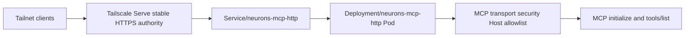
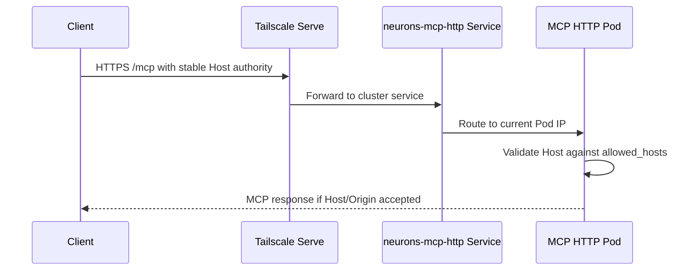

# LLM-Brain MCP Stable Host Rollout Design Spec

## Overview

Pod IP 기반 `Host` header workaround를 stable Tailscale Serve authority 기반 운영으로 전환한다. `neurons`는 기능과 image를 제공하고, `neurons-ops`는 k3s manifest와 rollout evidence를 소유하며, tyche는 Pod IP override를 제거하는 소비자 설정만 담당한다.

## Requirements Reference

- Phase 1 source: `requirements.md`
- Preview companion: `requirements.html`
- 핵심 기능 요구사항:
  - `MCP_HTTP_ALLOWED_HOSTS`와 `--allowed-host` 지원 확인
  - 새 `mcp-http` image tag 산출
  - `neurons-ops` canary/production manifest에 새 image와 stable Host allowlist 반영
  - client 기기별 allowlist 금지
  - live cluster/Tailscale/tyche mutation은 별도 승인 전 금지

## Approach Proposal

추천안: **server authority allowlist + canary-first manifest patch**

- 장점: DNS rebinding protection을 유지하면서 Pod IP churn과 client device identity를 분리한다.
- 단점: 새 image build/push와 `neurons-ops` manifest 업데이트가 필요하다.

대안: **tyche가 Pod IP Host header를 계속 갱신**

- 장점: 서버 변경 없이 임시 복구가 가능하다.
- 단점: Pod restart마다 깨지는 운영 구조라 목표와 맞지 않는다. 채택하지 않는다.

대안: **Tailscale client/device allowlist 확장**

- 장점: 접근 주체를 좁힐 수 있다.
- 단점: HTTP DNS rebinding guard의 문제는 request `Host` authority 문제다. client device allowlist는 이번 목표가 아니며 금지한다.

## Architecture

## Data Flow

## Component Details

### `neurons` code/image

- Confirm `MCP_HTTP_ALLOWED_HOSTS` and `--allowed-host` feed `TransportSecuritySettings.allowed_hosts`.
- Confirm `allowed_origins` receives HTTPS origins for added authorities.
- Keep `0.0.0.0` bind rejection and Kubernetes Pod IP bind support.
- Run focused MCP HTTP tests.
- Build/push a new `localhost:5000/neurons/mcp-http:sha-<verified-source>` image from the verified worktree source.

### `neurons-ops` k3s manifest

- Patch canary manifest first:
  - `Deployment/neurons-mcp-http-canary`
  - container `mcp-http`
  - new image tag
  - `MCP_HTTP_ALLOWED_HOSTS` env with stable server authorities
- Patch production manifest with the same image/env only after canary path is prepared:
  - `Deployment/neurons-mcp-http`
  - container `mcp-http`
- Use kustomize rendering as local evidence. Do not apply manifests without a separate live approval.

### tyche config

- Find the local or operational config that currently injects Pod IP `headers.Host`.
- Prepare a patch or exact operator instruction that removes the Pod IP `Host` workaround after production stable-host proof.
- Do not add MacBook, Mac mini, iPhone, client Tailscale IP, or client MagicDNS names.

### Tailscale ACL

- Default to no ACL change.
- Only escalate to ACL work if read-only evidence shows tailnet clients cannot reach the stable Serve authority despite correct server Host allowlist.
- Do not add per-client MCP server allowlist entries.

## Error Handling

- If focused MCP HTTP tests fail, stop before image build.
- If Docker build/push is unavailable locally, use a bounded remote build context from the verified source; do not trust stale remote checkout state.
- If `neurons-ops` root checkout is dirty, use a separate worktree and leave existing changes untouched.
- If tyche config cannot be found locally, record exact removal guidance instead of guessing.
- If Tailscale ACL state cannot be verified read-only, leave ACL unchanged and mark it as an operator precheck.

## Testing Strategy

- `neurons`:
  - focused MCP HTTP tests with optional `mcp-http` extra
  - image build/push evidence if Docker is available
- `neurons-ops`:
  - kustomize render for workload canary overlay
  - kustomize render for production/production-scale-out overlay
  - grep/render check for new image tag and `MCP_HTTP_ALLOWED_HOSTS`
- tyche:
  - config diff or exact operator instruction
  - no live MCP client mutation without separate approval

## TDD Strategy

- `neurons` code path already has tests for allowed host/env/CLI behavior; rerun focused tests before image build.
- Manifest changes have no unit-test seam, so use render-first checks as substitute evidence:
  - render current overlay before patch to observe missing env/current image
  - patch manifest
  - render after patch and assert image/env presence
- tyche config change uses diff review plus post-rollout smoke as evidence; live smoke is outside this no-live-mutation execution unless separately approved.

## Milestones

- M1: `neurons` capability and image — focused tests pass and a new `mcp-http` image tag is produced or build blocker is recorded.
- M2: `neurons-ops` manifest patch — canary and production render with new image and stable Host allowlist.
- M3: tyche/Tailscale boundary — Pod IP Host override removal path is identified, and ACL is either confirmed unnecessary or escalated as a separate operator precheck.
- M4: review and verification — changed surfaces receive simplification and architecture review; final checks pass or blockers are explicit.

## Open Questions

- None requiring user input. Ambiguous technical questions are answered through bounded local/multi-agent research.

## Self Review

- Client device allowlist is explicitly out of scope.
- DNS rebinding protection remains enabled.
- Public repo docs use placeholders for private stable authorities.
- Live cluster/Tailscale/tyche mutation remains gated.
