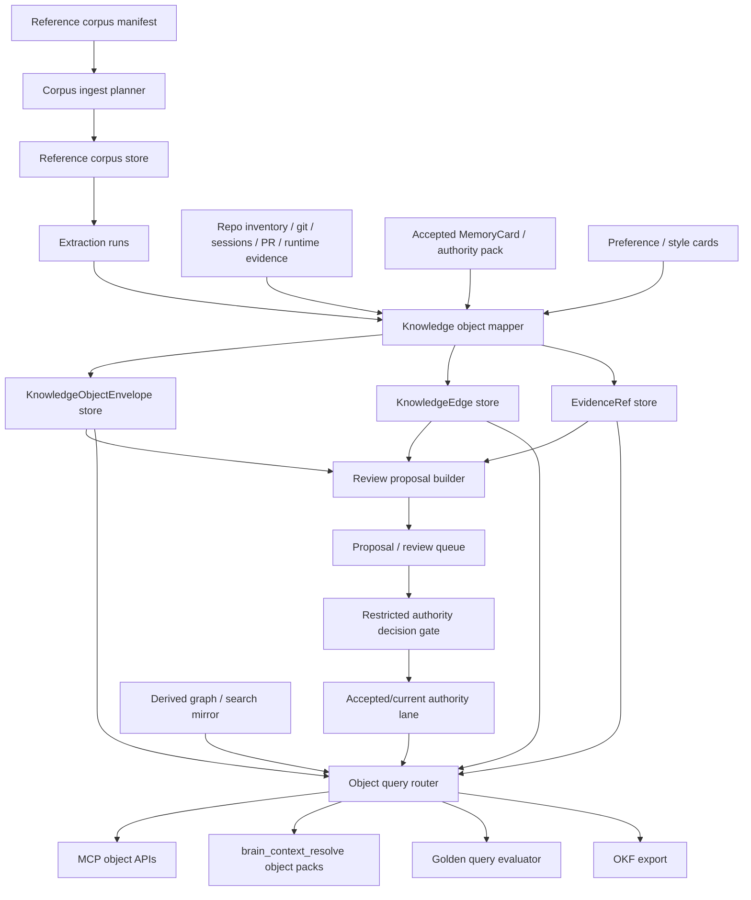

# LBrain Knowledge Object Substrate Design Spec

## Overview

LBrain을 feature별 임시 기억 도구가 아니라 repo 작업 지식을 다루는 공통 substrate로 확장한다. 핵심은 `ReferenceCorpus`, `KnowledgeObject`, typed edge, evidence, review proposal, authority decision을 같은 envelope로 다루고, MCP/CLI/agent context가 accepted/current, reference-only, proposal, archive, derived mirror, runtime evidence lane을 항상 분리해서 반환하게 만드는 것이다.

이번 design은 substrate-first milestone design이다. 전체 program은 한 번에 승인하되 구현은 evidence-gated milestone으로 쪼개고, 첫 실행은 local/test ledger와 sanitized fixture만 사용한다. 운영 검증은 구현 완료 후 별도 `프로덕션 검증` goal로 다시 진행한다.

## Requirements Reference

- Phase 1 source: `requirements.md`
- Preview companion: 생성하지 않음
- 승인 상태: `requirements.md` 사용자 승인 완료
- 선택된 접근: substrate-first milestone design
- 확정 범위:
  - `ReferenceCorpus -> KnowledgeObject`
  - `Documentation Cleanup`
  - `Golden Query Evaluation`
  - `Agent Context Pack`
  - OKF export-only companion
  - UI 제외
  - `external_object_store`, `managed_snapshot`, `metadata_only` storage mode 모두 지원

핵심 acceptance는 검색 결과 나열이 아니라 object, edge, evidence, freshness, gap, recommended action을 포함한 pack을 반환하는 것이다.

## Approach

추천 접근은 **ledger-backed object substrate with derived projections**이다.

1. 채택: ledger-backed object substrate
   - `KnowledgeObjectEnvelope`, `KnowledgeEdge`, `EvidenceRef`, `ReferenceCorpus` 계열 object를 additive ledger tables와 pure model modules로 도입한다.
   - graph/Qdrant/search mirror는 `derived_projection` lane으로만 join한다.
   - existing `MemoryCard`, `SourceRefRecord`, `OntologyEpisode`, `DocumentAuthorityCard`, `PreferenceRuleCard`, `RepoStyleProfile`, `ContextPack`은 새 substrate로 감싸서 재사용한다.
   - 장점: authority lane이 분명하고 기존 Brain Steward restricted gate를 살릴 수 있다.
   - 단점: 첫 milestone에서 object envelope와 기존 card 모델 사이 adapter가 필요하다.

2. 대안: document-cleanup 전용 확장
   - `brain_docs_*` 도구를 고도화해 문서 정리만 해결한다.
   - 장점: 빠르다.
   - 단점: 코드 영향, 배포 truth, style/preference, external corpus가 다시 별도 기능으로 갈라진다.

3. 대안: graph-first ontology projection
   - graph를 canonical처럼 다루고 object/edge를 graph schema로 먼저 만든다.
   - 장점: 관계 탐색은 빠르다.
   - 단점: current/stale/accepted/proposal authority를 graph freshness와 혼동할 위험이 크다.

이번 design은 1번을 채택한다.

## Architecture



Dependency direction:

```text
CLI/MCP
  -> BrainReadService / KnowledgeObjectReadService
    -> KnowledgeObjectStore
    -> existing memory/card/context/document/preference adapters
    -> derived graph/search mirror joins

Proposal tools
  -> BrainStewardService or KnowledgeObjectProposalService
    -> review queue only
    -> restricted authority gate for accepted/current changes
```

No component in this design may treat raw corpus, graph hits, search mirror hits, or session archive as accepted/current authority without an `AuthorityDecision`.

## Data Model

### Shared vocabulary

`lifecycle_status` values:

```text
observed
extracted
proposed
accepted
current
stale
superseded
retired
rejected
archived
```

State axes are separated. `authority_lane` answers "which source lane may be trusted for this object?" and `verification_state` answers "what was verified about the claim?" Implementations may expose a derived `authority_status` compatibility label for requirements/output compatibility, but storage and validation must use the separated fields.

`authority_lane` values:

```text
reference_only
candidate
proposal_only
accepted_current
accepted_non_current
derived_projection
archive_only
rejected
```

`verification_state` values:

```text
not_applicable
unverified
source_hash_verified
freshness_checked
test_verified
runtime_verified
runtime_unverified
```

`storage_mode` values:

```text
external_object_store
managed_snapshot
metadata_only
```

`privacy_class` values:

```text
public_safe
local_private
private_sensitive
secret_forbidden
```

Valid status combinations:

| Object state | Required `lifecycle_status` | Required `authority_lane` | Required `review_state` | Allowed `verification_state` |
| --- | --- | --- | --- | --- |
| Reference-only corpus object | `observed` or `extracted` | `reference_only` | `not_required` | `source_hash_verified`, `freshness_checked`, `unverified` |
| Review candidate | `proposed` | `candidate` or `proposal_only` | `needs_review` | any non-`runtime_verified` state unless runtime evidence exists |
| Accepted current memory | `accepted` or `current` | `accepted_current` | `accepted` | any state supported by evidence |
| Accepted stale/superseded memory | `stale`, `superseded`, or `retired` | `accepted_non_current` | `accepted` | any state supported by evidence |
| Archive-only item | `archived` | `archive_only` | `not_required` | `unverified` or `not_applicable` |
| Derived graph/search hit | `observed` or `extracted` | `derived_projection` | `not_required` | `unverified` unless authority-joined evidence proves more |
| Runtime truth | `observed` or `current` | `accepted_current` or `candidate` | `accepted` or `needs_review` | `runtime_verified` or `runtime_unverified` |

MemoryCard adapter mapping:

| Existing card fields | Object mapping |
| --- | --- |
| `lifecycle_state in accepted/human_accepted/auto_accepted` + `approval_state in approved/auto_accepted` + `currentness=current` | `lifecycle_status=current`, `authority_lane=accepted_current`, `review_state=accepted` |
| accepted/approved + `currentness in stale/superseded/archive_candidate` | `lifecycle_status` from currentness, `authority_lane=accepted_non_current`, `review_state=accepted` |
| `lifecycle_state in candidate/needs_review` | `lifecycle_status=proposed`, `authority_lane=candidate`, `review_state=needs_review` |
| rejected/disabled card | `lifecycle_status=rejected` or `retired`, `authority_lane=rejected`, `review_state=rejected` |

### `KnowledgeObjectEnvelope`

Canonical envelope for all work knowledge objects.

```yaml
schema_version: knowledge_object_envelope.v1
object_id: ko:<type>:<stable_hash>
object_type: RepoDocument
scope:
  user_id_hash: ""
  project: neurons
  repository_id: repo:<stable_hash>
  device_id_hash: ""
  branch: main
  runtime_id: ""
title: "README.md"
summary: "Public repo boundary and command surface."
lifecycle_status: current
authority_lane: accepted_current
verification_state: source_hash_verified
review_state: accepted
source_refs: []
evidence_refs: []
edge_refs: []
content_hash: sha256:<hash>
observed_at: "2026-07-05T00:00:00Z"
valid_from: ""
valid_to: ""
confidence:
  score: 0.86
  basis: "approved authority card and file inventory"
recommended_action: keep
freshness:
  state: current
  checked_at: ""
  next_check_after: ""
  gaps: []
privacy_class: public_safe
payload:
  path_ref: "README.md"
  status_reason: "repo_boundary_source"
```

Rules:

- `object_id` is opaque and stable from object type, scope, natural key, and content hash.
- `payload` is public-safe. Raw source body, secret, private host/path, raw external ids, and unredacted session body are forbidden.
- `scope.device_id_hash` allows "this PC" queries without exposing host identity.
- `scope.repository_id` and project edges allow the same project to be queried across multiple PCs.
- `accepted_current` can only appear after an authority decision or an existing accepted/current card adapter proves it.
- `runtime_verified` can only appear in `verification_state`, never as an authority lane.

### `KnowledgeEdge`

Typed relationship between objects.

```yaml
schema_version: knowledge_edge.v1
edge_id: ke:<type>:<stable_hash>
edge_type: supersedes
from_object_id: ko:RepoDocument:<hash>
to_object_id: ko:RepoDocument:<hash>
direction: forward
confidence:
  score: 0.74
  basis: "matching concept and stale card evidence"
evidence_refs: []
lifecycle_status: proposed
authority_lane: proposal_only
verification_state: unverified
observed_at: "2026-07-05T00:00:00Z"
freshness:
  state: needs_review
  gaps: []
payload:
  recommended_action: review_supersession
```

Initial edge types:

```text
derived_from
extracted_from
references
documents
implements
tests
touches
impacts
depends_on
supersedes
superseded_by
replaces
contradicts
validates
deployed_by
observed_on_device
belongs_to_project
same_project_across_device
requires_live_evidence
requires_review
promoted_from
rejected_as
applies_to_repo
applies_to_user
matches_preference
violates_preference
violates_style
used_for
```

### `EvidenceRef`

Evidence is a first-class object, not an inline string.

```yaml
schema_version: evidence_ref.v1
evidence_id: ev:<kind>:<stable_hash>
evidence_type: source_hash
authority_lane: reference_only
verification_state: source_hash_verified
source_ref_id: ""
locator:
  kind: relative_path
  value: "docs/specs/.../requirements.md"
content_hash: sha256:<hash>
observed_at: "2026-07-05T00:00:00Z"
producer:
  component: corpus_ingest
  version: "0.1"
privacy_class: public_safe
summary: "Markdown source hash for approved requirements."
gaps: []
```

Object read APIs do not reuse Brain Steward's redacted authority-pack projection because that projection intentionally forbids rich evidence keys. Object APIs return an `EvidenceRefView` and `LocatorView` instead:

```yaml
evidence_view:
  evidence_id: ev:<kind>:<stable_hash>
  evidence_type: source_hash
  authority_lane: reference_only
  verification_state: source_hash_verified
  locator_view:
    locator_kind: relative_repo_path
    display_ref: "docs/specs/.../requirements.md"
    locator_digest: sha256:<hash>
  summary: "Public-safe evidence summary."
  raw_return_capability: denied
```

`LocatorView` may expose relative repo paths and opaque/digested external locators, but never raw hostnames, user-local absolute paths, raw external ids, or secrets.

Supported evidence types include:

```text
source_hash
file_inventory
source_url
manual_text_without_url
commit
pull_request
test_result
runtime_smoke
authority_decision
review_decision
memory_card
session_artifact
graph_projection
search_mirror
extractor_run
freshness_check
```

### Reference Corpus Objects

`ReferenceCorpus`:

```yaml
corpus_id: rc:<stable_hash>
name: palantir-ontology
storage_mode: external_object_store
source_count: 65
manifest_ref: manifest:<hash>
authority_lane: reference_only
verification_state: source_hash_verified
privacy_class: local_private
freshness_policy: source_url_recheck_when_available
license_policy: operator_attested_reference_use
raw_body_policy: no_raw_return_by_default
```

`DocumentSource`:

```yaml
source_id: ds:<stable_hash>
corpus_id: rc:<stable_hash>
source_type: WEB_PAGE
source_url_status: present
storage_mode: external_object_store
source_url_ref: url_hash:<hash>
normalized_path_ref: sources-normalized/palantir-ontology-020.md
content_hash: sha256:<hash>
metadata_hash: sha256:<hash>
authority_lane: reference_only
verification_state: source_hash_verified
license_source_rights: operator_attested
```

`DocumentSnapshot`:

```yaml
snapshot_id: snap:<stable_hash>
source_id: ds:<stable_hash>
storage_mode: managed_snapshot
snapshot_kind: normalized_markdown
content_hash: sha256:<hash>
body_storage_ref: private_store:<opaque_id>
raw_body_returnable: false
raw_body_policy: no_raw_return_by_default
return_capability: denied_without_explicit_approval
retention_class: user_managed_reference
redaction_profile: public_safe_summary
deletion_policy: delete_snapshot_keep_metadata
license_source_rights: operator_attested
```

`DocumentChunk`:

```yaml
chunk_id: chunk:<stable_hash>
snapshot_id: snap:<stable_hash>
ordinal: 3
content_hash: sha256:<hash>
summary: "Ontology action types model human and agent decisions."
body_storage_ref: ""
```

`ExtractionRun`:

```yaml
run_id: extract:<stable_hash>
corpus_id: rc:<stable_hash>
extractor: reference_corpus_mapper
extractor_version: "0.1"
input_hash: sha256:<hash>
output_object_count: 42
output_edge_count: 87
status: completed
evaluation:
  public_safe_scan: pass
  source_count_match: pass
  missing_url_count: 26
  no_raw_output_scan: pass
```

`FreshnessCheck`:

```yaml
check_id: fresh:<stable_hash>
source_id: ds:<stable_hash>
check_mode: url_metadata
status: checked
result: unchanged
checked_at: "2026-07-05T00:00:00Z"
next_check_after: ""
gaps: []
```

Rules:

- URL 없는 manual text source는 `source_url_status=missing_manual_text`와 `freshness_gap` evidence를 가진다.
- `managed_snapshot` can store text only in local/private storage and cannot make an object authoritative.
- `metadata_only` cannot support content-derived extraction; queries must return `requires_source_body_or_summary` gap when content reasoning is requested.
- `external_object_store` requires hash verification before extraction output is trusted as reference evidence.
- `managed_snapshot` must declare `raw_body_policy`, `return_capability`, `retention_class`, `redaction_profile`, `deletion_policy`, and `license_source_rights`.
- Raw body retrieval is denied by default even when a managed snapshot exists.

### Review and Authority Objects

`ReviewProposal`:

```yaml
proposal_id: proposal:<stable_hash>
proposal_type: propose_stale
target_object_id: ko:RepoDocument:<hash>
proposed_object_id: ""
proposed_edges: []
reason: "newer design.md supersedes this historical design note"
evidence_refs: []
status: needs_review
created_by: codex
created_at: "2026-07-05T00:00:00Z"
proposal_write_performed: true
authoritative_memory_changed: false
```

`AuthorityDecision`:

```yaml
decision_id: decision:<stable_hash>
decision_type: accept_current
target_object_id: ko:RepoDocument:<hash>
previous_authority_lane: candidate
new_authority_lane: accepted_current
approved_by: human
approved_at: "2026-07-05T00:00:00Z"
evidence_refs: []
```

Rules:

- Proposal creation is a proposal write, not a read. It may write to local/test ledger by default but must not mutate accepted/current authority.
- Accepted/current mutation is restricted and uses an object decision adapter over the existing Brain Steward pattern.
- Stale/superseded/retired decisions first create proposals, then commit through a restricted gate.
- Review queue empty is not success. For cleanup/impact queries, empty queue plus discovered candidates returns `review_proposals_needed`.
- `write_performed=false` is reserved for denied restricted actions. Successful proposal creation reports `proposal_write_performed=true` and `authoritative_memory_changed=false`.
- `brain_object_decision_commit` is the restricted object-native authority surface. Its first implementation may adapt object proposals into existing `memory_*` restricted commit paths, but the response must be object-shaped.

## Storage Design

Use additive ledger-backed stores with pure model validation.

New logical stores:

- `KnowledgeObjectStore`
  - persists `KnowledgeObjectEnvelope`
  - indexes `object_type`, project, repository scope, lifecycle, authority lane, verification state, content hash
- `KnowledgeEdgeStore`
  - persists `KnowledgeEdge`
  - indexes source/target object id, edge type, authority lane
- `EvidenceRefStore`
  - persists public-safe evidence metadata
  - never stores forbidden raw body fields
  - renders `EvidenceRefView` and `LocatorView` for object APIs
- `ReferenceCorpusStore`
  - persists corpus/source/snapshot/chunk/extraction/freshness metadata
  - stores raw body only when `storage_mode=managed_snapshot` and `raw_body_policy` allows it
  - records retention, deletion, redaction, return capability, and source-rights policy
- `ReviewProposalStore`
  - can reuse or adapt existing MemoryCard review queue where possible
  - exposes object-native proposals without changing accepted memory semantics
  - invalidates object-pack cache after proposal write or restricted decision commit

Implementation seam:

```text
worker/lib/agent_knowledge/llm_brain_core/knowledge_objects.py
worker/lib/agent_knowledge/llm_brain_core/reference_corpus.py
worker/lib/agent_knowledge/llm_brain_core/object_store.py
worker/lib/agent_knowledge/llm_brain_core/object_query.py
worker/lib/agent_knowledge/llm_brain_core/object_pack_builder.py
worker/lib/agent_knowledge/llm_brain_core/okf_export.py
```

Existing modules remain active:

- `models.py`
  - `SourceRefRecord`, `OntologyEpisode`, `ContextPack` stay public-safe primitives.
- `document_authority.py`
  - becomes a `RepoDocument` adapter and cleanup pack source.
- `preference_authority.py`
  - becomes a `PreferenceRuleCard` to `ArtifactPreference`, `ReviewTonePreference`, and `HtmlReviewProfile` adapter.
- `repo_style_profile.py`
  - becomes `PersonalCodeStyleProfile`, `RepoStyleProfile`, `StyleProfile`, and `StyleRule` object source.
- `context.py` and `context_builder.py`
  - add object packs to `ContextPack.authority`.
- `brain_steward.py`
  - remains restricted authority gate.
- `mcp_tools.py` and `mcp_jsonrpc.py`
  - expose read/proposal-safe object tools.
- `rag_ingress/qdrant_*` and graph adapters
  - remain derived mirrors and must join through object/evidence authority.

No migration may remove or rename existing MCP tools in the first program.

Write/read cache rule:

- Proposal write, restricted decision commit, corpus ingest, freshness refresh, and OKF export source refresh must invalidate the affected object-pack cache key.
- Read-after-write for local/test ledger must observe the newly written proposal or decision in the next query.
- Production ledger writes are not part of this design execution.

## Update Flow

### Corpus ingest

```text
operator-provided manifest
  -> corpus ingest planner validates source count, metadata hashes, storage mode policy
  -> ReferenceCorpus + DocumentSource rows
  -> optional DocumentSnapshot / DocumentChunk rows by storage mode
  -> ExtractionRun row
  -> reference-only KnowledgeObjectEnvelope rows
  -> EvidenceRef rows for hash, URL, manual URL gap, extractor run
```

Design constraints:

- Manifest path is caller-supplied. No user-local path is hardcoded in repo docs or tests.
- Ingesting corpus creates `reference_only` objects, not accepted/current memory.
- Full Palantir corpus is not committed to the public repo. Tests use sanitized mini fixtures.
- Re-ingest is idempotent by source id, content hash, and normalized metadata hash.

### Object mapping

```text
Reference documents
  -> ReferenceDocument objects
  -> extracted concept/action/function/governance objects
  -> derived_from / references / used_for edges

Repo documents
  -> RepoDocument objects
  -> documents / supersedes / archive_candidate proposal edges

Code/repo inventory
  -> RepoFile / Component / Test / McpTool objects
  -> impacts / tests / implements edges

Runtime evidence
  -> PullRequest / Commit / CIStatus / DeploymentTarget / RuntimeTruth objects
  -> deployed_by / validates / requires_live_evidence edges

Preference/style evidence
  -> StyleRule / StyleProfile / HtmlReviewProfile / VisualizationProfile objects
  -> applies_to_repo / applies_to_user / violates_style edges
```

### Authority and review

```text
candidate object or edge
  -> ReviewProposal
  -> review queue
  -> restricted AuthorityDecision
  -> accepted/current object or stale/superseded/retired demotion
```

Rules:

- `accept_current`, `commit_supersession`, `commit_stale`, `retire` are restricted.
- A query can recommend proposals but must not commit them.
- Existing accepted/current `MemoryCard` can be adapted into `KnowledgeObjectEnvelope` with `authority_lane=accepted_current`.
- Existing graph/search results join as `derived_projection` evidence only.

### Freshness refresh

```text
DocumentSource
  -> freshness policy chooses check mode
  -> FreshnessCheck
  -> changed/unchanged/missing/uncheckable result
  -> object freshness update or ReviewProposal
```

Freshness results:

- `unchanged`: update `checked_at`.
- `changed`: create new snapshot candidate and `propose_stale` or `propose_supersede`.
- `missing_manual_text`: keep reference object but add freshness gap.
- `uncheckable`: return gap and preserve existing authority status.

## Query Flow

### Intent routing

Add a small deterministic route classifier before object pack assembly.

Routes:

```text
temporal_work_recall
reference_corpus_research
documentation_cleanup
stale_archive_discovery
authority_archive_separation
code_change_impact
pr_merge_truth
deployment_runtime_truth
code_style_preference
html_visualization_preference
handoff_debugging_pack
```

Each route returns:

```yaml
route: documentation_cleanup
source_lanes:
  - accepted_current
  - reference_only
  - proposal_only
  - archive_only
  - derived_projection
stop_reason: answered_with_gaps
missing_evidence:
  - review_proposals_needed
  - no_recent_freshness_check
```

### Pack builders

`ObjectPackBuilder` produces reusable packs:

- `DocumentationCleanupPack`
- `ChangeImpactPack`
- `RuntimeTruthPack`
- `PreferenceStylePack`
- `ReferenceResearchPack`
- `TemporalWorkPack`
- `AgentContextObjectPack`

All packs share fields:

```yaml
schema_version: object_pack.v1
route: documentation_cleanup
objects: []
edges: []
evidence: []
lanes:
  accepted_current: []
  reference_only: []
  proposal_only: []
  archive_only: []
  derived_projection: []
verification:
  runtime_verified: []
  runtime_unverified: []
  unverified: []
recommended_actions: []
confidence:
  score: 0.0
  basis: ""
gaps: []
audit:
  request_hash: ""
  consumer: codex
```

Route-specific pack behavior is declarative so future product slices do not hand-code every route from scratch:

```yaml
route_spec:
  route: documentation_cleanup
  required_object_types: [RepoDocument, Spec, AuthorityDecision]
  optional_object_types: [ReferenceDocument, WorkUnit]
  allowed_authority_lanes: [accepted_current, reference_only, proposal_only, archive_only, derived_projection]
  verification_policy: allow_unverified_with_gap
  evidence_policy: require_evidence_or_gap
  redaction_mode: object_safe
  recommended_action_vocabulary: [keep, update, merge, supersede, archive, retire, request_evidence, review]
  eval_assertions:
    - separates_current_from_archive
    - includes_recommended_action
    - includes_evidence_or_gap
```

Pack builders are implementations of route specs. Adding a new route should start with a route spec, not a one-off bespoke builder.

### Documentation cleanup answer

For "이 repo 문서 최신화하려면 뭘 봐야 해?" return:

- current authoritative docs
- active docs
- generated companions/previews
- stale/superseded/retired/archive candidates
- doc-to-doc supersession edges
- doc-to-concept edges
- recommended action per doc
- evidence/freshness/confidence/gaps

If current authority docs are empty, answer must say `accepted_current documents empty` and then show candidate/reference lanes separately.

### Code change impact answer

For "이 파일 바꾸면 어떤 테스트/런타임 영향 있어?" return:

- impacted `RepoFile`, `Component`, `McpTool`, `Test`, `Spec`, `RuntimeSurface`
- `impacts`, `tests`, `requires_live_evidence` edges
- recommended verification commands
- prior incidents or failed attempts when available
- `confidence` and `verification.unverified`

No runtime mutation or deploy check is performed by this query path.

### Runtime truth answer

For "이 PR merge됐어? 배포도 됐어?" return merge/CI/deploy/live lanes separately:

- `PullRequest`
- `Commit`
- `CIStatus`
- `DeploymentTarget`
- `RuntimeSurface`
- `RuntimeTruth`
- `LiveEvidenceGap`

Merge evidence alone cannot set `RuntimeTruth.verification_state=runtime_verified`.

### Device/project 360 answer

For "이 PC에서 한 작업" and "같은 프로젝트를 여러 PC에서 작업한 내역" return:

- device-scoped objects by `scope.device_id_hash`
- project-scoped objects by `scope.project` and `repository_id`
- `observed_on_device`, `belongs_to_project`, `same_project_across_device` edges
- unresolved device identity gaps when only one side is known

Raw hostname, local absolute path, or private user path is not returned.

## MCP API Changes

Add object-native MCP tools without removing existing tools.

### `brain_objects_query`

Read-only object query.

Input:

```yaml
repository: string
branch: string
query: string
current_files: string[]
project: string
object_types: string[]
route: string
limit: integer
response_mode: full | compact | degraded
consumer: unspecified | codex | claude-code | gemini | hermes
```

Output:

```yaml
schema_version: brain_objects_query.v1
route: string
object_pack: object_pack.v1
```

### `brain_object_explain`

Read-only explanation for one object id.

Input:

```yaml
object_id: string
include_edges: boolean
include_evidence: boolean
response_mode: full | compact | degraded
```

Output includes object, inbound/outbound edges, evidence refs, authority lane, freshness, and gaps.

### `brain_corpus_status`

Read-only corpus inventory.

Input:

```yaml
corpus_id: string
project: string
limit: integer
```

Output includes corpus metadata, source counts, storage mode distribution, freshness gaps, extraction run summary, and reference-only object count.

### `brain_corpus_ingest_plan`

Read-only ingest preview from an operator-supplied manifest.

Input:

```yaml
manifest_ref: string
storage_mode: external_object_store | managed_snapshot | metadata_only
project: string
corpus_name: string
```

Output includes planned object counts, privacy policy, source URL gaps, hash verification status, and rejected inputs. It performs no ledger writes.

### `brain_object_proposal_create`

Proposal-write object action. It can create `ReviewProposal` in a local/test ledger but cannot change accepted/current authority. Against production targets in this mega-program it must return a denied payload unless a later production-validation design explicitly opens the path.

Input:

```yaml
proposal_type: propose_current | propose_stale | propose_supersede | propose_retire | request_evidence
target_object_id: string
proposed_object: object
reason: string
evidence_refs: string[]
proposer: unspecified | codex | claude-code | gemini | hermes
```

Output includes:

```yaml
proposal_write_performed: true
authoritative_memory_changed: false
authority_write_performed: false
```

Denied production or permission cases include:

```yaml
proposal_write_performed: false
authoritative_memory_changed: false
authority_write_performed: false
permission: denied
reason: proposal_write_requires_local_test_ledger_or_later_production_gate
```

### `brain_object_decision_commit`

Restricted object-native authority action. This is the only object API that may change accepted/current, stale, superseded, retired, or rejected authority.

Input:

```yaml
proposal_id: string
decision_type: accept_current | reject_candidate | commit_supersession | commit_stale | retire
approved_by: string
decision_id: string
```

Output includes an `AuthorityDecision` view plus:

```yaml
proposal_write_performed: false
authority_write_performed: true
authoritative_memory_changed: true
cache_invalidated: true
```

Default permission is denied. The first implementation may adapt to existing `memory_candidate_approve`, `memory_candidate_reject`, `memory_supersede_commit`, and `memory_stale_commit` restricted gates, but the public response remains object-shaped.

### `brain_review_proposals`

Read-only review queue for object-native proposals.

Input:

```yaml
project: string
repository: string
proposal_types: string[]
limit: integer
```

Output includes redacted proposal metadata only.

### `brain_context_resolve` extension

Extend existing `ContextPack.authority` with:

```yaml
object_packs:
  documentation_cleanup: object_pack.v1
  reference_corpus: object_pack.v1
  preferences: object_pack.v1
  style: object_pack.v1
  current_work: object_pack.v1
  required_verification: object_pack.v1
  do_not_touch_boundaries: object_pack.v1
object_substrate_status:
  status: available | degraded | unavailable
  authority: ledger_accepted_current_plus_reference_objects
  gaps: []
```

Compatibility:

- Existing fields remain.
- Compact mode may include object pack summaries only.
- `consumer` vocabulary adds `gemini` across `CONTEXT_AUTHORITY_CONSUMERS`, MCP schemas, JSON-RPC validation, CLI argument choices, and proposer vocabulary. This is a consumer label for context shaping, not proof that a live Gemini provider lane is active.
- Unknown consumer still fails closed with sanitized error.

## CLI Changes

Add CLI commands through existing `neuron-knowledge` command surface:

```text
object-query
object-explain
corpus-status
corpus-ingest-plan
corpus-ingest
golden-query-eval
okf-export
```

Rules:

- `corpus-ingest-plan` is read-only.
- `corpus-ingest` writes only reference-only/candidate objects to a local/test ledger in this mega-program.
- `corpus-ingest` must deny production ledger targets with a static reason until a later `프로덕션 검증` design explicitly approves production ingest.
- `golden-query-eval` runs against fixture ledgers by default.
- `okf-export` writes a portable review artifact and never becomes canonical authority.
- No command prints raw private body, secret, raw external ids, private host, or user-local absolute path.

## OKF Export Role

OKF is an export-only review/exchange companion.

Bundle layout:

```text
okf/
  manifest.yml
  objects.yml
  edges.yml
  evidence.yml
  packs/
    documentation_cleanup.md
    change_impact.md
    runtime_truth.md
    agent_context.md
```

Mapping:

| LBrain | OKF export |
| --- | --- |
| `KnowledgeObjectEnvelope` | `objects.yml` item |
| `KnowledgeEdge` | `edges.yml` item |
| `EvidenceRef` | `evidence.yml` item |
| `ObjectPack` | Markdown review document plus YAML front matter |
| `ReviewProposal` | proposal section, not accepted authority |
| `AuthorityDecision` | decision reference only |

Constraints:

- No OKF import in this mega-program.
- OKF does not replace ledger authority.
- OKF export excludes raw private body and forbidden identifiers.
- OKF export is deterministic enough for review diffs.

## Error Handling

- Raw body unavailable:
  - return `requires_source_body_or_summary` gap and keep object in `metadata_only` or `external_object_store` lane.
- Source URL missing:
  - set `source_url_status=missing_manual_text`, add freshness gap, do not claim official/current source.
- Hash mismatch:
  - reject extraction run output, keep previous objects, create `request_evidence` proposal.
- Storage mode violation:
  - fail closed before persistence; report policy and offending field class, not raw value.
- Derived graph or search mirror unavailable:
  - return `derived_projection` lane as unavailable/degraded; do not fail accepted/current lanes.
- Review queue empty:
  - if query discovered candidates, return `review_proposals_needed`; if no candidates, return explicit empty queue evidence.
- Permission denied for restricted action:
  - return denied payload with `write_performed=false` and `authoritative_memory_changed=false`.
- Runtime truth without live evidence:
  - return `runtime_evidence_unverified`; never infer deployment from merge.
- Unknown consumer:
  - reject with sanitized invalid params error.
- Public-safe validation failure:
  - abort output generation and return static internal error at MCP boundary.

## Testing Strategy

### Model and safety tests

- `KnowledgeObjectEnvelope` accepts required object types and rejects forbidden raw/private fields.
- `KnowledgeEdge` validates endpoint ids, edge type, confidence range, and evidence refs.
- `EvidenceRef` rejects raw body-like keys and private identifiers.
- `authority_lane` and `verification_state` reject invalid combinations such as `runtime_verified` as an authority lane.
- MemoryCard adapter maps lifecycle/approval/currentness combinations to the expected object state table.
- Storage mode policy rejects raw body persistence for `metadata_only`.
- `managed_snapshot` requires raw body policy, return capability, retention class, redaction profile, deletion policy, and source-rights policy.
- Device/project scope serializes hashed device ids without raw hostname or absolute path.

### Corpus tests

- Sanitized mini corpus fixture ingests into `ReferenceCorpus`, `DocumentSource`, `DocumentSnapshot`, `DocumentChunk`, `ExtractionRun`, and `FreshnessCheck`.
- Missing URL manual text source produces `missing_manual_text` freshness gap.
- Re-ingest with same hashes is idempotent.
- Hash mismatch blocks extraction output.
- Full private corpus path is not required by tests.

### Pack builder tests

- Documentation cleanup pack separates accepted/current docs, active docs, generated companions, archive candidates, and derived candidates.
- Change impact pack returns impacted files/tests/docs/runtime surfaces with gaps when evidence is missing.
- Runtime truth pack separates merge, CI, deploy, and live runtime evidence.
- Preference/style pack separates inferred, proposed, accepted, user-global, repo-local, and provider-specific rules.
- Temporal work pack can group session/task/spec/PR/commit/test evidence into `WorkUnit`.

### MCP JSON-RPC tests

- `tools/list` exposes new object tools.
- `brain_objects_query` returns object pack with lane separation.
- `brain_object_explain` redacts evidence details in compact/degraded mode.
- `brain_corpus_status` reports corpus counts and freshness gaps.
- `brain_corpus_ingest_plan` performs no writes.
- `brain_object_proposal_create` reports `proposal_write_performed=true`, `authority_write_performed=false`, and `authoritative_memory_changed=false` for local/test ledger writes.
- `brain_object_proposal_create` denies production targets in this mega-program.
- `brain_object_decision_commit` is denied by default and can only pass through restricted gate.
- restricted authority decisions invalidate object-pack cache and are visible on read-after-write.
- `gemini` is accepted as a context consumer label without claiming a live provider lane.
- invalid params and internal errors do not echo raw caller input.

### Golden query eval

Initial eval queries:

```text
1. 어제 이 repo에서 뭐 했어?
2. 이 repo 문서 최신화하려면 뭘 봐야 해?
3. 오래된 문서/개념 후보 알려줘.
4. 이 파일 바꾸면 어떤 테스트/런타임 영향 있어?
5. 이 PR merge됐어? 배포도 됐어?
6. 지금 current SoT와 stale archive를 분리해서 말해줘.
7. 이 Palantir reference 문서는 공식/current/source URL 확인 가능 자료야?
8. 이 corpus에서 LBrain object model 설계에 필요한 개념만 뽑아줘.
9. 내 Java code style과 다른 diff를 찾아줘.
10. 내가 선호하는 HTML review artifact 기준으로 이 산출물을 평가해줘.
```

Each query must assert:

- route selected
- at least one object lane returned or explicit empty-lane evidence
- evidence refs or gaps present
- accepted/current not conflated with reference-only or derived projection
- recommended action present where action is expected
- baseline red eval captures the current low-quality behavior before implementation work makes it pass

## TDD Strategy

1. Add golden query baseline harness and fixture expectations for current failure shape. Confirm red against current implementation.
2. Add schema/model tests for `KnowledgeObjectEnvelope`, `KnowledgeEdge`, `EvidenceRef`, state-axis validation, MemoryCard adapter mapping, and storage mode policy. Confirm red.
3. Implement pure models and public-safe validation. Confirm focused green.
4. Add sanitized corpus fixture tests and ingest-plan tests. Confirm red.
5. Implement `ReferenceCorpus` planner/store adapters and idempotent mapping. Confirm green.
6. Add pack builder tests for documentation cleanup, change impact, runtime truth, and preference/style. Confirm red.
7. Implement declarative route specs, `ObjectPackBuilder`, and adapters from existing document/preference/style/context modules. Confirm green for each route slice.
8. Add MCP JSON-RPC tests for new read/proposal/restricted-denied tools. Confirm red.
9. Implement tool schemas and dispatch. Confirm green.
10. Turn golden queries green milestone by milestone instead of waiting until the end.
11. Add OKF export snapshot tests. Confirm red, then implement deterministic export.
12. Run focused worker tests, then broader worker test suite. Root Java checks require either a successful run or an explicit waiver with reason.

## Milestones

### M0. Spec lock and safety fixture

Done:

- `requirements.md` and `design.md` exist in the same spec directory.
- No placeholder, user-local absolute path, secret, raw private id, or unredacted session-body wording is introduced.
- Implementation uses a dedicated worktree and does not edit `main`.
- Golden query baseline harness exists and records current low-quality failures before green implementation starts.

Expected evidence:

- `git diff --check`
- sensitive string scan
- placeholder scan
- red baseline eval report

### M1. Core object substrate

Done:

- Pure models for `KnowledgeObjectEnvelope`, `KnowledgeEdge`, `EvidenceRef`, review proposal, and authority decision exist.
- Storage mode policy is enforced.
- Existing accepted/current `MemoryCard` can adapt into object envelopes without changing memory semantics.
- `authority_lane`, `verification_state`, and `review_state` invalid combinations are rejected.
- Object proposal/decision writes invalidate cache and pass read-after-write tests in local/test ledger.

Expected evidence:

- model unit tests
- public-safe validation tests
- backward compatibility tests for existing context/memory reads
- MemoryCard adapter mapping tests

### M2. Reference corpus ingest and status

Done:

- Sanitized manifest fixture can produce `ReferenceCorpus`, `DocumentSource`, snapshot/chunk metadata, extraction run, freshness gap, and reference-only objects.
- `brain_corpus_status` and `brain_corpus_ingest_plan` expose counts and gaps.
- Full private corpus can be used by operator path later, but tests do not depend on it.

Expected evidence:

- fixture corpus tests
- ingest idempotency tests
- MCP corpus status JSON-RPC test

### M3. Documentation cleanup object pack

Done:

- Documentation cleanup query returns current authoritative docs, active docs, generated companions, stale/archive candidates, supersession edges, recommended actions, evidence, freshness, confidence, and gaps.
- Empty accepted/current lane is explicitly reported instead of hidden.
- Legacy docs APIs either read from the new documentation cleanup pack adapter or keep their old output with explicit compatibility tests until M5 context integration.

Expected evidence:

- pack builder tests
- golden queries 2, 3, 6 pass for fixture repo state
- existing `brain_docs_current`, `brain_docs_explain`, and `brain_docs_archive_candidates` remain compatible

### M4. Cross-use-case object packs

Done:

- Change impact, runtime truth, temporal work recall, and preference/style packs use the same object/edge/evidence substrate.
- Device/project bidirectional mapping supports per-PC and all-PC project questions through hashed scope and edges.
- Merge and deployment truth remain separate.

Expected evidence:

- golden queries 1, 4, 5, 9, 10 pass for fixtures
- runtime truth pack test proves merge does not imply deploy
- device/project scope tests prove raw host/path is not returned

### M5. MCP context and agent pack integration

Done:

- `brain_objects_query`, `brain_object_explain`, `brain_review_proposals`, `brain_object_proposal_create`, `brain_corpus_status`, and `brain_corpus_ingest_plan` are exposed.
- `brain_object_decision_commit` is exposed as restricted-denied by default.
- `brain_context_resolve` includes compact object packs for Codex, Claude Code, Gemini, and Hermes: current authority facts, reference corpus objects, repo guardrails, style/preference pack, current work units, required tests/runtime checks, do-not-touch boundaries, and explicit gaps.
- Existing MCP tools stay compatible.

Expected evidence:

- JSON-RPC tests
- compact/degraded mode tests
- consumer vocabulary tests
- proposal write semantics and restricted decision denial tests
- cache invalidation/read-after-write tests

### M6. Golden query evaluator and OKF export

Done:

- Golden query harness can run the initial 10 queries and assert lane/evidence/gap/recommended-action quality.
- OKF export emits deterministic Markdown/YAML bundle for object packs.
- OKF remains export-only.
- Baseline red eval from M0 is compared against green milestone results.

Expected evidence:

- eval snapshot tests
- OKF export snapshot tests
- public-safe scan over exported bundle

### M7. Integration review and production-validation handoff

Done:

- Full local verification for changed worker surfaces is complete.
- Implementation result includes a handoff packet for a follow-up `프로덕션 검증` grill-to-spec cycle.

Expected evidence:

- worker test command output
- optional review summaries when requested
- no live production mutation
- follow-up production validation goal text

## Migration Plan

1. Add pure model modules and tests without touching live runtime.
2. Add additive ledger/store seams behind feature-local APIs.
3. Adapt existing cards/doc/preference/style outputs into object envelopes.
4. Add reference corpus plan/status using sanitized fixtures.
5. Add object pack builders and route classifier.
6. Add MCP read/proposal/restricted-denied object tools.
7. Extend `brain_context_resolve` with backward-compatible object pack fields.
8. Update `CONTEXT_AUTHORITY_CONSUMERS`, MCP schema, JSON-RPC validation, CLI choices, and proposer vocabulary for the `gemini` consumer label.
9. Add OKF export.
10. Use operator-provided local corpus manifest for non-test corpus ingestion only after local tests pass.

Compatibility rules:

- Existing MCP names and response fields remain.
- Existing Brain Steward restricted gates remain.
- Graph/search mirror remains derived.
- No accepted/current promotion happens during migration.
- Object proposal writes are local/test ledger only in this design.
- No production ledger or runtime mutation happens without a later explicit production-validation goal.

## Validation Plan

Local validation for this implementation:

```text
cd worker && uv run pytest -q
JAVA_HOME="$(/usr/libexec/java_home -v 25)" gradle test
git diff --check
```

Focused validation should run first:

```text
cd worker && uv run pytest -q worker/tests/test_knowledge_objects.py
cd worker && uv run pytest -q worker/tests/test_reference_corpus.py
cd worker && uv run pytest -q worker/tests/test_object_packs.py
cd worker && uv run pytest -q worker/tests/test_neuron_mcp_stdio.py
```

Exact test filenames may be adjusted during implementation if repo conventions suggest better grouping.

Mandatory safety gates:

- production target denial test for `corpus-ingest` and `brain_object_proposal_create`
- proposal-only mutation audit proving accepted/current rows are unchanged by proposal creation
- restricted decision denial test proving default `brain_object_decision_commit` performs no write
- ledger write audit for local/test proposal and restricted-decision paths
- object-pack cache invalidation and read-after-write test
- public-safe output scan over MCP object responses and OKF export
- managed snapshot policy test for return capability, retention, redaction, deletion, and source-rights fields

If root Java checks are not runnable in the implementation environment, the final implementation report must state an explicit waiver reason. Otherwise the repo instruction default is to run both worker and root checks.

Production validation is out of this design execution's mutation scope. After M7 implementation evidence exists, run a new grill-to-spec cycle with `프로덕션 검증` as the goal, then execute it through multi-agent `agentic-execution`. That follow-up may perform read-only MCP smoke, corpus status checks, and runtime truth checks first; any live mutation still needs a separate explicit gate.

## Design Self-Review

- This is not a document-only design; docs, code impact, runtime truth, temporal work, preference/style, and reference corpus share the same substrate.
- OKF is export-only and cannot become canonical authority.
- UI is excluded from the first mega-program.
- Raw corpus storage mode is independent from accepted/current authority.
- Authority lane and runtime verification state are separate axes.
- Current/stale/superseded/retired changes require proposal/review/decision lifecycle.
- Graph/search/session archive remain candidate or derived lanes.
- Device/project 360 is supported with hashed identifiers and typed edges, not raw machine identity.
- Palantir concepts are reduced to object/link/action/function/pipeline/governance mechanics needed by LBrain.
- First implementation can be tested entirely with sanitized fixtures and local ledgers.
- A separate production-validation goal is required after implementation.

## Open Questions

None.
