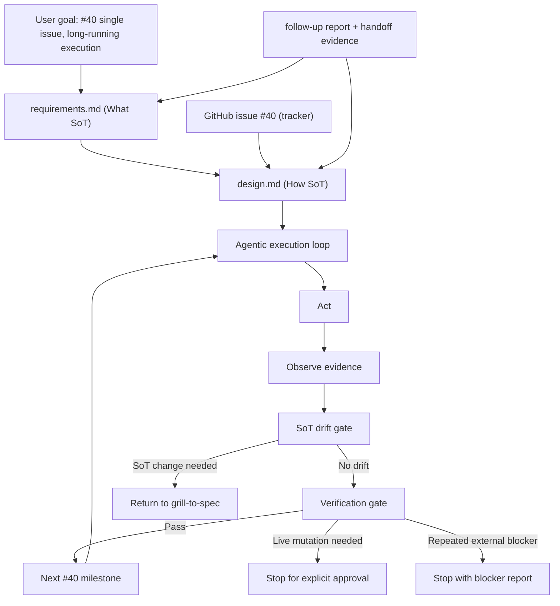

# Architecture Debt Single-Issue Campaign Design Spec

## Overview

이 설계는 GitHub issue #40을 단일 architecture debt tracker로 유지하면서, 승인된 SoT 안에서 장기 실행 agent가 drift 없이 #40 backlog를 순차적으로 상환하도록 만드는 실행 설계입니다.

첫 시작점은 R1 correction campaign입니다. `worker/eval`, `specs` drift, runtime verification scope, #40 evidence wording을 먼저 고정하고, self-check가 통과하면 사용자의 추가 확인 없이 #40 backlog의 다음 항목으로 계속 진행합니다.

## Requirements Reference

- Phase 1 source: `requirements.md`
- Preview companion: 생성하지 않음
- GitHub tracker: issue #40
- 주요 요구사항:
  - #40 하나만 GitHub issue tracker로 사용
  - `requirements.md`는 What SoT, 승인된 `design.md`는 How SoT
  - R1 baseline 고정 후 long-running loop 자동 계속
  - SoT 변경 필요, live mutation 승인 필요, 반복된 외부 blocker에서만 중단
  - API-only verification과 full E2E verification 표현 분리

## Approach Proposal

### 선택된 접근: R1 baseline 먼저, self-check 후 자동 계속

R1 correction을 첫 milestone으로 고정합니다. eval/readiness, specs drift, verification wording을 먼저 정리하면 이후 PR의 evidence language와 stop condition이 안정됩니다. 그 뒤 #40 backlog를 우선순위대로 계속 처리합니다.

선택 이유:

- long-running loop가 무엇을 믿어야 하는지 먼저 고정합니다.
- runtime verification 과장 표현을 먼저 막아 이후 완료 선언이 흔들리지 않습니다.
- 설계 drift가 생겼을 때 멈출 기준이 명확해집니다.
- 사용자 확인 없이 다음 milestone으로 넘어가는 정책과 잘 맞습니다.

### 대안 1: quick-win cleanup 동시 포함

R1과 함께 model connector, CouchDB dead code, compose env cleanup까지 묶는 방식입니다. 빠른 변화는 만들 수 있지만, baseline이 흔들린 상태에서 cleanup이 먼저 진행될 수 있어 완료 판단이 흐려집니다.

### 대안 2: #40 전체 big-bang campaign

Ledger, TargetProfile, k3s, `llm_brain_core`까지 하나의 대형 설계로 다루는 방식입니다. 전체 그림은 강하지만, long-running loop의 첫 failure point가 너무 많아지고 SoT 변경 회귀가 잦아질 위험이 큽니다.

## Architecture



### SoT Layers

| Layer | Artifact | Responsibility |
| --- | --- | --- |
| Requirement SoT | `requirements.md` | What, boundaries, success criteria |
| Design SoT | `design.md` | How, milestones, verification strategy |
| Tracker | GitHub issue #40 | Single issue status and human-visible backlog |
| Evidence log | implementation-created status/evidence notes | Progress and test evidence, not a SoT replacement |

### Execution Contract

The implementation agent consumes the approved `design.md` as one long-running goal. It must not ask the user after each milestone. It continues when:

- the current milestone is complete,
- verification evidence passes,
- the next milestone is already covered by `requirements.md` and `design.md`,
- no live mutation approval is needed,
- no SoT change is needed.

It stops only when:

- implementation evidence contradicts `requirements.md` or `design.md`,
- the next safe step requires live write/delete/disable/deploy/k3s/Docker/systemd/firewall mutation,
- the same external blocker prevents meaningful progress repeatedly,
- all design milestones are complete and evidence is collected.

## Data Flow

```mermaid
sequenceDiagram
    participant Agent as Agentic Loop
    participant SoT as requirements.md + design.md
    participant Issue as GitHub #40
    participant Code as Repo
    participant Tests as Tests/Evidence

    Agent->>SoT: read current SoT before milestone
    Agent->>Issue: read #40 status/backlog
    Agent->>Code: make scoped implementation changes
    Agent->>Tests: run relevant verification
    Tests-->>Agent: pass/fail/evidence
    Agent->>SoT: compare evidence against milestone done criteria
    alt pass and no drift
        Agent->>Issue: update progress if appropriate
        Agent->>SoT: continue to next milestone
    else SoT conflict
        Agent-->>Agent: stop; return to grill-to-spec
    else approval required
        Agent-->>Agent: stop; request explicit approval
    end
```

## Component Details

### R1 Baseline Correction

Purpose:
Stabilize the language and evidence gates used by all later work.

Scope:

- `worker/eval` readiness classification
- `specs` drift matrix
- runtime verification level taxonomy
- #40 status wording alignment

Expected outputs:

- Code/docs/tests that distinguish dev-only eval harness from product readiness gate
- A spec drift status artifact or equivalent checked source that classifies done/partial/stale/superseded/open claims
- Verification wording that separates API-only, queue smoke, and full E2E business verification
- #40 progress update only if the implementation has evidence to support it

Non-goals:

- No live RetiredIndexBridge write/delete/disable
- No live k3s/Docker/systemd/firewall mutation
- No full Ledger or TargetProfile refactor in R1

### Backlog Sequencer

Purpose:
Choose the next #40 item after R1 without asking the user.

Ordering rule:

1. Items that make verification truthful and non-misleading
2. Low-effort cleanup with strong deletion tests
3. High-value architecture refactors
4. k3s public contract hardening, without live migration

The sequencer should prefer small PR-sized changes, but it must keep #40 as the only issue tracker.

### Drift Gate

Purpose:
Prevent the execution loop from rewriting scope by accident.

Checks:

- Does the next action still match `requirements.md`?
- Does the implementation strategy still match `design.md`?
- Does new evidence require a new requirement or changed success criterion?
- Would proceeding require approval-gated live mutation?

Outcomes:

- Continue when all checks pass.
- Return to grill-to-spec when SoT must change.
- Stop for explicit approval when live mutation is required.

### Evidence Gate

Purpose:
Prevent false completion.

Each milestone must include at least one of:

- unit/integration test evidence,
- static guard or contract test evidence,
- read-only runtime evidence,
- public-safe manual evidence with bounded scope.

The gate must label the verification level:

- API shape only
- API + queue smoke
- local unit/contract verification
- read-only runtime verification
- full E2E business verification

## Error Handling

### SoT Conflict

If implementation reveals that `requirements.md` or `design.md` is wrong or incomplete, do not patch around it. Stop and return to grill-to-spec with:

- the conflicting evidence,
- the affected requirement/design section,
- the smallest required decision.

### Live Mutation Required

If the next step requires live write/delete/disable/deploy/k3s/Docker/systemd/firewall mutation, stop before execution. Report:

- exact mutation class,
- why read-only/local evidence is insufficient,
- proposed approval boundary,
- rollback/postcheck expectations.

### Verification Failure

Verification failure is not itself a reason to stop. The agent should diagnose and continue inside the approved SoT. Stop only if repeated failure reveals SoT conflict or external blocker.

### GitHub Issue Drift

If #40 body drifts from source artifacts, source artifacts win. The agent should update #40 only after evidence supports the change.

## Testing Strategy

### R1 Tests and Evidence

Expected verification for R1:

- Targeted `uv` tests for eval/readiness behavior where applicable
- Tests or static checks for verification wording/taxonomy if code/docs expose those labels
- Spec drift artifact checked against known spec files
- Read-only checks for #40 body alignment

### Later Milestones

Later milestones choose tests by area:

| Area | Expected verification |
| --- | --- |
| model connectors | `uv` targeted connector/reranker tests |
| CouchDB dead code | deletion-test suite and CLI import checks |
| compose env | compose config tests and env coverage guard |
| Ledger | ledger boundary/transaction tests, then broader worker tests |
| TargetProfile | Java/Python parity tests |
| k3s public contract | schema/static manifest checks, no live apply |

Full worker or Gradle suites are run when blast radius touches shared behavior.

## TDD Strategy

Code-changing milestones use red -> green -> refactor or an equivalent TDD-first loop:

1. Write or adjust a failing characterization/contract test that captures the debt.
2. Implement the smallest change that satisfies the test.
3. Refactor only inside the approved design boundary.
4. Run targeted verification.
5. Broaden verification when shared interfaces or runtime claims change.

Docs-only or classification-only milestones may use substitute evidence:

- source diff against approved requirements,
- static consistency checks,
- issue body read-back,
- generated status matrix checked against source files.

## Milestones

### M0. SoT and Tracker Baseline

Done when:

- `requirements.md` and `design.md` are present and aligned.
- #40 is the only GitHub issue tracker.
- The implementation agent can identify stop conditions before coding.

Expected evidence:

- Git status showing source artifacts.
- Read-back of #40 tracker status.

### M1. R1 Verification Vocabulary and Eval Baseline

Done when:

- `worker/eval` is classified as dev-only harness, product readiness gate, or explicit open blocker.
- API-only, queue smoke, read-only runtime, and full E2E verification are named separately.
- Any code/docs that currently imply stronger verification are corrected or guarded.

Expected evidence:

- Targeted tests or static checks.
- Source references for changed wording/classification.

### M2. Spec Drift Matrix

Done when:

- Relevant `specs/*` claims are classified as done, partial, stale, superseded, or open.
- Implementation agents have a source artifact to consult before changing code.
- Drift matrix does not expose secrets or private runtime identifiers.

Expected evidence:

- Checked source artifact under the approved spec/docs location.
- Static/read-only validation that major spec files are covered.

### M3. #40 Alignment and Continuation Gate

Done when:

- #40 reflects current status without spawning new issues.
- #40 does not overclaim runtime verification.
- The next backlog item can be selected automatically from the design ordering rule.

Expected evidence:

- GitHub issue read-back.
- Evidence note mapping #40 sections to source artifacts.

### M4. Automatic Backlog Continuation

Done when:

- Agent moves from R1 baseline work to the next highest-priority safe #40 item without user confirmation.
- The chosen next item has a scoped evidence gate.
- Stop conditions are re-evaluated before starting.

Expected evidence:

- Progress/evidence log entry.
- Targeted tests for the next item or documented blocker.

### M5+. Subsequent #40 Debt Items

Done when:

- Each active #40 backlog item is either resolved, narrowed, explicitly deferred, or blocked by a named approval/external condition.
- Completion evidence is present for every resolved item.
- No design drift occurred without grill-to-spec return.

Expected evidence:

- PR/test/evidence links or local artifacts.
- Final #40 status update.

### M17. MCP Single Internal Definition

Done when:

- MCP tool name, public schema, dispatch owner, and handler callable are derived from one internal contract object per tool.
- Public `list_tools()` remains schema-compatible and does not expose handlers or dispatch-only metadata.
- Top-level dispatch, restricted steward write dispatch, and steward read/proposal dispatch use the internal contract/handler source instead of parallel name maps.
- Existing HTTP schema conversion and stdio behavior remain compatible.

Expected evidence:

- Failing-first MCP registry tests that prove schema/owner/handler split is no longer allowed.
- Targeted MCP registry/stdio tests pass.
- Optional `mcp-http` targeted transport/schema test passes when the extra is available.
- Full worker suite is run because MCP dispatch is shared behavior.

### M18. Ledger Area-Object Extraction

Done when:

- A first Ledger area object owns a behavior-preserving side-effect boundary currently hidden behind `Ledger` or a mixin seam.
- Public `Ledger` API compatibility is preserved.
- Existing durable-state, transaction, GC safety, and memory-promotion semantics are unchanged by tests.
- Boundary checks prevent the extracted area from being bypassed through direct inherited mixin calls.

Expected evidence:

- Failing-first Ledger boundary tests or characterization tests.
- Focused Ledger area/core/transaction tests pass.
- Full worker suite is run because Ledger is durable-state authority.
- Any broader Ledger multiple-inheritance removal is explicitly deferred unless already covered by the approved SoT.

### M20. TargetProfile Shared Schema Artifact

Done when:

- A public-safe target profile contract artifact lists each logical profile, backend kind, dataset role, and retired bridge dataset env key.
- Java `TargetProfileRegistry.DEFAULT`, `application.yml`, Python resolver tests, compose, and `.env.example` all match the artifact.
- The artifact contains no physical dataset id, token, or private runtime value.

Expected evidence:

- Failing-first Java/Python parity tests.
- Targeted Java TargetProfile tests pass.
- Targeted Python shadow-worker resolver tests pass.

### M21. RetiredIndexBridge Adapter Placement Guard

Done when:

- Java retired bridge adapter implementation remains under `adapter.ext.retired_index_bridge`.
- Backend-neutral target ports do not depend on retired bridge implementation packages.
- A static architecture test guards against legacy `targetAdapter` or target-port implementation leakage.

Expected evidence:

- Failing-first Java architecture/package-boundary test.
- Targeted Java adapter/architecture tests pass.

### M22. compose SnakeYAML Hardening

Done when:

- Compose env anchor tests parse YAML merge output instead of relying only on string assertions.
- Java ingress services and Python ingress worker resolve the common retired bridge env keys from the shared anchor.
- Runtime-specific live queue/delivery controls remain service-local.

Expected evidence:

- Failing-first or strengthened `ComposeConfigTest` using SnakeYAML.
- Targeted compose config tests pass.

### M23. k3s Public Contract Hardening

Done when:

- `deploy/k3s` public contract files are covered by static tests for public/private boundary, workload inventory, scale-out caveats, NetworkPolicy/CNI caveat, workqueue isolation, and backup/restore rehearsal gates.
- Tests prove no live apply or host mutation is required.

Expected evidence:

- Failing-first static k3s public contract tests.
- Focused worker/static tests pass.

## Agentic Execution Handoff

Use the approved `design.md` as one implementation goal:

```text
Goal: Execute the Architecture Debt Single-Issue Campaign from approved specs/architecture-debt-single-issue/design.md.

Read first:
- specs/architecture-debt-single-issue/requirements.md
- specs/architecture-debt-single-issue/design.md
- GitHub issue #40
- 2026-07-05 follow-up architecture review artifact
- 2026-07-05 orchestrator follow-up handoff artifact

Execution rule:
- Start with M0/M1.
- Continue through milestones without asking the user after each milestone.
- For the current continuation, run M17 before M18.
- After M19, continue with M20-M23 before declaring the #40 campaign development-complete.
- Before each milestone, re-read requirements.md, design.md, and #40.
- Stop only for SoT conflict, explicit live mutation approval, repeated external blocker, or complete success.
- Do not create new GitHub issues.
- Do not perform live write/delete/disable/deploy/k3s/Docker/systemd/firewall mutation without approval.
- Use uv for Python tests and Gradle wrapper/configured Gradle for Java checks.
```

## Open Questions

None. The selected approach is R1 baseline first, then automatic continuation through #40 backlog under the approved SoT.
