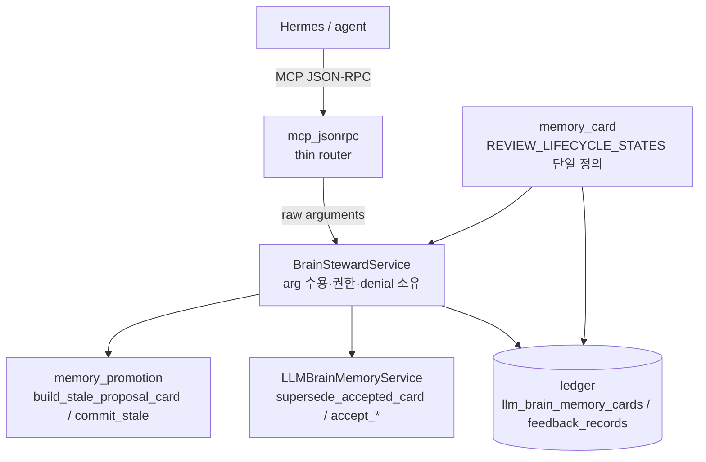

# Brain Steward MCP Hardening Design Spec

## Overview

proposal-only Brain Steward MCP 표면에 (1) supersede/stale **완결 경로**, (2) stale의
**reference-only 저장**, (3) **granular restricted 권한 + audit**, (4) **dispatch/모델 중복 제거**,
(5) **거버넌스/문서 정합**을 더한다. 기존 안전 불변식(authority 불변, fail-closed redaction,
restricted 기본 차단)은 보존하고 강화한다.

## Requirements Reference

- Phase 1 source: `specs/brain-steward-hardening/requirements.md` (사용자 사전 승인)
- 핵심: FR1~FR9. 안전 불변식 보존 + MCP wire 호환 유지가 최상위 제약.

## Architecture

### Boundary rules (유지)

- ledger가 authority. accepted+current만 authoritative.
- proposal은 비-accepted lane만. read/proposal 출력은 safe projection + `assert_public_safe`.
- restricted commit만 authority를 바꾸며 기본 차단·write 이전 fail-closed.

## Component Details

### C1. `memory_card.REVIEW_LIFECYCLE_STATES` (신규 단일 정의, FR1/A3)
- 입력: 없음. 출력: `frozenset({"candidate","suggested_accept","needs_review"})` (모델 상수).
- 의존: 없음(최하위 모델 계층). ledger와 brain_steward가 import.
- brain_steward의 기존 동명 상수와 ledger SQL 리터럴을 이 정의로 대체. ledger 조회는 파라미터
  바인딩으로 동일 집합 사용.

### C2. `memory_promotion.build_stale_proposal_card` (신규 verb, FR2/Q4/A4/S4)
- 입력: `target_card`, `reason`, `timestamp`. 출력: validate 통과한 reference-only stale proposal
  envelope(card_type=`status`).
- 동작: target에서 `brain_id/scope/project/provider`만 참조하고, `card_type="status"`,
  `typed_payload={status_value:"stale", observed_at, expires_at:"", current_authority:target_id}`,
  `source_refs=[]`, `evidence_refs=[]`, `evidence_hashes=[]`, `render_text=""`,
  `derived_from=[target_id]`, lifecycle/judgment/approval=`needs_review`, currentness=`stale`,
  freshness=`historical`, `reason_capsule`(model_reason=redacted reason)을 빌드한다.
- target의 raw `typed_payload`/`source_refs`/`render_text`를 **복제하지 않는다**.
- `validate_memory_card_envelope`로 검증 후 반환(write 없음).

### C3. `memory_promotion.commit_stale` (신규 verb, FR4/S2)
- 입력: `accepted_card`, `timestamp`. 출력: `currentness="stale"`, `freshness="historical"`로
  demote한 dict(write 없음). `commit_supersession`과 동일 패턴(상태 불변식상 stale은 superseded_by
  불요).
- 호출부가 반환 dict를 `upsert_llm_brain_memory_card`에 넘겨 확정.

### C4. `BrainStewardService` 변경 (FR2/3/4/5/6/7/8)
- `stale_mark`: C2 verb를 호출해 reference-only proposal을 만들고 id에 reason hash를 포함
  (`_sha16(target, "stale", reason_hash)`).
- `supersede_commit(*, proposal_memory_id, approved_by, decision_id)`: restricted. proposal에서
  `steward_target_memory_id`(old)와 replacement 후보를 복원해 `LLMBrainMemoryService
  .supersede_accepted_card`로 확정. proposal은 commit 후 lifecycle을 종료 상태로 표시(또는 큐에서
  제외되는 상태로 전이). audit feedback record 기록.
- `stale_commit(*, proposal_memory_id, approved_by, decision_id)`: restricted. proposal의
  target을 로드해 C3 `commit_stale`로 demote하고 upsert. audit feedback record 기록.
- 권한: `StewardPermissions(allow_review_commit: bool=False, allow_auto_accept: bool=False)`로 교체.
  `_guard_restricted(capability)`가 capability별로 검사. approve/reject/supersede_commit/
  stale_commit → `allow_review_commit`; auto_accept → `allow_auto_accept`.
- denial: `_restricted_denied(tool)` 가 `brain_steward_restricted_denied.v1` 페이로드를 **service에서**
  반환. dispatch는 그대로 전달.
- arg 수용: `accept_source_span(arguments)` 가 source_span 필드 선택을 service에서 수행
  (dispatch의 `_STEWARD_SOURCE_SPAN_KEYS` 제거). 또는 각 proposal 메서드가 raw arguments mapping을
  받아 내부에서 선택.
- projection: `_base_projection(card)` 공유 후 `_authority_item`/`_review_item`이 전용 필드만 추가
  (출력 동일).

### C5. `mcp_jsonrpc._dispatch_steward_tool` 변경 (FR7/8)
- raw `arguments`를 service 메서드로 전달하는 얇은 라우터. source_span 튜플/필드 선택 제거.
- restricted denied는 service 반환을 그대로 `_tool_result`로 감쌈(try/except 손-구성 제거 또는 최소화).
- 신규 tool 2개 라우팅: `memory_supersede_commit`, `memory_stale_commit`(restricted).

### C6. `mcp_tools.list_tools` 변경 (FR3/4/9)
- `memory_supersede_commit`, `memory_stale_commit` 스키마 추가([steward/restricted]).
  입력: `proposal_memory_id`, `approved_by`, `decision_id`(+ supersede는 필요한 필드). 기존 8개 wire
  스키마는 불변.

### C7. `KnowledgeSearchService` 변경 (FR5)
- `allow_restricted_steward`(=review_commit)과 신규 `allow_steward_auto_accept`(기본 False)를
  `StewardPermissions`로 매핑해 `brain_steward()`에 주입. 기본값 모두 False.

### C8. 문서 (FR9)
- `docs/contracts/brain-steward-mcp.md`: 완결 경로(supersede/stale commit), granular 권한, stale
  reference-only 저장, audit, 잔여 한계(free-text) 갱신.
- `specs/context-authority-roadmap/design.md`: Hermes read-only 문구에 본 spec을 sanctioned
  proposal-only extension으로 참조하는 cross-reference 1줄 추가.

## Data Flow

### Flow A: stale 제안 → 확정
1. `memory_stale_mark(memory_id, reason)` → C2가 reference-only status proposal 빌드 →
   `_persist_proposal`(fail-closed pre-scan) → review_queue 등장. 원본 불변.
2. (restricted) `memory_stale_commit(proposal_memory_id, ...)` → target 로드 → C3 `commit_stale` →
   `upsert_llm_brain_memory_card`(target demote) → feedback record. proposal은 commit 표시되어 큐에서
   제외.

### Flow B: supersede 제안 → 확정
1. `memory_supersede_propose(old_memory_id, source_span)` → 교체 후보 proposal(supersedes=[old]).
2. (restricted) `memory_supersede_commit(proposal_memory_id, ...)` → `supersede_accepted_card`
   (new accept + old demote) → feedback record.

## Error Handling

- target/proposal 미존재 → 정적 메시지 ValueError → JSON-RPC `-32602`(타입명만).
- read-only ledger에서 commit/proposal write → `_guard_writable` ValueError(write 이전).
- 권한 부족 → service가 denied 페이로드 반환(write 없음). auto_accept는 별도 capability.
- proposal이 supersede/stale commit 대상이 아님(kind 불일치, 이미 accepted, source_refs 빈
  candidate 등) → ValueError로 fail-closed.
- commit 대상 old card가 이미 superseded/stale → idempotent 또는 명확한 거부(테스트로 고정).
- 어떤 출력도 raw/private 누출 시 `assert_public_safe`가 fail-closed.

## Testing Strategy

- 단위: 각 신규 verb(`build_stale_proposal_card`, `commit_stale`)와 service 메서드.
- 계약: dispatch round-trip(read/proposal/commit/denied) 형태 보존, wire 스키마 불변.
- 안전 회귀: stale proposal이 target raw ref/typed_payload를 저장하지 않음(envelope_json 검사);
  (target,reason) 멱등; commit이 기본 차단·flag시에만 동작; auto_accept가 review_commit만으로 안 열림;
  commit이 feedback record 기록; 완결 후 proposal이 review_queue에서 제외·target demote.
- 전역: `cd worker && uv run pytest -q` 전체 green 유지(기존 1276 + 신규).

## TDD Strategy

모든 milestone은 red→green→refactor. 각 milestone에서: 실패 테스트 먼저 → 최소 구현 → 전체 worker
테스트 green → refactor. docs milestone(M7)은 narrow 예외(substitute evidence = 소스/계약 일관성
점검). 안전 불변식 약화 리팩터 금지.

## Milestones

agentic-execution이 act→observe→adjust로 소비. 각 milestone은 done 정의 + 기대 evidence 포함.
순서는 의존성 기반(M1→M2→M3→M4→M5→M6→M7) 권장.

- **M1 — 단일 review-lifecycle 정의(FR1/A3).** done: `memory_card.REVIEW_LIFECYCLE_STATES` 신설,
  ledger 조회와 brain_steward 적격성이 이를 참조. evidence: 중복 제거 + 큐/적격성 일치 테스트 green,
  전체 green.
- **M2 — reference-only stale proposal(FR2/Q3/Q4/A4/S3/S4).** done: `build_stale_proposal_card` verb +
  `stale_mark`가 target raw 미복제, id가 (target,reason) 멱등. evidence: 저장 envelope에 target
  typed_payload/source_refs 부재 테스트, 멱등/원본불변 테스트 green.
- **M3 — supersede/stale 완결 경로(FR3/FR4/S2).** done: `commit_stale` verb, restricted
  `memory_supersede_commit`/`memory_stale_commit` tool 배선. evidence: 기본 차단; flag 시 old card
  demote + proposal 큐 제외 테스트; supersede는 new accept + old superseded.
- **M4 — granular 권한 + commit audit(FR5/FR6/S5/S6).** done: `StewardPermissions`(review_commit/
  auto_accept 분리), commit이 feedback record 기록. evidence: auto_accept가 review_commit만으론
  안 열림; commit feedback record 조회 가능; 기본 모두 차단 테스트.
- **M5 — thin dispatch + service-owned denial/arg(FR7/FR8/A1/A2).** done: dispatch가 raw arguments
  전달·denied 페이로드 service 소유, `_STEWARD_SOURCE_SPAN_KEYS` 제거. evidence: dispatch round-trip
  과 denied/wire 형태 불변 테스트 green.
- **M6 — 공유 base projection(FR8/A5).** done: `_base_projection` 추출, `_authority_item`/
  `_review_item` 출력 동일. evidence: projection 출력 동등성 테스트 green.
- **M7 — 거버넌스/문서(FR9/S1/S7).** done: 본 spec 확정, contract 문서 갱신, roadmap cross-reference
  1줄. evidence: 소스/계약 일관성 점검(narrow 예외, 코드 변경 없음).

## Open Questions

없음. 범위 밖(YAGNI): full permission-profile/identity 바인딩, proposal-create 단위 audit,
brain_query projection 통합, free-text 잔여 누출(구조적 projection으로 완화, denylist 한계는 문서화).
