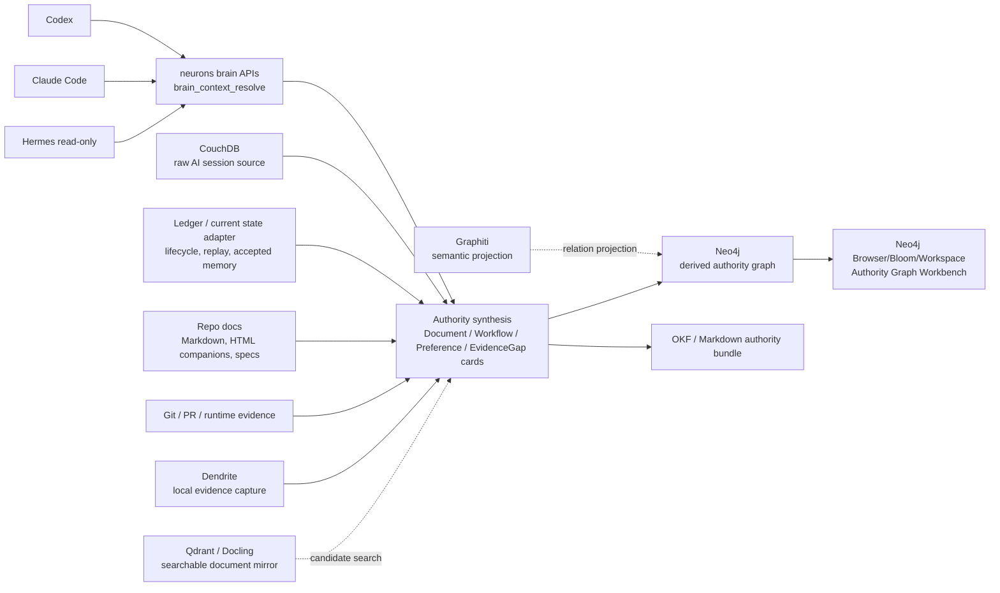

# Neurons Context Authority Roadmap Design Spec

## Overview

`neurons`를 단순 memory/retrieval system이 아니라 Context Authority Engine으로
확장한다. Agent는 `brain_context_resolve`를 통해 현재 믿어도 되는 context를 받고,
사람은 Neo4j Browser/Bloom/Workspace를 Authority Graph Workbench로 사용해 같은
authority graph를 검토한다.

핵심 설계 원칙은 agent-facing product API와 human-facing graph workbench를 분리하되,
둘이 동일한 authority synthesis 결과를 보게 만드는 것이다.

## Requirements Reference

- Phase 1 source: `specs/context-authority-roadmap/roadmap.md`
- Approval: 사용자가 현재 로드맵을 승인함. 이번 흐름은 `grill-to-spec`
  변형으로, `requirements.md` 대신 승인된 `roadmap.md`를 Phase 1 source로 둔다.
- Preview companion:
  `.harnesskit/optimal-response-out/content/optimal-response-20260627T095959-neurons-context-authority-architecture.html`
- Prior specs:
  - `specs/llm-brain-core-v1/requirements.md`
  - `specs/llm-brain-core-v1/design.md`
  - `specs/llm-brain-core-v1/implementation-matrix.md`
  - `specs/llm-brain-bulk-semantic-lane/requirements.md`
  - `specs/llm-brain-bulk-semantic-lane/design.md`
  - `docs/specs/2026-06-21-qdrant-docling-searchable-mirror/requirements.md`
  - `docs/specs/2026-06-24-qdrant-mirror-cutover/requirements.md`
- Core approved requirements:
  - `neurons` owns authority synthesis and agent-facing brain APIs.
  - Agent consumers call `brain_context_resolve`, not Neo4j/Qdrant/Graphiti
    directly as the default path.
  - Neo4j is promoted from derived graph index to Authority Graph Workbench
    substrate, but not to raw source of truth.
  - Graphiti remains semantic extraction/projection path.
  - Qdrant/Docling remains searchable document mirror, not canonical memory.
  - Ledger/current state adapter owns lifecycle/currentness seam; PG/SQLite are
    storage adapters hidden behind authority stores.
  - Dendrite captures local evidence and source locators; it does not decide
    document/workflow/preference authority.
  - RAGFlow is not an active Context Authority component.
  - Hermes is read-only consumer in this roadmap; self-improvement/proposal loop
    is out of scope. (Cross-ref: the proposal-only Brain Steward surface in
    `specs/brain-steward-hardening/` is a sanctioned extension — agents only
    propose; authoritative truth still changes solely through restricted
    human/manual commit, so "agents do not decide authority" still holds.)
  - Custom UI is deferred until Neo4j workbench leaves a concrete screen gap.

## Approach Proposal

### Approved Direction: `neurons` Authority API + Neo4j Workbench Projection

`neurons` synthesizes authority cards and Context Packs. The same synthesis result
is projected into Neo4j so humans can inspect graph shape, evidence links,
currentness, and conflicts with Browser/Bloom/Workspace. Agents still use
`brain_context_resolve` as the default interface.

This direction is selected because it removes immediate custom UI pressure while
keeping product authority in application policy rather than in Cypher queries or
graph schema conventions.

Pros:
- Keeps existing `neurons` ownership boundary intact.
- Lets Neo4j do what it is good at: graph traversal, visual inspection, Cypher,
  workbench UI, and MCP/debug graph access.
- Avoids building a custom operations UI before real screen gaps are known.
- Gives agents a stable product API that can join graph hits with ledger state,
  document mirror status, workflow contracts, user preferences, privacy policy,
  and evidence gaps.

Cons:
- Requires projection consistency checks between Context Pack output and Neo4j.
- Requires explicit graph schema discipline so Browser/Bloom views stay useful.
- Requires clear degraded behavior when Neo4j, Graphiti, or Qdrant is stale or
  unavailable.

### Alternative A: Neo4j-Centered Product Surface

Neo4j Browser/Bloom/Workspace and Neo4j MCP become the main operator and agent
interface. `neurons` becomes a thinner ingest/projection service.

Decision: rejected for this roadmap. It would make early UI feel faster, but
would push document authority, workflow defaults, privacy policy, and
agent-start response contracts into graph conventions that are harder to test
and version as product behavior.

### Alternative B: Custom UI in Parallel

Build a dedicated Context Authority UI while implementing M1-M6.

Decision: deferred. It adds frontend scope before proving which Neo4j workbench
screens are actually insufficient. Custom UI can be reconsidered after M6 when
API contracts, projection schema, and operator workflows are stable.

## Architecture



### Boundary Rules

- Agent-facing integrations call `neurons` brain APIs.
- Neo4j is a derived authority graph and workbench surface, not raw truth.
- Neo4j MCP is allowed for operator/debug and advanced graph inspection, not as
  the default coding-agent context resolver.
- Graphiti writes/reads semantic graph projections but does not decide product
  authority.
- Qdrant returns recall/search candidates that must be joined with document and
  lifecycle authority before product use.
- Ledger/current state adapter stores accepted/current lifecycle state behind an
  interface; callers do not couple to PG/SQLite.
- HTML outputs are inventory items with explicit status such as generated
  companion or human preview.
- Archive/delete recommendations remain proposals.
- RAGFlow is not reintroduced as a Context Authority dependency.

## Data Flow

### Flow 1: Agent-Start Context Pack

1. Agent calls `brain_context_resolve` with repo/task scope.
2. Resolver loads raw/session references, current state, repo document inventory,
   workflow evidence, preference evidence, graph/search status, and live evidence
   availability.
3. Authority synthesis produces:
   - `DocumentAuthorityCard`;
   - `WorkflowContractCard`;
   - `PreferenceRuleCard`;
   - `EvidenceGap`;
   - boundary guardrail summary.
4. Context Pack builder returns compact/full/degraded response according to
   consumer and token budget.
5. Response separates canonical authority from derived index/mirror freshness.

### Flow 2: Human Neo4j Workbench Inspection

1. Authority synthesis emits graph projection events or snapshots.
2. Projection writer upserts authority nodes and evidence edges into Neo4j.
3. Neo4j Browser/Bloom/Workspace shows:
   - documents and statuses;
   - source/evidence links;
   - workflow contracts and preference scopes;
   - stale/superseded/archive candidates;
   - unresolved evidence gaps;
   - projection freshness.
4. Operator can use Cypher or Neo4j MCP for inspection/debug.
5. Any operator decision that changes product authority must flow back through
   `neurons` authority/state APIs, not direct graph mutation.

### Flow 3: Document Authority Synthesis

1. Repo inventory finds Markdown, HTML, generated companions, implementation
   matrices, review docs, and generated human-readable artifacts.
2. Evidence join connects documents to sessions, commits, PRs, live/runtime
   evidence, and source file metadata when available.
3. `DocumentAuthorityCard` assigns status, reason, confidence, evidence refs,
   and currentness.
4. Archive/delete output is an `archive_candidate` proposal only.
5. Context Pack and Neo4j projection consume the same card.

### Flow 4: Workflow and Preference Authority

1. Skill files, repo instructions, sessions, and correction history produce
   workflow/preference evidence.
2. Synthesis separates repeatable workflow defaults from personal preferences.
3. Cards include scope, evidence, confidence, reason, exceptions, and applies
   conditions.
4. Context Pack exposes the applicable subset for the current repo/task.
5. Neo4j projection exposes scope and evidence edges for human review.

### Flow 5: Local Evidence and Federation

1. Dendrite captures local file/session/git evidence with source locators,
   hashes, redaction hints, and sync policy hints.
2. `neurons-local` consumes local capture artifacts and can answer local context
   offline.
3. `neurons-local` emits central-safe sync artifacts.
4. `neurons-central` dedupes by device/repo/file identity and synthesizes
   federated authority.
5. Raw PC file bodies and graph DB files are not centrally synced.

## Component Details

### `brain_context_resolve`

Purpose:
- default agent-start product API;
- returns Context Authority Pack with authority sections and evidence gaps;
- hides backend storage/index details.

Inputs:
- repo/workspace identity;
- task or current request;
- optional current files;
- desired response mode: compact/full;
- consumer type: Codex, Claude Code, Hermes.

Outputs:
- current document authorities;
- workflow contracts;
- preference rules;
- graph/search/mirror freshness status;
- evidence gaps and next actions;
- boundary guardrails.

Dependencies:
- authority card stores;
- raw session store;
- ledger/current state adapter;
- document inventory;
- Qdrant/search adapter;
- Neo4j projection status;
- live evidence probes when available.

### Authority Card Stores

Purpose:
- provide backend-neutral storage/read seam for current authority cards;
- hide concrete state adapter choice.

Core records:
- `DocumentAuthorityCard`;
- `WorkflowContractCard`;
- `PreferenceRuleCard`;
- `EvidenceGap`;
- `ProjectionCheckpoint`.

Required fields:
- stable id;
- scope;
- status/type;
- reason;
- evidence refs;
- confidence;
- freshness/currentness;
- source timestamps or hashes;
- generated artifact markers when relevant.

### Neo4j Authority Projection

Purpose:
- make authority results inspectable in Neo4j Browser/Bloom/Workspace;
- provide derived relationship graph for debugging and operator workflows.

Projected nodes:
- `Repo`;
- `Document`;
- `DocumentSnapshot`;
- `AuthorityCard`;
- `WorkflowContract`;
- `PreferenceRule`;
- `Evidence`;
- `EvidenceGap`;
- `Session`;
- `Commit`;
- `PullRequest`;
- `Device`;
- `SyncArtifact`.

Projected relationships:
- `HAS_DOCUMENT`;
- `HAS_STATUS`;
- `SUPPORTED_BY`;
- `SUPERSEDES`;
- `GENERATED_FROM`;
- `MENTIONED_IN`;
- `TOUCHED_BY`;
- `APPLIES_TO`;
- `CONFLICTS_WITH`;
- `EMITTED_BY`.

Rules:
- projection is idempotent;
- graph nodes carry `projection_version` and `source_card_id`;
- direct graph edits do not become authority unless imported through explicit
  `neurons` approval/state paths;
- projection lag is reported as status, not silently hidden.

### Graphiti Adapter

Purpose:
- semantic episode/entity/relation extraction and Neo4j adapter path.

Rules:
- not in hot path for expensive extraction;
- never the product authority layer;
- unavailable/stale Graphiti status degrades relation recall, not canonical
  authority.

### Qdrant / Docling Mirror

Purpose:
- searchable mirror for PDF/doc/document fuzzy recall.

Rules:
- search hits are candidates;
- every product answer using a hit must join to document authority/currentness;
- mirror unavailable state appears as degraded search status.

### Dendrite Capture Boundary

Purpose:
- capture local source evidence and locators.

Rules:
- no document/workflow/preference authority decisions;
- no central raw file body replication by default;
- emits evidence that later becomes `Session -> File` and `Commit -> File`
  style edges.

### OKF / Markdown Authority Bundle

Purpose:
- reviewable human/agent-readable authority artifact.

Layout:

```text
context-authority/
  index.md
  log.md
  documents/
  workflows/
  preferences/
  evidence-gaps/
```

Rules:
- includes source, evidence, status, confidence, and generated marker fields;
- drift between bundle, Context Pack, and Neo4j projection is detectable;
- bundle is not a replacement for runtime authority state.

## Error Handling

### Missing or Stale Source Evidence

If repo docs, sessions, Git, PR, or live/runtime evidence cannot be verified,
`brain_context_resolve` returns an evidence gap with severity and suggested
action. It does not invent authority.

### Neo4j Unavailable

Context Pack generation continues from canonical stores and state adapters.
Response includes projection status `unavailable` or stale. Human workbench is
degraded, but agent-start authority can still function.

### Graphiti Extraction Lag

Graphiti lag degrades semantic relation richness. It does not block document,
workflow, or preference authority cards if card evidence exists.

### Qdrant Mirror Unavailable

Document fuzzy recall degrades. Existing document authority cards remain usable.
Responses that would have depended on fuzzy document recall include a search
degradation field.

### Conflicting Authority Evidence

Conflicts become explicit evidence gaps or conflict edges. The system must show
why a card won or why no card can safely win.

### Unsafe Archive/Delete

Archive/delete recommendations remain proposal-only. No automatic deletion or
cleanup is triggered by this roadmap.

### Boundary Violation

If a code path lets agent consumers bypass `neurons` and call Neo4j/Qdrant/
Graphiti as the default context source, tests should fail. Operator/debug paths
must be clearly named and separate.

## Testing Strategy

### Contract Tests

- `brain_context_resolve` returns authority sections for a real repo scope.
- Compact/full/degraded modes preserve required status fields.
- Codex, Claude Code, and Hermes consume the same read-only product contract.
- Backend implementation details do not leak as required agent behavior.

### Authority Synthesis Tests

- Markdown source and HTML/generated companion are not confused.
- Document status includes reason, confidence, and evidence refs.
- Workflow contract cards include scope, evidence, confidence, reason, and
  exceptions.
- Preference cards are separate from workflow contracts.
- Archive candidates are proposals only.

### Neo4j Projection Tests

- Authority cards project to stable Neo4j nodes/edges.
- Projection is idempotent.
- Projection status/checkpoint is returned in Context Pack status.
- Neo4j workbench projection remains consistent with API output.
- Direct Neo4j graph state never wins over authority card state.

### Search and Mirror Tests

- Qdrant hits require document authority join before product use.
- Qdrant unavailable produces degraded search status.
- Graphiti unavailable/stale produces degraded graph status.

### Boundary Regression Tests

- Agent-facing API does not require direct Neo4j/Qdrant/Graphiti calls.
- RAGFlow is not introduced as a core Context Authority dependency.
- Dendrite capture does not assign authority statuses.
- Raw PC file bodies and graph DB files are not synced for federation.
- Hermes self-improvement/proposal loop is not added.

### Runtime Evidence Tests

- Runtime claims about deployed `neurons` remain evidence gaps unless verified
  against the approved Ubuntu runtime surface.
- Compose baseline work can run in parallel with M1 without implying production
  k3s migration.

## TDD Strategy

Default for code-changing milestones is red -> green -> refactor.

For each milestone:

1. Write failing contract/boundary tests for the user-visible behavior.
2. Add or adapt the smallest authority model/API/projection seam needed.
3. Make tests pass without widening ownership boundaries.
4. Refactor only after behavior and boundary tests are green.
5. Run worker tests with `uv`.
6. Run root service checks with the configured Gradle/JDK path when JVM code or
   repo-wide guardrails are touched.

Docs-only edits are the narrow exception. Substitute evidence is self-review
plus source/preview consistency checks.

## Milestones

### M1: Project Context Authority MVP

Done evidence:
- `brain_context_resolve` returns authority sections for `neurons`.
- MCP smoke proves a coding agent receives the Context Pack.
- Codex/Claude Code/Hermes are equal read-only consumers.
- First authority nodes/edges are visible in Neo4j workbench.
- Runtime claims without Ubuntu evidence appear as gaps.
- Boundary cross-check passes.

### M2: Document Authority Synthesis

Done evidence:
- `DocumentAuthorityCard` assigns status, reason, confidence, and evidence refs.
- Markdown source and HTML/generated companion are correctly distinguished.
- Archive/delete remains proposal-only.
- Context Pack and Neo4j projection consume the same cards.

### M3: Workflow Contract Memory

Done evidence:
- Workflow contracts are derived from skill files and session evidence.
- Contracts include scope, evidence, confidence, reason, and exceptions.
- No skill update/proposal loop is introduced.

### M4: User Preference Memory

Done evidence:
- Preference rules are scoped and confidence-bearing.
- Preferences are separated from workflow contracts.
- Context Pack only applies relevant preferences for the current repo/task.

### M5: OKF / Markdown Authority Bundle

Done evidence:
- Bundle export includes source, evidence, status, confidence, and generated
  artifact markers.
- Bundle diff/review works through Git.
- Bundle, Context Pack, and Neo4j projection drift can be detected.

### M6: Context Pack API Hardening

Done evidence:
- Agent-specific smokes pass.
- Compact/full/degraded response contracts are tested.
- Neo4j projection remains consistent with API output.
- Backend boundary guardrail tests pass.

### M7: Dendrite Local Evidence Capture

Done evidence:
- `Session -> File` and `Commit -> File` edge inputs are reliably available.
- Raw local file bodies remain local by default.
- `neurons-local` can consume capture artifacts later.

### M8: neurons-local per-PC Brain

Done evidence:
- One PC can answer local context questions offline.
- Local node emits central-safe sync artifacts.
- Local privacy policy is enforced.

### M9: neurons-central Federation

Done evidence:
- Central authority can merge multiple device artifacts.
- Conflicts are explainable.
- Raw PC file bodies and graph DB files are not synced.

### M10: Repo Style Profile

Done evidence:
- Style claims link to files, commits, sessions, and repo scope.
- System distinguishes user preference from accidental historical code.

### Infra-A: Compose Baseline / Hardening

Done evidence:
- Runtime is reproducible enough for Context Authority work.
- Compose remains near-term operational target.
- Work does not imply production k3s migration.

### Infra-B: k3s PoC

Done evidence:
- Non-production canary proves orchestration fit.
- Stateful DB migration is not first.
- Rollback to compose remains straightforward.

## Open Questions

- Exact Neo4j projection schema naming can be refined during M1 without changing
  the approved boundary.
- Whether Bloom perspectives are worth maintaining manually or generated from
  projection metadata should be decided after first M1 workbench use.
- The concrete storage adapter for authority card stores remains an
  implementation decision behind the ledger/current state adapter seam.
- Custom UI should remain deferred until a repeated workbench gap is observed
  after M6.

## Handoff to Agentic Execution

After this `design.md` is approved, implementation should move to
`agentic-execution` as one long-running goal. `agentic-execution` consumes this
design and its milestone evidence gates. If implementation discovers that
roadmap/design source-of-truth needs to change, it must return to
`grill-to-spec` rather than rewriting the SoT inside the execution loop.
