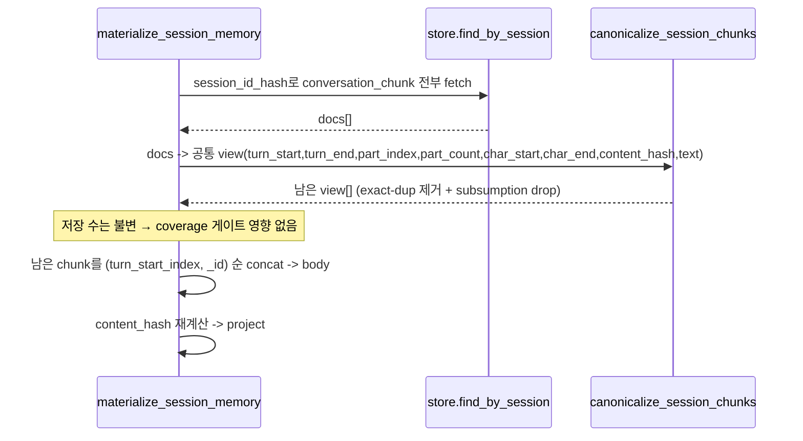

# Hermes Chunk Overlap Resolution Design Spec

## Overview

neurons의 canonical session-memory build 경로(M3 `materialize_session_memory`)가 같은 세션의
`conversation_chunk`들을 dedup 없이 concat하는 탓에, 재전송된 "자란" Hermes 세션이 겹치는
chunk(짧은+긴)를 둘 다 recall에 노출한다. 이를 막기 위해 M3 materialize 단계에 **subsumption +
exact-dup canonicalization**을 적용한다. 정책은 regeneration 경로의 기존 로직과 동일하게 두고,
가능하면 공유 pure 함수로 추출해 일관성을 보장한다. 원본 CouchDB chunk는 삭제하지 않는다.

## Requirements Reference

- Phase 1 source: `requirements.md`
- 핵심: canonical M3에서 in-memory subsumption(긴 chunk가 짧은 chunk의 turn 윈도우+텍스트를
  포함하면 drop) + exact-dup 제거 후 concat. coverage 게이트 불변, 원본 비삭제, dendrite 무변경,
  worker Python 한정.

## Approach Proposal

### 선택안 A (채택): M3 materializer in-memory canonicalization (regen 로직 재사용)

`materialize_session_memory`의 fetch→sort→concat 사이에 canonicalization 단계를 삽입. regen 경로의
subsumption/exact-dup 정책을 **공유 pure 함수**로 추출해 양쪽이 동일 정책을 쓰게 한다.

- 장점: recall substrate(CouchDB→session-memory)를 직접 고침. 이미 검증된 정책 재사용 →
  정합·저위험. 원본 비삭제(가역). coverage/ingress/Java/dendrite 무변경.
- 단점: 공유 함수 추출 시 두 record shape(M3 CouchDB doc vs regen record)을 공통 view로 어댑트해야 함.

### 선택안 B (기각): chunk-level supersede 필드 + delivery-time supersede

CouchDB chunk 스키마에 `supersedes` 추가 + 새 chunk가 옛 chunk를 포함하면 옛 것을 superseded로
표시, materialize/find_by_session가 필터. 스키마+쓰기경로+필터 신설로 범위가 크고, 원본 상태를
변경(가역성↓). M3 dedup만으로 recall이 깨끗해지므로 과함.

### 선택안 C (기각): Java RAGFlow `supersedePriorVersions` 활성화

projection 레이어(RAGFlow)만 정리. 기본 off + `logical_document_id` 필요. **CouchDB M3 substrate는
그대로 중복**이라 canonical recall이 안 깨끗해짐. 부적합.

**결정: A.** substrate 직접 수정 + 기존 정책 재사용 + 비파괴.

## Architecture

```mermaid
flowchart LR
  FS[find_by_session<br/>session_id_hash] --> CH[conversation_chunk docs]
  CH --> CAN{canonicalize_session_chunks<br/>(공유 pure 함수)}
  CAN -->|exact-dup 제거 + subsumption drop| KEEP[남은 chunk]
  KEEP --> SORT[sort by turn_start_index, _id]
  SORT --> BODY[concat -> session-memory body]
  BODY --> PROJ[project (RAGFlow/Qdrant)]
  REGEN[memory_regeneration<br/>_canonicalize_session_chunks_for_memory] -. 같은 정책 .-> CAN
```

### Module Boundaries

| 모듈 | 변경 | 책임 |
| --- | --- | --- |
| `session_memory/chunk_overlap.py` (신규 or 기존 모듈 내) | `canonicalize_session_chunks(view[]) -> view[]`: exact-dup + subsumption pure 함수 | overlap 정책 단일 구현 |
| `couchdb_source/session_memory_materializer.py` | `materialize_session_memory`가 concat 전 canonicalize 호출(CouchDB doc → 공통 view 어댑트) | canonical M3 build |
| `session_memory/memory_regeneration.py` | (선택) `_canonicalize_session_chunks_for_memory`를 공유 함수로 위임(테스트 green 시) | regen 정책 일원화 |
| Java ingress / dendrite | 변경 없음 | — |

## Data Flow



## Component Details

### `canonicalize_session_chunks(chunks: Sequence[ChunkView]) -> list[ChunkView]` (공유 pure)
- 입력: 한 세션의 chunk view 시퀀스. `ChunkView` = 최소 공통 필드(turn_start_index,
  turn_end_index, part_index, part_count, char_start, char_end, content_hash, text/redacted_text).
- 1단계 exact-dup: `(content_hash, turn_start_index, turn_end_index, part_index, part_count,
  char_start, char_end[, redaction_version])` 동일하면 1개만 유지.
- 2단계 subsumption: chunk A가 chunk B의 turn 윈도우를 strict 포함(A.turn_start<=B.turn_start,
  A.turn_end>=B.turn_end, 진부분집합)하고 A.text가 B.text(sanitized)를 포함하면 B를 drop.
- regen 경로의 기존 predicate와 동일 의미(동일 정책). 순수 함수(부수효과 없음).

### `materialize_session_memory` 수정
- fetch한 conversation_chunk doc들을 `ChunkView`로 매핑 → `canonicalize_session_chunks` 호출 →
  남은 것만 기존 sort/concat. coverage 카운트는 저장 doc 기준이라 영향 없음(잉여만 제거).
- tool_evidence_bundle 등 다른 doc 타입은 기존대로(이 규칙은 conversation_chunk에 한정).

### (선택) `memory_regeneration._canonicalize_session_chunks_for_memory` 위임
- 기존 record를 `ChunkView`로 어댑트해 공유 함수에 위임. 그 경로의 기존 테스트가 green이면 적용,
  아니면 M3만 적용하고 regen은 후속(미결정 항목).

## Error Handling

| 시나리오 | 처리 |
| --- | --- |
| chunk 0개/1개 | canonicalize는 그대로 반환(무동작). 기존 동작 유지. |
| 겹치지 않는 chunk | 아무 것도 drop 안 함. 전부 concat. |
| 부분 겹침(turn 윈도우 교차하나 포함 아님) | subsumption 미적용(보수적). 둘 다 유지(기존 동작). |
| text 미포함(윈도우만 포함) | subsumption 미적용(text 포함 조건 불충족 → drop 안 함). regen과 동일. |
| coverage 미달 | 기존 `materialization_loss` 그대로(저장 수 기준, canonicalize 무관). |

## Testing Strategy

- `cd worker && uv run pytest -q`. 신규/갱신 테스트는 worker tests에 추가.
- 케이스:
  1. subsumption: 한 세션에 짧은(turn 1-2) + 긴(turn 1-4, 1-2 텍스트 포함) chunk → materialized
     body에 긴 것만, 짧은 것 내용 중복 없음.
  2. exact-dup: 동일 chunk 2개 → 1개만 반영.
  3. non-overlap: turn 1-2 + 3-4 → 둘 다 보존, 순서대로 concat.
  4. partial-overlap(포함 아님) → 둘 다 보존(보수적).
  5. coverage 불변: 저장 chunk 수 기준 `fully_materialized` 판정 유지.
  6. 공유 함수 단위 테스트(pure): 위 정책을 직접 검증.
  7. regression: 기존 materializer/regen/recall 테스트 green.
- evidence: 위 green + (선택) 합성 CouchDB store fixture로 end-to-end materialize 본문 검증.

## TDD Strategy

red -> green -> refactor. 공유 pure 함수와 M3 통합을 red 테스트 선작성 후 구현. regen 위임은
기존 테스트를 특성화로 삼아 behavior-preserving 확인(green 유지 시에만 적용).

## Milestones

- M1: `canonicalize_session_chunks` 공유 pure 함수 + 단위 테스트(exact-dup/subsumption/non-overlap/
  partial). done: 함수 테스트 green.
- M2: `materialize_session_memory`에 통합(ChunkView 어댑트 + 호출) + coverage 불변 + materialize
  레벨 테스트. done: M3 dedup 테스트 green + 기존 materializer 테스트 green.
- M3(선택): regeneration 경로를 공유 함수로 위임. done: regen 기존 테스트 green(behavior 보존).
  위험하면 skip하고 Open Questions로 남김.
- M4: 전체 `uv run pytest -q` green + 합성 fixture end-to-end 본문 검증.

## Open Questions

- regeneration 경로 위임 여부(M3 선택). 그 경로 테스트가 green으로 보존되면 일원화, 아니면 M3만.
- chunk-level supersede 필드(이력 링크)·삭제형 정리는 이번 scope 밖(YAGNI). 필요 시 별도 grill.
- 실제 런타임 재투영(L3)은 별도 승인.

## Review Feedback Log

- (초안) grill-to-spec 자문자답 + 5개 sonnet 리서치(ingress/worker-delivery/session-memory/
  supersede-dedup/contracts) 근거. 핵심: regen 경로엔 이미 subsumption이 있으나 canonical M3엔
  없음 → M3에 동일 정책 적용이 최소·정합 해결. dendrite/Java/ingress 무변경.
