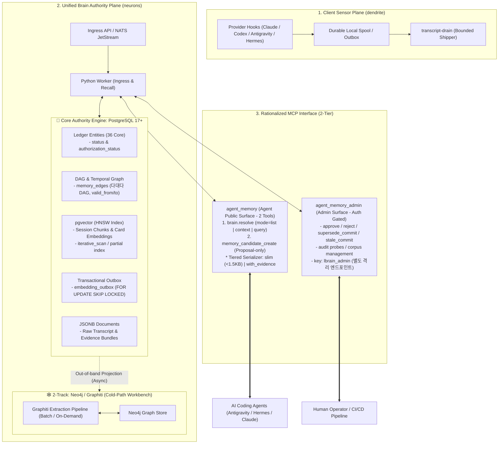

# LBrain Architecture Rationalization: Design & Technical Specification (v2.1)

- **Status**: Approved for Implementation
- **Date**: 2026-09-01
- **Target Repository**: `neurons` (Server/Brain Authority)
- **Review Status**: Peer Review Addressed & Fully Approved (`PASS_WITH_GAPS` ➡️ `PASS`)

---

## 1. Target System Architecture



---

## 2. PostgreSQL Storage Layer Specification

### 2.1. Extension Configuration
```sql
CREATE EXTENSION IF NOT EXISTS "uuid-ossp";
CREATE EXTENSION IF NOT EXISTS "vector"; -- pgvector 0.7+
```

### 2.2. Schema: DDL for Memory Cards, Edges, Chunks & Outbox

```sql
-- 1. 정형 지식 / 결정 카드 테이블
CREATE TABLE memory_cards (
    memory_id VARCHAR(64) PRIMARY KEY,
    project VARCHAR(64) NOT NULL,
    card_type VARCHAR(32) NOT NULL, -- 'decision', 'preference', 'task', 'evidence'
    title TEXT NOT NULL,
    summary TEXT NOT NULL,
    typed_payload JSONB NOT NULL,    -- {decision, rationale, alternatives, consequence}
    
    -- 상태 머신 (직교 분리)
    lifecycle_state VARCHAR(32) NOT NULL DEFAULT 'candidate', -- 'candidate', 'human_accepted'
    authorization_status VARCHAR(32) NOT NULL DEFAULT 'disabled', -- 'active', 'disabled'
    currentness VARCHAR(32) NOT NULL DEFAULT 'current', -- 'current', 'superseded', 'stale'
    confidence NUMERIC(3,2) NOT NULL DEFAULT 1.0,
    
    -- 시간축(Temporal) 구간 보존
    valid_from TIMESTAMPTZ NOT NULL DEFAULT NOW(),
    valid_to TIMESTAMPTZ,
    
    -- 임베딩 메타데이터 (다모델/다차원 지원)
    embedding_model VARCHAR(64),
    embedding_dim INT,
    embedding_revision INT NOT NULL DEFAULT 1,
    embedding_state VARCHAR(32) NOT NULL DEFAULT 'pending', -- 'pending', 'ready', 'stale', 'failed'
    embedding vector(1536), -- 모델별 인덱스 분리 또는 vector 타입 활용
    
    -- 무결성 해시
    content_hash VARCHAR(71) NOT NULL, -- sha256:...
    source_ref JSONB NOT NULL DEFAULT '[]'::jsonb,
    
    created_at TIMESTAMPTZ NOT NULL DEFAULT NOW(),
    updated_at TIMESTAMPTZ NOT NULL DEFAULT NOW()
);

-- 부분 인덱스 및 활성 검색 최적화
CREATE INDEX idx_memory_cards_active ON memory_cards(project, authorization_status, currentness);
CREATE INDEX idx_memory_cards_temporal ON memory_cards(project, valid_from, valid_to);

-- HNSW 코사인 유사도 인덱스
CREATE INDEX idx_memory_cards_embedding ON memory_cards 
USING hnsw (embedding vector_cosine_ops)
WITH (m = 16, ef_construction = 64);


-- 2. 다대다 DAG 및 관계 간선 테이블 (Graphiti/Neo4j의 관계 역량 RDBMS 수용)
CREATE TABLE memory_edges (
    edge_id BIGSERIAL PRIMARY KEY,
    src_id VARCHAR(64) NOT NULL REFERENCES memory_cards(memory_id) ON DELETE CASCADE,
    rel_type VARCHAR(32) NOT NULL, -- 'supersedes', 'derived_from', 'contradicts', 'supports'
    dst_id VARCHAR(64) NOT NULL REFERENCES memory_cards(memory_id) ON DELETE CASCADE,
    provenance_hash VARCHAR(71) NOT NULL, -- 관계 근거 해시
    confidence NUMERIC(3,2) NOT NULL DEFAULT 1.0,
    valid_from TIMESTAMPTZ NOT NULL DEFAULT NOW(),
    valid_to TIMESTAMPTZ,
    created_at TIMESTAMPTZ NOT NULL DEFAULT NOW()
);

CREATE INDEX idx_memory_edges_traversal ON memory_edges(src_id, rel_type, dst_id);
CREATE INDEX idx_memory_edges_reverse ON memory_edges(dst_id, rel_type);


-- 3. 세션 대화 청크 테이블 (과거 대화 시맨틱 검색용)
CREATE TABLE session_memory_chunks (
    chunk_id VARCHAR(64) PRIMARY KEY,
    session_id_hash VARCHAR(71) NOT NULL,
    project VARCHAR(64) NOT NULL,
    provider VARCHAR(32) NOT NULL,
    chunk_index INT NOT NULL,
    content_markdown TEXT NOT NULL,
    embedding_model VARCHAR(64) NOT NULL,
    embedding vector(1536),
    created_at TIMESTAMPTZ NOT NULL DEFAULT NOW()
);

CREATE INDEX idx_session_chunks_lookup ON session_memory_chunks(project, session_id_hash);
CREATE INDEX idx_session_chunks_embedding ON session_memory_chunks 
USING hnsw (embedding vector_cosine_ops)
WITH (m = 16, ef_construction = 64);


-- 4. Transactional Outbox 테이블 (임베딩 비동기 안전 생성 및 동시성 락)
CREATE TABLE embedding_outbox (
    outbox_id BIGSERIAL PRIMARY KEY,
    target_type VARCHAR(32) NOT NULL, -- 'memory_card', 'session_chunk'
    target_id VARCHAR(64) NOT NULL,
    content_hash VARCHAR(71) NOT NULL,
    payload_text TEXT NOT NULL,
    status VARCHAR(32) NOT NULL DEFAULT 'queued', -- 'queued', 'processing', 'completed', 'failed'
    retry_count INT NOT NULL DEFAULT 0,
    last_error TEXT,
    created_at TIMESTAMPTZ NOT NULL DEFAULT NOW(),
    updated_at TIMESTAMPTZ NOT NULL DEFAULT NOW()
);

-- 워커 폴링 고속 인덱스
CREATE INDEX idx_embedding_outbox_queue ON embedding_outbox(status, created_at) 
WHERE status IN ('queued', 'failed');
```

### 2.3. Outbox Worker Fetch Query (Concurrency Safe)
```sql
-- 복수 워커 간 중복 처리 방지
SELECT outbox_id, target_type, target_id, payload_text 
FROM embedding_outbox 
WHERE status = 'queued' AND retry_count < 5
ORDER BY created_at ASC 
LIMIT 10 
FOR UPDATE SKIP LOCKED;
```

### 2.4. Hybrid Search Query with Iterative Scan & DAG Traversal
```sql
-- 1. 코사인 유사도 하이브리드 검색 (PostgreSQL 17+ / pgvector 0.7+)
SET LOCAL hnsw.iterative_scan = 'relaxed';

SELECT 
    m.memory_id,
    m.card_type,
    m.title,
    m.summary,
    m.typed_payload,
    m.currentness,
    m.confidence,
    m.content_hash,
    1 - (m.embedding <=> :query_vector) AS similarity_score
FROM memory_cards m
WHERE m.project = :project
  AND m.authorization_status = 'active'
  AND m.currentness = 'current'
  AND (m.valid_to IS NULL OR m.valid_to > NOW())
  AND m.embedding_state = 'ready'
ORDER BY m.embedding <=> :query_vector
LIMIT :limit;

-- 2. 순환 방지(Cycle-safe) 다단계 DAG 관계 탐색 쿼리
WITH RECURSIVE provenance_tree AS (
    SELECT src_id, dst_id, rel_type, 1 AS depth
    FROM memory_edges
    WHERE src_id = :root_memory_id
    UNION ALL
    SELECT e.src_id, e.dst_id, e.rel_type, p.depth + 1
    FROM memory_edges e
    JOIN provenance_tree p ON e.src_id = p.dst_id
    WHERE p.depth < 5
)
SELECT * FROM provenance_tree;
```

---

## 3. Graphiti / Neo4j 2-Track Operation Strategy

| 트랙 | 대상 경로 | 동작 정책 | 비용 & 지연시간 |
|---|---|---|---|
| **Hot-Path** (실시간 에이전트 루프) | Ingress Enqueue, MCP `brain.resolve` | **Graphiti 실시간 LLM 추출 완전 차단** (Ledger + pgvector로 즉시 응답) | **0초 지연 / 0 토큰 비용** |
| **Cold-Path** (비동기 워크벤치) | 백그라운드 크론, 개발자 온톨로지 뷰어 | CouchDB/Postgres 데이터를 읽어 **비동기 배치로 Neo4j에 투영** | 실시간 요청에 무영향 |

---

## 4. MCP Interface (2-Tier Architecture)

### 4.1. Tier 1: `agent_memory` (Public Agent Surface)
에이전트에게 노출되는 도구를 **단 2개로 완벽히 통합**한다.

#### ① `brain.resolve` (단일 통합 읽기 도구)
- **Parameters**:
  - `query` (string, optional): 검색어 (비어있으면 기본 컨텍스트 조회)
  - `mode` (string, enum: `["context", "query", "list"]`, default: `"context"`)
  - `project` (string, required): 대상 프로젝트
  - `response_mode` (string, enum: `["slim", "with_evidence"]`, default: `"slim"`)
  - `limit` (int, default: 5)
  - `as_of` (string, optional): 과거 시점 Temporal Recall용 ISO 일시

#### ② `memory_candidate_create` (제안 전용 쓰기 도구)
- **Parameters**: `card_type`, `project`, `title`, `summary`, `typed_payload`, `content_hash`, `source_ref`
- **보안 가드**:
  - `authorization_status`는 무조건 `disabled` / `lifecycle_state`는 `candidate`로만 생성.
  - Rate-limit 및 프로젝트 범위 강제.

### 4.2. Tier 2: `agent_memory_admin` (Admin Control Plane)
- **접근 통제**: 별도의 서비스 키(`lbrain_admin`), 내부망/TLS 통신, CI/CD 전용.
- **도구 목록**:
  - `memory_candidate_approve`, `memory_candidate_reject`
  - `memory_supersede_commit`, `memory_stale_commit`
  - `brain_permission_sensitive_audit_probe`
  - `brain_corpus_ingest_plan`

---

## 5. Tiered Slim Serializer Specification

### 5.1. `response_mode="slim"` (기본 모드, ~1.2 KB / ~300 토큰)
```json
{
  "schema_version": "lbrain_slim_context.v1",
  "project": "neurons",
  "recent_context": "Session codex/neurons: chunk=1, tools=9",
  "decisions": [
    {
      "id": "mem_steward_cb05d2d9",
      "title": "OCI is primary app plane while HomeLab remains stateful backend",
      "decision": "OCI is the primary operating plane; HomeLab remains stateful backend.",
      "rationale": "Production verification report defines architecture split.",
      "currentness": "current"
    }
  ],
  "preferences": [
    {
      "rule": "HTML review artifacts must be compact and evidence-dense.",
      "scope": "html_review_artifact"
    }
  ],
  "active_guardrails": [
    "agents_use_brain_context_resolve",
    "ledger_is_single_authority"
  ],
  "gaps": ["graph_edge_degraded"],
  "has_more": false
}
```

### 5.2. `response_mode="with_evidence"` (상세 모드)
`slim` 내용에 더해 `content_hash`, `evidence_hashes`, `edges (DAG 관계망)`, `source_refs`를 추가로 확장 반환.

---

## 6. Migration Roadmap & Zero-Downtime Cutover

```
Phase 1: MCP Refactoring & Tiered Slim Serializer (Zero DB Risk)
├── Step 1.1: agent_memory MCP 도구를 2개(brain.resolve, memory_candidate_create)로 통합
├── Step 1.2: Tier 2 Admin 도구를 agent_memory_admin 엔드포인트로 격리
└── Step 1.3: Slim Serializer를 기본 적용하여 68.5KB ➡️ 1.2KB로 즉시 토큰 절감

Phase 2: PostgreSQL pgvector Dual-Read Shadow (검증 단계)
├── Step 2.1: PostgreSQL 인스턴스에 pgvector 확장 활성화 및 HNSW 테이블/Outbox 생성
├── Step 2.2: Qdrant 기존 세션 벡터 데이터를 PostgreSQL로 1회성 마이그레이션
└── Step 2.3: Phase 2.5 Dual-Read Shadow 검증 (Qdrant vs pgvector Recall@k & Latency 비교 벤치마크)

Phase 3: Hot-Path Cutover & 2-Track Alignment
├── Step 3.1: Python Worker의 Search Backend를 SEARCH_BACKEND=postgres_pgvector로 공식 전환
├── Step 3.2: Graphiti/Neo4j를 Hot-path에서 완전 비활성화하고 배치 워크벤치로 격리
└── Step 3.3: Qdrant 컨테이너 퇴역 및 Compose/k3s 리소스 회수
```
