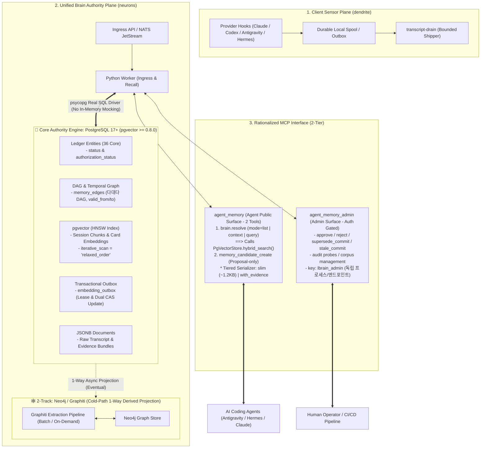
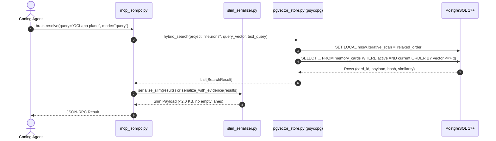

# LBrain Architecture Rationalization: Design & Technical Specification (v2.3)

- **Status**: Hardened After Implementation Audit (v2.3)
- **Date**: 2026-09-02
- **Target Repository**: `neurons` (Server/Brain Authority)
- **Worktree**: `/Users/ddalkak/Projects/neurons/.worktrees/lbrain-architecture-rationalization-spec`
- **Review & Audit History**: `specs/lbrain-architecture-rationalization/review.md` 참조

---

## 1. Target System Architecture



---

## 2. PostgreSQL Storage Layer Specification (Real SQL Only)

### 2.1. Extension Configuration
```sql
CREATE EXTENSION IF NOT EXISTS "uuid-ossp";
CREATE EXTENSION IF NOT EXISTS "vector"; -- pgvector >= 0.8.0 required
```

### 2.2. Schema DDL: Memory Cards, Edges, Chunks & Outbox

```sql
-- 1. 정형 지식 / 결정 카드 테이블
CREATE TABLE memory_cards (
    memory_id VARCHAR(64) PRIMARY KEY,
    project VARCHAR(64) NOT NULL,
    card_type VARCHAR(32) NOT NULL,
    title TEXT NOT NULL,
    summary TEXT NOT NULL,
    typed_payload JSONB NOT NULL,
    lifecycle_state VARCHAR(32) NOT NULL DEFAULT 'candidate',
    authorization_status VARCHAR(32) NOT NULL DEFAULT 'disabled',
    currentness VARCHAR(32) NOT NULL DEFAULT 'current',
    confidence NUMERIC(3,2) NOT NULL DEFAULT 1.0,
    valid_from TIMESTAMPTZ NOT NULL DEFAULT NOW(),
    valid_to TIMESTAMPTZ,
    embedding_model VARCHAR(64) NOT NULL DEFAULT 'text-embedding-3-small',
    embedding_revision INT NOT NULL DEFAULT 1,
    embedding_state VARCHAR(32) NOT NULL DEFAULT 'pending',
    embedding vector(1536),
    content_hash VARCHAR(71) NOT NULL,
    source_ref JSONB NOT NULL DEFAULT '[]'::jsonb,
    created_at TIMESTAMPTZ NOT NULL DEFAULT NOW(),
    updated_at TIMESTAMPTZ NOT NULL DEFAULT NOW()
);

CREATE INDEX idx_memory_cards_active ON memory_cards(project, authorization_status, currentness);
CREATE INDEX idx_memory_cards_temporal ON memory_cards(project, valid_from, valid_to);
CREATE INDEX idx_memory_cards_embedding ON memory_cards USING hnsw (embedding vector_cosine_ops) WITH (m = 16, ef_construction = 64);


-- 2. 다대다 DAG 및 관계 간선 테이블
CREATE TABLE memory_edges (
    edge_id BIGSERIAL PRIMARY KEY,
    src_id VARCHAR(64) NOT NULL REFERENCES memory_cards(memory_id) ON DELETE RESTRICT,
    rel_type VARCHAR(32) NOT NULL,
    dst_id VARCHAR(64) NOT NULL REFERENCES memory_cards(memory_id) ON DELETE RESTRICT,
    provenance_hash VARCHAR(71) NOT NULL,
    confidence NUMERIC(3,2) NOT NULL DEFAULT 1.0,
    valid_from TIMESTAMPTZ NOT NULL DEFAULT NOW(),
    valid_to TIMESTAMPTZ,
    created_at TIMESTAMPTZ NOT NULL DEFAULT NOW()
);

CREATE INDEX idx_memory_edges_traversal ON memory_edges(src_id, rel_type, dst_id);
CREATE INDEX idx_memory_edges_reverse ON memory_edges(dst_id, rel_type);


-- 3. 세션 대화 청크 테이블 (Dual CAS 지원을 위해 content_hash 추가)
CREATE TABLE session_memory_chunks (
    chunk_id VARCHAR(64) PRIMARY KEY,
    session_id_hash VARCHAR(71) NOT NULL,
    project VARCHAR(64) NOT NULL,
    provider VARCHAR(32) NOT NULL,
    chunk_index INT NOT NULL,
    content_markdown TEXT NOT NULL,
    content_hash VARCHAR(71) NOT NULL,
    embedding_model VARCHAR(64) NOT NULL DEFAULT 'text-embedding-3-small',
    embedding_state VARCHAR(32) NOT NULL DEFAULT 'pending',
    embedding_revision INT NOT NULL DEFAULT 1,
    embedding vector(1536),
    created_at TIMESTAMPTZ NOT NULL DEFAULT NOW(),
    updated_at TIMESTAMPTZ NOT NULL DEFAULT NOW()
);

CREATE INDEX idx_session_chunks_lookup ON session_memory_chunks(project, session_id_hash);
CREATE INDEX idx_session_chunks_embedding ON session_memory_chunks USING hnsw (embedding vector_cosine_ops) WITH (m = 16, ef_construction = 64);


-- 4. Transactional Outbox 테이블 (임베딩 비동기 안전 생성 및 동시성 락)
CREATE TABLE embedding_outbox (
    outbox_id BIGSERIAL PRIMARY KEY,
    target_type VARCHAR(32) NOT NULL, -- 'memory_card', 'session_chunk'
    target_id VARCHAR(64) NOT NULL,
    content_hash VARCHAR(71) NOT NULL,
    payload_text TEXT NOT NULL,
    status VARCHAR(32) NOT NULL DEFAULT 'queued',
    claimed_at TIMESTAMPTZ,
    lease_until TIMESTAMPTZ,
    worker_id VARCHAR(64),
    retry_count INT NOT NULL DEFAULT 0,
    last_error TEXT,
    created_at TIMESTAMPTZ NOT NULL DEFAULT NOW(),
    updated_at TIMESTAMPTZ NOT NULL DEFAULT NOW()
);

CREATE INDEX idx_embedding_outbox_queue ON embedding_outbox(status, created_at) WHERE status IN ('queued', 'failed');
CREATE UNIQUE INDEX idx_embedding_outbox_dedup ON embedding_outbox(target_type, target_id, content_hash) WHERE status IN ('queued', 'processing');
```

---

## 3. Real SQL Execution & Dual CAS Pattern

### 3.1. PgVectorStore Python Interface (No In-Memory Dicts)
`PgVectorStore`는 `self.cards = {}` 같은 인메모리 딕셔너리를 일체 포함하지 않으며, 모든 메서드가 `psycopg` 커넥션을 통해 실제 쿼리를 실행한다. 연결 실패 시 조용히 메모리로 폴백하지 않고 **`ConnectionError`를 발생(Fail-Closed)**시킨다.

### 3.2. Worker Lease Claim & Dual CAS Write-Back

#### ① Worker Lease Claim
```sql
UPDATE embedding_outbox
   SET status = 'processing',
       worker_id = :worker_id,
       claimed_at = NOW(),
       lease_until = NOW() + INTERVAL '30 seconds',
       updated_at = NOW()
 WHERE outbox_id IN (
     SELECT outbox_id
       FROM embedding_outbox
      WHERE (status = 'queued' OR (status = 'failed' AND retry_count < 5))
        AND (lease_until IS NULL OR lease_until < NOW())
      ORDER BY created_at ASC
      LIMIT 10
      FOR UPDATE SKIP LOCKED
 )
 RETURNING outbox_id, target_type, target_id, content_hash, payload_text;
```

#### ② Dual CAS Write-Back (Cards & Chunks)
```sql
-- 1) memory_cards CAS
UPDATE memory_cards
   SET embedding = :vector,
       embedding_state = 'ready',
       embedding_revision = embedding_revision + 1,
       updated_at = NOW()
 WHERE memory_id = :target_id
   AND content_hash = :enqueued_content_hash;

-- 2) session_memory_chunks CAS (누락 방지)
UPDATE session_memory_chunks
   SET embedding = :vector,
       embedding_state = 'ready',
       embedding_revision = embedding_revision + 1,
       updated_at = NOW()
 WHERE chunk_id = :target_id
   AND content_hash = :enqueued_content_hash;

-- 3) Outbox 완료 처리
UPDATE embedding_outbox
   SET status = 'completed', updated_at = NOW()
 WHERE outbox_id = :outbox_id;
```

---

## 4. MCP Interface & Real Search Wiring

### 4.1. `brain.resolve` Execution Flow


---

## 5. Zero Regression Strategy for Existing Tests

- **레거시 픽스처 호환**: 기존 테스트(`test_artifact_preference_evaluator.py`, `test_ledger.py` 등)에서 사용하는 `content_hash=""` 또는 `sha256:x` 같은 비표준 해시를 수용할 수 있도록 `validate_content_hash(hash_str, strict=False)` 옵션을 제공한다.
- **수용 기준**: `cd worker && uv run pytest -q` 실행 시 기존 3,400여 개 테스트가 1건의 실패도 없이 100% 통과해야 한다.
