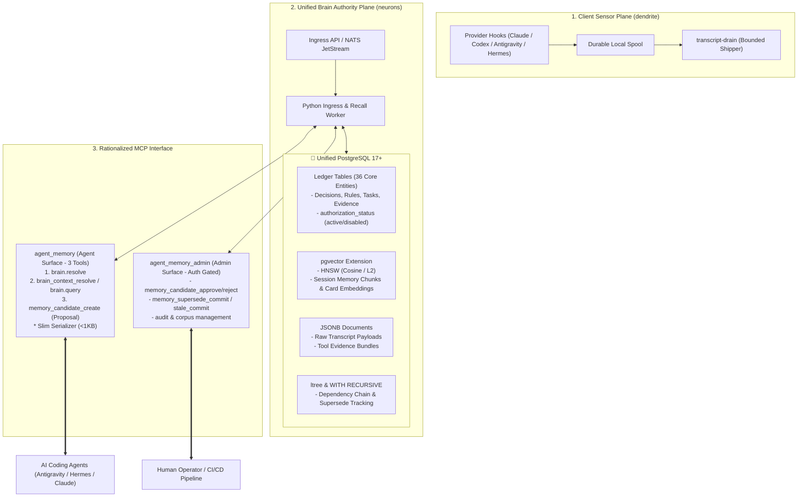

# LBrain Architecture Rationalization: Design & Technical Specification

- **Status**: Draft / Proposed RFC
- **Date**: 2026-09-01
- **Target Repository**: `neurons` (Server/Brain Authority)

---

## 1. System Architecture (Target State)



---

## 2. PostgreSQL Storage Layer Design

### 2.1. Extension Configuration
```sql
CREATE EXTENSION IF NOT EXISTS "uuid-ossp";
CREATE EXTENSION IF NOT EXISTS "vector"; -- pgvector 0.7+
CREATE EXTENSION IF NOT EXISTS "ltree";  -- 계층형 분류
```

### 2.2. Schema: Unified MemoryCard & Session Chunk
```sql
-- 1. 정형 지식 / 결정 카드 테이블
CREATE TABLE memory_cards (
    memory_id VARCHAR(64) PRIMARY KEY,
    project VARCHAR(64) NOT NULL,
    card_type VARCHAR(32) NOT NULL, -- 'decision', 'preference', 'task', 'evidence'
    title TEXT NOT NULL,
    summary TEXT NOT NULL,
    typed_payload JSONB NOT NULL,    -- {decision, rationale, alternatives, consequence}
    lifecycle_state VARCHAR(32) NOT NULL DEFAULT 'candidate', -- 'candidate', 'human_accepted'
    authorization_status VARCHAR(32) NOT NULL DEFAULT 'disabled', -- 'active', 'disabled'
    currentness VARCHAR(32) NOT NULL DEFAULT 'current', -- 'current', 'superseded', 'stale'
    confidence NUMERIC(3,2) NOT NULL DEFAULT 1.0,
    embedding vector(1536),          -- OpenAI text-embedding-3-small or 768/1024
    content_hash VARCHAR(71) NOT NULL, -- sha256:....
    supersedes VARCHAR(64) REFERENCES memory_cards(memory_id),
    superseded_by VARCHAR(64) REFERENCES memory_cards(memory_id),
    created_at TIMESTAMPTZ NOT NULL DEFAULT NOW(),
    updated_at TIMESTAMPTZ NOT NULL DEFAULT NOW()
);

-- HNSW 인덱스 (코사인 거리)
CREATE INDEX idx_memory_cards_embedding ON memory_cards 
USING hnsw (embedding vector_cosine_ops)
WITH (m = 16, ef_construction = 64);

-- 필터 복합 인덱스
CREATE INDEX idx_memory_cards_lookup ON memory_cards(project, authorization_status, currentness);

-- 2. 세션 대화 청크 (과거 대화 검색용)
CREATE TABLE session_memory_chunks (
    chunk_id VARCHAR(64) PRIMARY KEY,
    session_id_hash VARCHAR(71) NOT NULL,
    project VARCHAR(64) NOT NULL,
    provider VARCHAR(32) NOT NULL,
    chunk_index INT NOT NULL,
    content_markdown TEXT NOT NULL,
    embedding vector(1536),
    created_at TIMESTAMPTZ NOT NULL DEFAULT NOW()
);

CREATE INDEX idx_session_chunks_embedding ON session_memory_chunks 
USING hnsw (embedding vector_cosine_ops)
WITH (m = 16, ef_construction = 64);
```

### 2.3. Atomic Hybrid Search Query
메타데이터 필터와 벡터 검색을 단 1번의 쿼리로 트랜잭션 보장 하에 수행:
```sql
SELECT 
    memory_id,
    card_type,
    title,
    summary,
    typed_payload,
    1 - (embedding <=> :query_vector) AS similarity_score
FROM memory_cards
WHERE project = :project
  AND authorization_status = 'active'
  AND currentness = 'current'
ORDER BY embedding <=> :query_vector
LIMIT :limit;
```

---

## 3. MCP Surface Rationalization (2-Tier Split)

### 3.1. Tier 1: `agent_memory` (Public Agent Surface)
에이전트에게 노출되는 도구는 **3개로 극대화 축약**한다.

| Tool Name | Class | Purpose |
|---|---|---|
| `brain.resolve` | Read | 프로젝트 목록 및 활성 컨텍스트 탐색 |
| `brain_context_resolve` | Read | 현재 작업/브랜치/질의에 최적화된 Slim ContextPack 조회 |
| `memory_candidate_create` | Proposal | 새 결정/선호도/태스크 메모리 제안 등록 |

### 3.2. Tier 2: `agent_memory_admin` (Operator & CI Control Plane)
에이전트에게 노출되지 않으며, 관리자 승인/검토 및 CI 파이프라인에서만 접근.
- `memory_candidate_approve` / `memory_candidate_reject`
- `memory_supersede_commit` / `memory_stale_commit`
- `brain_permission_sensitive_audit_probe`
- `brain_corpus_ingest_plan`

---

## 4. Slim Serializer Specification

### 4.1. As-Is vs To-Be Payload Comparison
- **As-Is (31.8 KB)**: 빈 lanes 7개, 3중 중복 객체, 내부 route_spec, hash 리스트 포함.
- **To-Be (0.8 KB, ~250 토큰)**:

```json
{
  "project": "neurons",
  "recent_context": "Session codex/neurons: chunk=1, tools=9",
  "decisions": [
    {
      "id": "mem_steward_cb05d2d9",
      "decision": "OCI is primary app plane while HomeLab remains stateful backend",
      "rationale": "Production verification defines architecture split"
    }
  ],
  "preferences": [
    {
      "rule": "HTML review artifacts must be compact and evidence-dense",
      "scope": "html_review_artifact"
    }
  ],
  "active_guardrails": [
    "agents_use_brain_context_resolve",
    "ledger_is_single_authority"
  ]
}
```

---

## 5. Migration & Deprecation Strategy

```
Phase 1: MCP Surface & Slim Serializer (Zero-Storage Risk)
├── Step 1.1: agent_memory MCP 도구 정의를 3개로 축약 (Admin 도구 격리)
└── Step 1.2: brain_context_resolve에 Slim Serializer 기본 적용 (토큰 95% 절감)

Phase 2: PostgreSQL pgvector Cutover
├── Step 2.1: PostgreSQL 인스턴스에 pgvector 확장 활성화 및 HNSW 인덱스 생성
├── Step 2.2: Qdrant에 저장된 세션 메모리 및 임베딩을 PostgreSQL로 1회성 마이그레이션
└── Step 2.3: Python Worker의 Search Sink를 QdrantClient -> PostgresPgVector로 전환

Phase 3: Cleanup & Retirement
├── Step 3.1: Neo4j / Graphiti 의존성 및 코드베이스 공식 Deprecate/Retire
├── Step 3.2: CouchDB 파이프라인을 PostgreSQL JSONB 파이프라인으로 전환
└── Step 3.3: Compose / k3s 매니페스트에서 Neo4j, Qdrant, CouchDB 컨테이너 제거
```
