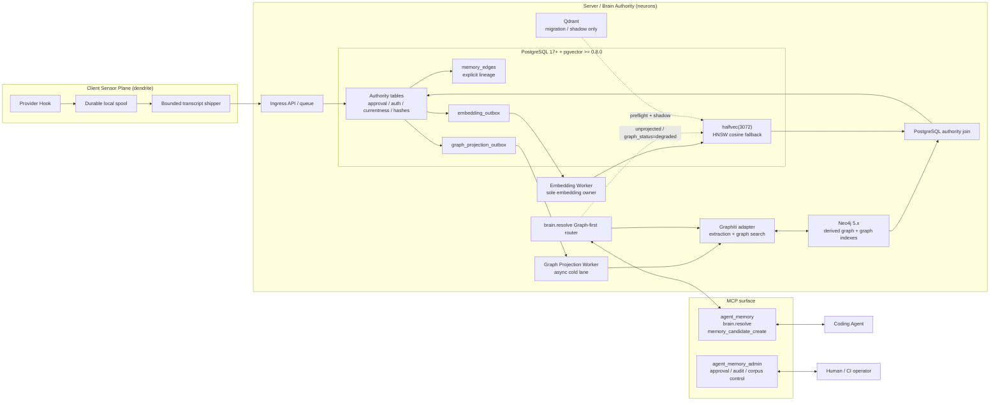
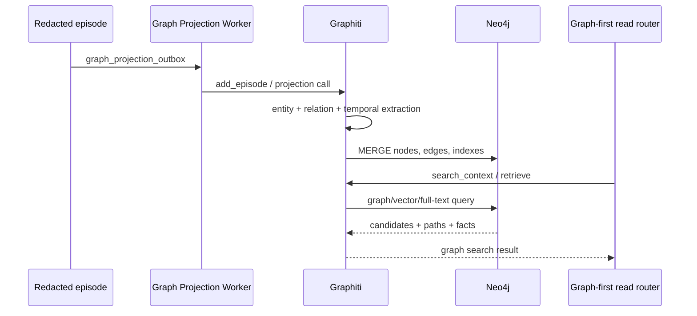

# LBrain Architecture Rationalization: Design & Technical Specification (v2.5)

- **Status**: Decision-aligned target architecture; multi-agent review remediation (v2.5)
- **Date**: 2026-09-03
- **Target Repository**: `neurons` (Server/Brain Authority)
- **Worktree**: `/Users/ddalkak/Projects/neurons/.worktrees/lbrain-architecture-rationalization-spec`
- **Requirements**: `specs/lbrain-architecture-rationalization/requirements.md`
- **Review & Audit History**: `specs/lbrain-architecture-rationalization/review.md` 참조

---

## 0. 설계 결정과 경계

이 설계는 **Graphiti와 Neo4j를 유지하고, 조회는 Graph-first로 바꾸며, Qdrant는 임베딩 이관·섀도우 기간에만 사용하는 것**을 전제로 한다.

- PostgreSQL: 승인·권한·currentness·content hash·명시적 lineage의 권위 저장소
- Graphiti → Neo4j: 엔티티·관계·temporal fact를 저장하고 탐색하는 주 조회 경로
- PostgreSQL `halfvec(3072)`: graph 미투영 데이터와 graph 장애 시의 명시적 semantic fallback
- Qdrant: migration/dual-read shadow 전용. 정상 Agent read path에 두지 않음
- AST/Graphify: product runtime에서 제외
- `pgai`: 첫 cutover의 embedding owner가 아님. Embedding Worker 하나만 임베딩을 생성함

**조회 우선순위와 권위는 분리한다.** Neo4j가 후보를 먼저 찾고 PostgreSQL이 권한과 currentness를 최종 판정한다. PostgreSQL 장애는 빈 결과로 감추지 않지만, Neo4j 장애 시에는 명시적인 `pgvector_fallback`을 선택할 수 있다.

이 절의 구성도와 아래 SQL은 **목표 계약**이다. M3에서 project-scoped `brain.resolve`의 Graph-first 라우터를 구현했고 실제 로컬 PostgreSQL과 Graphiti adapter 변환 경계로 검증했다. legacy `brain.query`와 graph trigger의 SQLite projection cursor는 아직 남아 있다. Neo4j live 검증·PG graph outbox 연결·cutover 전에는 목표 구성도를 운영 완료로 해석하지 않는다.

---

## 1. Target System Architecture



### 1.1. 역할 매핑

| 구성요소 | 저장하거나 수행하는 것 | 하지 않는 것 |
|---|---|---|
| PostgreSQL | 상태, 승인, 권한, hash, 명시적 edge, outbox | inferred graph의 주 조회 엔진 역할을 독점하지 않음 |
| Graphiti | episode를 읽어 entity/relation/time/provenance로 만들고 Neo4j 검색 API를 조립 | PostgreSQL 승인 상태를 직접 바꾸지 않음 |
| Neo4j | Graphiti가 만든 노드·엣지·그래프 인덱스와 multi-hop 탐색 | 승인·권한의 독립 SoT가 되지 않음 |
| pgvector | 3072차원 semantic fallback과 미투영 카드 검색 | Graphiti의 temporal relation을 대체하지 않음 |
| Qdrant | 기존 데이터 source, 비교용 shadow | 공개 Agent 조회의 정상 경로가 아님 |

---

## 2. 데이터 흐름과 일관성 모델

### 2.1. Write flow

1. Worker가 redacted episode 또는 candidate를 받는다.
2. 하나의 PostgreSQL transaction에서 권위 행과 필요한 명시적 `memory_edges`를 기록한다.
3. 목표 PG authority writer는 같은 transaction에서 `embedding_outbox`와 `graph_projection_outbox`를 기록한다. 현재 legacy trigger는 SQLite ledger-backed cursor를 사용하므로 이 단계는 cutover 전제조건이다.
4. commit 후 Embedding Worker가 `gemini-embedding-2`로 벡터를 생성하고 CAS로 PostgreSQL에 반영한다.
5. Graph Projection Worker가 redacted episode를 Graphiti에 전달한다.
6. Graphiti가 entity/relation/temporal fact를 추출하고 Neo4j에 idempotent하게 투영한다.
7. projection cursor, source revision, lag, 실패·retry 상태를 PostgreSQL 또는 동일한 durable runtime state에 남긴다.

PostgreSQL commit과 Neo4j commit은 하나의 분산 transaction이 아니다. 따라서 응답에는 graph freshness와 projection lag를 포함하고, graph 결과를 PostgreSQL 권위 데이터로 가장하지 않는다.

### 2.2. Read flow

1. `brain.resolve`가 project, `as_of`, query를 검증한다.
2. `mode="query"`이면 Graphiti adapter를 먼저 호출한다.
3. Graphiti/Neo4j가 entity, relation, temporal path 기반 후보를 반환한다.
4. 후보 ID를 PostgreSQL에 join하여 `authorization_status`, `currentness`, project, hash, validity를 재검증한다.
5. graph가 미투영이거나 명시적으로 degraded/unavailable이면 PostgreSQL `halfvec(3072)` fallback을 사용한다. 미투영 카드가 있더라도 이미 검증된 graph 후보 순서는 보존하고 PG 후보를 중복 없이 보충한다. 그래프 결과가 남으면 `retrieval_path=graph_neo4j`, 실제 PG 보충 시 `fallback_used=true`이다.
6. 결과에 검색 경로와 graph 상태를 붙이고 bounded serializer가 응답을 만든다. PG 재조회에서 바뀐 hash는 결과에서 제외하고 `authority_join_status=mismatch`로 표시한다. 입력·cursor 검증은 Pydantic이 담당한다.

PG fallback은 Graphiti/Neo4j의 관계 의미를 복원하지 않는다. outage/degraded 상태는 projection backlog보다 우선한다. fallback 실행 결과에는 원인에 맞는 graph 상태와 `fallback_used=true`를 넣고, PG 실패·embedding 부재는 `error_code`와 MCP `isError=true`로 전달한다.

### 2.3. Read metadata 계약

```json
{
  "metadata": {
    "retrieval_path": "graph_neo4j",
    "graph_status": "available",
    "authority_join_status": "verified",
    "fallback_used": false,
    "projection_lag_ms": 420,
    "has_more": false
  }
}
```

허용되는 `retrieval_path`는 `graph_neo4j`, `pgvector_fallback`, `none`이다. `graph_status`는 `available`, `degraded`, `unavailable`, `projection_lag` 중 하나이고, `authority_join_status`는 `verified`, `mismatch`, `unavailable` 중 하나다. 지연 필드는 `projection_lag_ms` 하나만 사용하며, `graph_status="available"`일 때도 측정할 수 없으면 `null`을 반환한다. Qdrant를 정상 경로 이름으로 반환하지 않는다.

### 2.4. Graph-to-authority canonical join key

Graphiti/Neo4j 후보는 PostgreSQL 행으로 재검증할 수 있는 canonical key를 반드시 반환한다.

- MemoryCard 후보: `authority_memory_id = memory_cards.memory_id`
- Episode/source 후보: `source_type`, `source_id`, `source_revision`, `content_hash`
- `graph_projection_outbox`와 Neo4j node에는 위 key를 같은 문자열로 저장하고, 후보가 key를 잃으면 `authority_join_status="unavailable"`로 처리한다.
- Graph node의 inferred property를 PostgreSQL 권위 상태로 복사하지 않는다. join 결과가 `mismatch`이면 결과에서 제외하고 gap/metric에 기록한다.
- `GraphFact`는 검증된 원본 episode의 `authority_sources=[{authority_memory_id, content_hash}]`를 보존한다. inferred fact의 hash를 카드 hash로 사용하지 않는다. 원문 키워드 일치가 없더라도 관계 검색의 source key가 PG join으로 이어져야 한다. fact validity와 PG 카드 validity는 각각 반개구간 `[valid_from, valid_to)`으로 확인한다.

---

## 3. PostgreSQL 저장소와 DDL

### 3.1. Extension과 embedding profile

```sql
CREATE EXTENSION IF NOT EXISTS "uuid-ossp";
CREATE EXTENSION IF NOT EXISTS "vector"; -- pgvector >= 0.8.0
```

정식 profile:

```text
profile_id: lbrain-memory-gemini-embedding-2-v1
model:      gemini-embedding-2
dimension:  3072
distance:   cosine
sql_type:   halfvec(3072)
operator:   halfvec_cosine_ops
```

일반 `vector` 타입의 dimension 제한 때문에 `vector(3072)`를 사용하지 않는다. `halfvec(3072)`와 `halfvec_cosine_ops`를 schema와 query에서 함께 사용한다.

### 3.2. Authority와 vector tables

```sql
CREATE TABLE IF NOT EXISTS memory_cards (
    memory_id VARCHAR(64) PRIMARY KEY,
    project VARCHAR(64) NOT NULL,
    card_type VARCHAR(32) NOT NULL,
    title TEXT NOT NULL,
    summary TEXT NOT NULL,
    typed_payload JSONB NOT NULL DEFAULT '{}'::jsonb,
    lifecycle_state VARCHAR(32) NOT NULL DEFAULT 'candidate',
    authorization_status VARCHAR(32) NOT NULL DEFAULT 'disabled',
    currentness VARCHAR(32) NOT NULL DEFAULT 'current',
    confidence NUMERIC(3,2) NOT NULL DEFAULT 1.0,
    valid_from TIMESTAMPTZ NOT NULL DEFAULT NOW(),
    valid_to TIMESTAMPTZ,
    embedding_model VARCHAR(64) NOT NULL DEFAULT 'gemini-embedding-2',
    embedding_revision INT NOT NULL DEFAULT 1,
    embedding_state VARCHAR(32) NOT NULL DEFAULT 'pending',
    embedding halfvec(3072),
    content_hash VARCHAR(71) NOT NULL,
    source_ref JSONB NOT NULL DEFAULT '[]'::jsonb,
    created_at TIMESTAMPTZ NOT NULL DEFAULT NOW(),
    updated_at TIMESTAMPTZ NOT NULL DEFAULT NOW()
);

CREATE INDEX IF NOT EXISTS idx_memory_cards_active
    ON memory_cards(project, authorization_status, currentness);

CREATE INDEX IF NOT EXISTS idx_memory_cards_temporal
    ON memory_cards(project, valid_from, valid_to);

CREATE INDEX IF NOT EXISTS idx_memory_cards_embedding
    ON memory_cards USING hnsw (embedding halfvec_cosine_ops)
    WITH (m = 16, ef_construction = 64);

CREATE TABLE IF NOT EXISTS session_memory_chunks (
    chunk_id VARCHAR(64) PRIMARY KEY,
    session_id_hash VARCHAR(71) NOT NULL,
    project VARCHAR(64) NOT NULL,
    provider VARCHAR(32) NOT NULL DEFAULT 'unspecified',
    chunk_index INT NOT NULL DEFAULT 0,
    content_markdown TEXT NOT NULL,
    token_count INT NOT NULL DEFAULT 0,
    content_hash VARCHAR(71) NOT NULL,
    embedding_model VARCHAR(64) NOT NULL DEFAULT 'gemini-embedding-2',
    embedding_state VARCHAR(32) NOT NULL DEFAULT 'pending',
    embedding_revision INT NOT NULL DEFAULT 1,
    embedding halfvec(3072),
    created_at TIMESTAMPTZ NOT NULL DEFAULT NOW(),
    updated_at TIMESTAMPTZ NOT NULL DEFAULT NOW()
);

CREATE INDEX IF NOT EXISTS idx_session_chunks_lookup
    ON session_memory_chunks(project, session_id_hash);

CREATE INDEX IF NOT EXISTS idx_session_chunks_embedding
    ON session_memory_chunks USING hnsw (embedding halfvec_cosine_ops)
    WITH (m = 16, ef_construction = 64);
```

### 3.3. Explicit lineage와 outbox

```sql
CREATE TABLE IF NOT EXISTS memory_edges (
    edge_id BIGSERIAL PRIMARY KEY,
    src_id VARCHAR(64) NOT NULL REFERENCES memory_cards(memory_id) ON DELETE RESTRICT,
    rel_type VARCHAR(32) NOT NULL,
    dst_id VARCHAR(64) NOT NULL REFERENCES memory_cards(memory_id) ON DELETE RESTRICT,
    provenance_hash VARCHAR(71) NOT NULL,
    confidence NUMERIC(3,2) NOT NULL DEFAULT 1.0,
    properties JSONB NOT NULL DEFAULT '{}'::jsonb,
    valid_from TIMESTAMPTZ NOT NULL DEFAULT NOW(),
    valid_to TIMESTAMPTZ,
    created_at TIMESTAMPTZ NOT NULL DEFAULT NOW()
);

CREATE INDEX IF NOT EXISTS idx_memory_edges_traversal
    ON memory_edges(src_id, rel_type, dst_id);

CREATE INDEX IF NOT EXISTS idx_memory_edges_reverse
    ON memory_edges(dst_id, rel_type);

CREATE TABLE IF NOT EXISTS embedding_outbox (
    outbox_id BIGSERIAL PRIMARY KEY,
    target_type VARCHAR(32) NOT NULL,
    target_id VARCHAR(64) NOT NULL,
    content_hash VARCHAR(71) NOT NULL,
    payload_text TEXT NOT NULL,
    status VARCHAR(32) NOT NULL DEFAULT 'queued',
    claimed_at TIMESTAMPTZ,
    lease_until TIMESTAMPTZ,
    worker_id VARCHAR(64),
    retry_count INT NOT NULL DEFAULT 0,
    last_error TEXT,
    created_at TIMESTAMPTZ NOT NULL DEFAULT NOW(),
    updated_at TIMESTAMPTZ NOT NULL DEFAULT NOW()
);

CREATE INDEX IF NOT EXISTS idx_embedding_outbox_queue
    ON embedding_outbox(status, created_at)
    WHERE status IN ('queued', 'failed');

CREATE UNIQUE INDEX IF NOT EXISTS idx_embedding_outbox_dedup
    ON embedding_outbox(target_type, target_id, content_hash)
    WHERE status IN ('queued', 'processing');

CREATE TABLE IF NOT EXISTS graph_projection_outbox (
    projection_id BIGSERIAL PRIMARY KEY,
    source_type VARCHAR(32) NOT NULL,
    source_id VARCHAR(128) NOT NULL,
    source_revision VARCHAR(128) NOT NULL,
    content_hash VARCHAR(71) NOT NULL,
    episode_payload JSONB NOT NULL,
    status VARCHAR(32) NOT NULL DEFAULT 'queued',
    claimed_at TIMESTAMPTZ,
    lease_until TIMESTAMPTZ,
    worker_id VARCHAR(64),
    retry_count INT NOT NULL DEFAULT 0,
    last_error TEXT,
    created_at TIMESTAMPTZ NOT NULL DEFAULT NOW(),
    updated_at TIMESTAMPTZ NOT NULL DEFAULT NOW(),
    UNIQUE (source_type, source_id, source_revision)
);

CREATE INDEX IF NOT EXISTS idx_graph_projection_outbox_queue
    ON graph_projection_outbox(status, created_at)
    WHERE status IN ('queued', 'failed');
```

기존 설치가 `vector(1536)`라면 `CREATE TABLE IF NOT EXISTS`만으로 바뀌지 않는다. 기존 vector를 `halfvec(3072)`로 무리하게 cast하거나 zero-padding하지 말고, maintenance window에서 shadow column/table을 만들고 profile 일치 데이터는 검증 후 복사하고 나머지는 re-embed한다.

---

## 4. Real SQL과 동시성 계약

### 4.1. PgVectorStore

`PgVectorStore`는 process-local dict를 persistence로 사용하지 않는다.

- DSN 또는 caller-owned `psycopg` connection을 반드시 받는다.
- connection/schema/query 실패는 `ConnectionError` 또는 원래 DB 예외로 전달한다.
- 실패 시 빈 결과, 임시 memory mode, Qdrant 자동 우회를 반환하지 않는다.
- 모든 vector 입력은 길이 3072와 finite number를 검사한다.
- SQL cast는 `%s::halfvec`이고 distance expression은 `embedding <=> %s::halfvec`이다.

### 4.2. Outbox lease

```sql
WITH candidates AS (
    SELECT outbox_id
      FROM embedding_outbox
     WHERE (
             status = 'queued'
             OR (status = 'failed' AND retry_count < 5)
             OR (status = 'processing' AND retry_count < 5)
           )
       AND (lease_until IS NULL OR lease_until < NOW())
     ORDER BY created_at, outbox_id
     LIMIT 10
     FOR UPDATE SKIP LOCKED
)
UPDATE embedding_outbox AS job
   SET status = 'processing',
       worker_id = :worker_id,
       claimed_at = NOW(),
       lease_until = NOW() + (:lease_seconds * INTERVAL '1 second'),
       updated_at = NOW()
  FROM candidates
 WHERE job.outbox_id = candidates.outbox_id
RETURNING job.*;
```

만료된 processing 작업도 재획득한다. worker 완료·실패·CAS API는 `worker_id`를 필수 검증하고, CAS는 outbox 행을 `FOR UPDATE`로 잠근 뒤 대상 행을 변경한다. lease 만료는 transaction 시작 시각이 아닌 `clock_timestamp()`로 확인한다. dead-letter도 대상 hash가 일치할 때만 embedding 상태를 바꾼다.

### 4.3. Dual CAS write-back

```sql
UPDATE memory_cards
   SET embedding = :vector::halfvec,
       embedding_state = 'ready',
       embedding_revision = embedding_revision + 1,
       updated_at = NOW()
 WHERE memory_id = :target_id
   AND content_hash = :enqueued_content_hash;

UPDATE session_memory_chunks
   SET embedding = :vector::halfvec,
       embedding_state = 'ready',
       embedding_revision = embedding_revision + 1,
       updated_at = NOW()
 WHERE chunk_id = :target_id
   AND content_hash = :enqueued_content_hash;
```

두 update 중 대상 row가 0개면 stale job이다. vector를 쓰지 않고 job을 명시적으로 completed/CAS-skipped로 기록한다. `worker_id`가 있는 worker 경로에서는 대상 update와 terminal outbox update 모두 동일한 `status='processing'`, owner, `lease_until > NOW()` fence를 통과해야 한다. CAS의 대상 `UPDATE`는 embedding 파생 필드만 변경하고 lifecycle·authorization·currentness·content hash 같은 권위 필드는 변경하지 않으므로, accepted authority row도 동일한 hash와 활성 lease를 가진 **embedding-only write-back**은 허용한다. 이 경계를 벗어나 대상 SQL이 권위 필드를 수정하게 되면 accepted lifecycle predicate를 추가해야 한다.

### 4.4. 명시적 edge recursive query

`memory_edges`의 lineage 조회는 `WITH RECURSIVE`, depth limit, visited path로 제한한다. 이 query는 승인된 명시적 관계를 검사하는 용도이며 Graphiti가 추출한 모든 inferred relation을 복제하는 용도가 아니다.

M4는 root 최대 20개를 한 SQL statement에서 조회한다. 양쪽 카드의 project·accepted lifecycle·현재 authorization·validity와 edge validity를 확인하며, default read는 current만, 명시적 `as_of`는 당시 유효한 current/superseded만 허용한다. 현재 권한 회수나 stale/conflicted/unknown 상태는 과거 시점 조회로 우회하지 못한다. SQL은 depth 5와 visited path로 요청 단위 순환을 막고, row limit 100의 sentinel과 depth boundary로 잘린 결과를 표시한다. 글로벌 edge 순환 금지라는 새 도메인 정책을 추가하지 않는다.

SQL statement timeout은 1초를 상한으로 하되 호출자의 기존 제한이 더 짧으면 그대로 존중하고, 성공 후 기존 GUC를 복원한다. 고분기 그래프에서 시간 상한을 넘으면 evidence 오류를 명시하며 빈 성공으로 처리하지 않는다. `root_hashes`와 edge는 같은 SQL snapshot으로 반환하고, serializer가 앞서 읽은 카드 hash와 비교한다. 중간 권한 회수·revision 변경이 감지되면 `evidence_unavailable`을 반환한다.

공개 `with_evidence`는 실제 페이지 후보에 대해 한 번만 batch 조회한다. root의 hash는 `items`에, 비-root의 hash는 `evidence.content_hashes`에, 관계·provenance hash는 `evidence.explicit_edges`에 둔다. 전체 visited path와 동일 hash를 여러 번 반복하지 않아 작은 관계가 3KB 예산 때문에 통째로 사라지지 않게 한다. 추가 field·원문·private source_ref는 Pydantic `_EvidenceEdge`의 whitelist 밖으로 버린다. 초과 edge는 결정적 순서로 제거하고 `evidence_truncated=true`, `evidence_max_depth=5`를 명시한다. `has_more`/`next_cursor`는 카드 페이지의 계속 여부이며 잘린 evidence 전체를 복원하는 별도 cursor라고 주장하지 않는다.

이 보정은 실제 PostgreSQL에서 `insert_edge`의 SQL 인자 수 불일치, 한 개의 실제 근거까지 소실되는 응답 크기 문제, 과거 유효한 superseded 기록 누락을 재현한 뒤 적용했다. Graphiti도 고정된 `0.30.1`의 `SearchFilters`/`DateFilter`를 사용해 top-k 이전에 같은 시간 범위를 적용하고 episode reference time을 일치시킨다. Neo4j live temporal 품질 검증은 별도 gate다.

---

## 5. Embedding Worker와 profile 일관성

### 5.1. 기본값

| 항목 | 기본값 |
|---|---|
| model | `gemini-embedding-2` |
| dimension | `3072` |
| distance | cosine |
| PostgreSQL type | `halfvec(3072)` |
| profile | `lbrain-memory-gemini-embedding-2-v1` |
| owner | Embedding Worker |
| alternative | Ollama를 명시한 local profile에서만 `nomic-embed-text / 768` |

Graphiti의 Neo4j vector index를 생성하는 embedder도 동일한 profile을 사용해야 한다. 다른 dimension의 vector를 같은 collection/index에 섞지 않는다. Qdrant에 남은 기존 vector가 profile과 다르면 migration tool이 quarantine하고 re-embed job을 만든다.

`pgai`는 첫 cutover에 자동으로 embedding을 생성하는 숨은 owner가 아니다. 나중에 도입할 경우 worker와의 중복 enqueue, retry, hash/CAS, model revision을 별도 ADR로 결정한다.

### 5.2. Qdrant source preflight

이관 전 실제 Qdrant에서 다음을 읽어 checkpoint에 남긴다.

- collection name과 실제 dimension
- distance metric
- configured model 또는 payload model
- point count, duplicate/deleted 상태
- payload 필드와 source/content hash coverage
- scroll pagination의 마지막 offset

문서의 기본값 `3072`만으로 Qdrant 원본 차원을 추정하지 않는다.

---

## 6. Graphiti와 Neo4j 계약

### 6.1. 두 부품의 관계

Graphiti는 그래프 DB가 아니다. Graphiti는 episode를 받아 LLM 기반 구조화·중복/모순 처리·temporal edge 생성·검색 조립을 담당하는 애플리케이션 라이브러리다. Neo4j는 Graphiti가 사용하는 노드·엣지 저장소와 graph query/index 실행기다.



### 6.2. Hot/Cold 규칙

- MCP hot path에서 `add_episode`와 LLM entity extraction을 기다리지 않는다.
- Graphiti/Neo4j에 이미 투영된 graph를 읽는 것은 hot path에서 허용한다.
- projection worker는 redacted input만 사용하고, 실패한 LLM 응답·private text를 graph에 저장하지 않는다.
- Graphiti extraction timeout은 retry/dead-letter로 보내고 Agent 응답을 장시간 붙잡지 않는다.
- graph result의 source revision과 projection lag를 반환한다.

### 6.3. 버전과 운영

- `graphiti-core`는 현재 검증 대상 `0.30.1`을 `pyproject.toml`과 `uv.lock`에 exact pin한다. 업그레이드 시 Graphiti schema/index/retrieval 회귀를 다시 검증한다.
- Neo4j는 현재 compose의 `neo4j:5.26-community` major/image 조합을 함께 검증한다.
- Graphiti upgrade 때는 add/search/retrieve, Neo4j schema/index initialization, entity idempotency, temporal query, redaction, timeout fallback을 함께 regression test한다.
- Apache AGE는 이 target architecture에서 사용하지 않는다. Graphiti의 Neo4j adapter를 AGE로 바꾸는 별도 경로를 만들지 않는다.

### 6.4. PostgreSQL과 graph의 관계

PostgreSQL `memory_edges`는 승인된 explicit relation의 authority이다. Graphiti/Neo4j의 inferred graph는 derived projection이다. 같은 관계가 양쪽에 있으면 `provenance_hash`, `source_revision`, `inference` 여부를 구분하여 authority join 후 사용한다.

---

## 7. MCP 2-Tier와 Slim Serializer

### 7.1. Agent public surface

Agent에게 공개하는 operation은 두 개다.

1. `brain.resolve`
   - `mode=list`: 정해진 lane을 나열
   - `mode=context`: 현재 task에 필요한 slim context
   - `mode=query`: Graphiti/Neo4j-first semantic/graph query
2. `memory_candidate_create`
   - proposal-only
   - project-scoped
   - rate-limited
   - 직접 approve/commit 불가

승인·reject·supersede·stale commit·감사 probe·corpus 관리는 `agent_memory_admin`의 별도 인증과 endpoint에서만 실행한다.

HTTP는 기본 `--surface agent`로 공개 두 도구만 제공한다. admin은 별도 포트/프로세스에서 `--surface admin`과 외부 주입한 `LLM_BRAIN_ADMIN_TOKEN`이 필요하다. 32자 이상의 공백 없는 ASCII secret을 상수 시간 비교하며 모든 `/mcp` method를 검증한다. `lbrain_admin`은 접속 secret이 아닌 인증된 서버의 내부 identity이다. health endpoint는 민감한 상태 없이 공개한다.

### 7.2. 응답 크기 규칙

- 기본 `response_mode="slim"`
- soft budget: 250~500 tokens
- 목표 크기: 약 1.2KB
- hard max: MCP tool result의 UTF-8 JSON 3KB (`content`와 `structuredContent` 중복, escape, cursor 포함; HTTP/JSON-RPC framing 제외)
- deterministic field order와 stable pagination token
- 초과 시 `has_more=true`; raw transcript, private path, 대형 typed payload는 반환하지 않음
- `with_evidence`에서만 hash chain, edge summary, authority join detail을 확장

Serializer는 검색 엔진을 결정하지 않는다. 검색 경로, graph 상태, authority join 결과가 먼저 확정된 뒤 payload를 줄인다.

M3에서 발견한 두 경계 결함 때문에 구현을 보정했다. 구조화 payload만 재던 크기 계산은 `mcp_payload.tool_result_bytes`의 실제 tool-result 계산으로 통일했다. 목록은 최초 100건을 메모리에 고정하지 않고 SQL `memory_id > after_memory_id` keyset으로 이어 읽는다. query cursor는 요청과 정렬된 후보 ID/hash에, context/list cursor는 요청과 마지막 ID에 결합한다. 후자는 동시 변경을 포함한 snapshot을 보장하지 않지만 매 페이지 권위를 재검증하고 고정 데이터에서 누락·중복 없이 끝난다. 실제 PostgreSQL 107건 Unicode 목록으로 끝까지 페이지 이동과 3KB cap을 확인했다.

---

## 8. Migration과 cutover 절차

### Phase 0 — 측정

- 실제 Qdrant와 PostgreSQL의 connection, dimension, distance, model을 read-only probe한다.
- 실제 Neo4j의 node/edge/index 상태와 Graphiti version을 기록한다.
- 기존 Qdrant의 Recall@5 측정치가 mock/dummy vector 기반이면 cutover 증거로 폐기한다.

### Phase 1 — PostgreSQL vector fallback 준비

- 신규 schema를 `halfvec(3072)`로 설치한다.
- source vector가 정확히 `gemini-embedding-2 / 3072 / cosine`이면 PG fallback으로 복사한다.
- 차원이 다르거나 model이 불명확하면 quarantine 후 Embedding Worker가 re-embed한다.
- card/chunk hash와 vector profile을 함께 검증한다.

### Phase 2 — Graphiti/Neo4j replay

- Qdrant point 자체가 아니라 원본 episode 또는 권위 card/reference를 replay한다.
- Graph Projection Worker가 Graphiti를 호출하여 Neo4j entity/relation/temporal graph를 재생성한다.
- projection cursor, source revision, duplicate, failure, lag를 checkpoint에 남긴다.
- vector-only copy는 relation, temporal validity, provenance를 복원한 것으로 간주하지 않는다.

### Phase 3 — Dual-read shadow

각 query에 대해 다음을 동시에 기록하되 Agent 응답은 아직 기존 계약을 유지할 수 있다.

- Graphiti/Neo4j 후보와 PG authority join 결과
- PG vector fallback 결과
- 기존 Qdrant shadow 결과
- Recall@5, relation/temporal correctness
- authority false-positive/false-negative
- p50/p95 latency, projection lag, fallback rate
- slim payload size와 evidence coverage

기본 cutover benchmark는 실제 Qdrant/실제 PostgreSQL만 사용하며, 최소 50개 query fixture와 동일한 10분 관찰 창을 요구한다. 기본 gate는 `mean Recall@5 >= 0.95`, relation/temporal correctness `>= 0.95`, backend error `0건`, PostgreSQL p95 `<= 20ms`다. false-positive와 fallback rate는 측정값 및 승인된 상한을 같이 기록해야 하며, 빈 fixture·mock client·dummy vector·Python dict scan 결과는 gate 통과로 인정하지 않는다. 결과에는 `evidence_class=live_cutover`를 기록해야 하고, 테스트용 harness는 `evidence_class=test_harness`로 별도 실행하며 `cutover evidence`와 섞지 않는다.

### Phase 4 — Graph-first cutover

다음 조건을 모두 만족할 때 `brain.resolve(mode="query")`를 전환한다.

- graph-first 후보의 품질 gate 통과
- PostgreSQL authority join 통과
- graph 장애 시 explicit fallback과 metadata 통과
- Graphiti extraction이 hot path를 막지 않음
- 실제 Neo4j/Graphiti read latency와 projection lag가 관찰 가능
- Qdrant public query 호출이 없음

Qdrant는 rollback window 동안 보존할 수 있지만 정상 조회의 우선순위로 되돌리지 않는다.

---

## 9. 장애와 운영 규칙

| 상황 | 응답/동작 |
|---|---|
| PostgreSQL 연결 실패 | Fail-Closed. 빈 결과나 in-memory 모드 금지 |
| Neo4j read timeout | `graph_status="degraded"` + PG fallback + `fallback_used=true` |
| Graphiti projection 실패 | outbox retry/dead-letter; 기존 graph는 source revision과 함께 유지 |
| graph projection lag 증가 | `graph_status="projection_lag"`, `projection_lag_ms` 공개, 운영 alert, 필요 시 PG fallback |
| embedding model/dimension mismatch | write 거부 또는 quarantine; 임의 cast/padding 금지 |
| Qdrant shadow 실패 | shadow metric만 실패; 권위 write와 graph read를 Qdrant에 종속시키지 않음 |
| Agent가 admin mutation 호출 | auth boundary에서 거부 |

---

## 10. 검증 포트폴리오와 현재 구현 경계

### 10.1. 필수 검증

- 실제 PostgreSQL DDL, `halfvec(3072)`, HNSW, `halfvec_cosine_ops`
- 실제 `psycopg` CRUD/search와 DB fail-closed
- memory card/chunk Dual CAS와 outbox lease
- 실제 Neo4j Graphiti add/search/retrieve와 projection replay
- graph-first → authority join → PG fallback 순서
- Qdrant preflight와 vector/episode migration 분리
- MCP public 2-tool schema, admin isolation, 3KB serializer cap
- Graphiti redaction, temporal correctness, idempotency, timeout/dead-letter

### 10.2. 테스트 수에 대한 원칙

전체 테스트 개수는 품질 지표가 아니다. 동작 계약별 최소 테스트 묶음을 유지하고 중복 mock/in-memory 테스트는 inventory를 만든 뒤 축소한다. 실패를 숨기기 위한 skip/xfail은 추가하지 않는다. 기존 호환성 테스트가 새 profile과 충돌하면 테스트를 명시적 legacy profile로 격리하고, production default를 옛 dimension에 맞추지 않는다.

### 10.3. 이 문서와 현재 코드의 차이

이 문서와 기본값 정합화는 Graphiti/Neo4j 유지, 3072 profile, PG fallback 계약을 확정한다. M3는 공개 `brain.resolve`의 Graph-first 후보 검색·PG authority join·명시적 fallback과 HTTP 접근 경계를 로컬에서 검증했다. 기존 Graphiti adapter를 재사용하면서 관계 검색 결과의 canonical source key 보존 결함도 수정했다. legacy `brain.query` 전환, `graph_projection_outbox` writer/consumer 연결, live PostgreSQL/Neo4j cutover benchmark는 아직 별도 milestone이다. 이 차이를 닫기 전에는 Graph-first 운영 완료로 보고하지 않는다.
