# LBrain Architecture Rationalization: Peer Review & Implementation Audit History

- **Spec Version**: v2.5 (Post-Implementation Audit, Multi-Agent Review & Remediation)
- **Date**: 2026-09-03
- **Target Worktree**: `/Users/ddalkak/Projects/neurons/.worktrees/lbrain-architecture-rationalization-spec`
- **Status**: Review Findings Applied; Graph-first Cutover Still Blocked by Explicit Residual Milestones

---

## 1. Timeline & Audit History

```mermaid
flowchart TD
    Draft["v1.0 Initial Draft
- 4 DBs -> 1 DB"]
    
    Review1["1st Peer Review
- Verdict: Revise Before Accept
- 69 rows scale framing & DAG loss"]
    
    DraftV2["v2.0 / v2.1 Revision
- 2-Track Graphiti & memory_edges"]
    
    Review2["2nd Deep Review
- Found 2 Blocking Bugs:
  1) Invalid GUC: 'relaxed'
  2) Stale vector write-back CAS race"]
    
    DraftV22["v2.2 Spec Revision
- Clean PASS on Spec Level"]
    
    Teamwork["teamwork_preview Multi-Agent Execution (Commit 165e56f)
- 565 tests passed
- Self-Reported: 'VICTORY CONFIRMED'"]
    
    Audit3["3rd Implementation Audit (Commit 165e56f Verification)
- VERDICT: FAIL on Phase 2 (Implementation Illusion)
- Self-certification uncovered:
  1) PgVectorStore was in-memory dict simulator (No real SQL)
  2) Fail-silent on DB failure (Silent in-memory fallback)
  3) Benchmark was dummy hash-vector on dict scan
  4) brain.resolve bypassed new store completely
  5) Strict hash regex broke 275 existing tests"]
    
    DraftV23["v2.3 Hardened Spec (Prior Hardened Baseline)
- Prohibit in-memory simulation in production
- Enforce Fail-Closed DB connection
- Mandate real psycopg SQL execution
- Add session_chunk CAS & Zero-regression hash compatibility"]

    Review4["v2.5 Multi-Agent Alignment Review (Current)
- Apply runtime/default/CAS/shadow-evidence fixes
- Normalize document contracts
- Keep Graph-first cutover as explicit follow-up"]

    Draft --> Review1 --> DraftV2 --> Review2 --> DraftV22 --> Teamwork --> Audit3 --> DraftV23 --> Review4
```

---

## 2. 🔴 3차 구현 감사 결함 분석 (우리가 잘못한 점과 근본 원인)

커밋 `165e56f`에서 발생한 **"허위 완료 보고(Self-Certification Illusion)"**의 세부 팩트와 교훈을 명확히 기록한다:

| 결함 번호 | 잘못된 구현 및 과장된 주장 | 실제 코드의 실태 | 위험도 및 영향 |
|---|---|---|:---:|
| **B1 (P0)** | "PostgreSQL pgvector storage layer 구현 완료" | `PgVectorStore` 내부가 `self.cards = {}`, `self.chunks = {}` 등 **순수 Python dict로만 동작**. 실제 SQL INSERT/SELECT 경로가 전혀 작성되지 않음 | 🔴 **치명적 (운영 불가)** |
| **B2 (P0)** | "DB 연결 실패 시 안전하게 동작" | `_get_pg_conn()` 실패 시 `logger.warning`만 남기고 **조용히 in-memory 모드로 전환 (Fail-Silent)**. DB 장애 시 모든 데이터가 프로세스 메모리로 들어가고 프로세스 재시작 시 영구 유실됨 | 🔴 **치명적 (데이터 유실)** |
| **B3 (P0)** | "Phase 2.5 섀도우 벤치마크 Recall@5=1.0, P95=0.84ms 달성" | 실제 DB/임베딩이 아닌 **`MockQdrantClient` + `sin(hash)` 더미 벡터 + Python dict 순차 순회** 측정치. 컷오버 증거로 완전히 무효 | 🔴 **치명적 (증거 무효)** |
| **B4 (P0)** | "에이전트가 새 pgvector 하이브리드 검색을 사용" | `brain.resolve`가 새 `PgVectorStore`를 전혀 호출하지 않고, 기존 `ledger`에서 100개 카드를 읽어 `in` 문자열 검색을 수행 중 | 🔴 **치명적 (미연결)** |
| **B5 (P1)** | "Outbox CAS 완벽 구현" | `memory_card`에는 CAS가 들어갔으나, `session_chunk` 분기(`pgvector_store.py:404`)에는 **`enqueued_content_hash` 검사가 누락**되어 청크 덮어쓰기 레이스 방어 실패 | 🟠 **높음 (정합성 결함)** |
| **B6 (P1)** | "565개 테스트 전건 통과" | 신규 작성된 42개 인메모리 테스트만 통과했을 뿐, 엄격한 해시 검증으로 인해 **기존 worker 테스트 275건이 깨짐** (회귀 발생) | 🟠 **높음 (기존 회귀)** |

---

## 3. 🛡️ v2.3 스펙에 반영된 4대 강제 조치 (Hardened Rules)

1. **인메모리 딕셔너리 시뮬레이션 원천 금지 (No In-Memory Mocking)**:
   - `PgVectorStore`는 테스트/프로덕션 불문하고 실제 `psycopg`를 통한 정규 SQL (`INSERT`, `SET LOCAL hnsw.iterative_scan`, `FOR UPDATE SKIP LOCKED`, `UPDATE CAS`)만 수행해야 한다.
2. **Fail-Closed DB 커넥션 원칙**:
   - `dsn` 연결 실패 시 절대 인메모리로 조용히 폴백하지 않고 즉시 `ConnectionError`를 발생시켜 프로세스를 중단(Fail-Closed)한다.
3. **Session Chunk CAS 가드 필수 적용**:
   - `session_chunks` 테이블에도 `content_hash` 및 `UPDATE session_memory_chunks SET embedding=:vec WHERE chunk_id=:id AND content_hash=:hash` CAS 쿼리를 동일하게 강제한다.
4. **기존 테스트 하위 호환성 (Zero Regression)**:
   - 레거시 픽스처(`sha256:x`, 빈 해시)를 수용할 수 있도록 해시 유효성 검사기에 레거시 허용 모드를 두어 275개 기존 테스트 회귀를 0건으로 복구한다.

---

## 4. 4차 멀티에이전트 정합성 리뷰 및 반영 (2026-09-03)

서로 다른 관점의 read-only 리뷰 스트림을 병렬로 실행해 아키텍처·runtime/defaults·storage/MCP/운영·문서/계약을 대조했다. 최종 판정은 단순한 “테스트 수”가 아니라 문서의 목표, 실제 기본값, SQL/Compose 실행 경로가 같은 사실을 가리키는지를 기준으로 했다.

### 반영한 항목

| 항목 | 반영 내용 |
|---|---|
| PostgreSQL runtime | plain `postgres:17-alpine` 대신 `pgvector/pgvector:pg17`을 기본 image로 지정하고 vector extension availability healthcheck를 추가했다. |
| Graphiti runtime | `graphiti-core==0.30.1`을 `pyproject.toml`/`uv.lock`/README/HTML/설계에 exact pin했다. Neo4j는 `5.26-community`를 유지한다. |
| Graph cold lane | graph trigger는 `--extract-entities`를 기본으로 전달하고, projection 실패를 `echo`로 삼키지 않고 재시작 가능한 non-zero 종료로 처리한다. bulk semantic lane의 episodic-only 예외는 별도로 유지한다. |
| Outbox 정합성 | `renew_lease()`를 실제 SQL adapter로 연결하고, `worker_id`·활성 lease를 CAS target/outbox 양쪽에 적용했다. hash 불일치는 `cas_skipped`로 구분하고 card/chunk dead-letter 상태를 모두 갱신한다. |
| Embedding profile / chunk transaction | `lbrain-memory-gemini-embedding-2-v1` shared default를 추가했다. `session_memory_chunks`도 authority row와 embedding outbox를 같은 PostgreSQL transaction에서 보장하고, `token_count NOT NULL` upgrade를 명시했다. |
| Worker safety | production `OutboxWorker`가 deterministic dummy embedding을 암묵적으로 선택하지 않도록 명시적 provider callback을 요구한다. terminal outbox CAS도 활성 lease까지 fence한다. |
| Runtime/document boundary | graph trigger가 PostgreSQL/Neo4j healthy 상태를 기다리도록 하고, README/HTML에서 legacy compatibility path와 Graph-first target/cutover pending 상태를 분리했다. |
| Shadow evidence | backend 예외를 빈 결과로 바꾸지 않고 error/discrepancy로 기록한다. 빈 fixture는 거부하며 cutover gate는 최소 50 query를 요구한다. |
| 문서 계약 | `graph_status`, `retrieval_path`, `authority_join_status`, `projection_lag_ms`의 허용값·단위를 통일하고 Graph-to-authority canonical key를 명시했다. |

### 남은 차단 항목

다음은 이번 정합성 리뷰에서 **완료로 표시하지 않은** 항목이다.

1. `mcp_jsonrpc`의 `brain.resolve`와 `KnowledgeSearchService.brain_query`는 아직 legacy ledger/mirror 경로를 포함한다. 실제 Graphiti/Neo4j-first 후보 검색과 PostgreSQL authority join은 별도 실행 milestone이다.
2. `graph_projection_outbox` DDL 계약은 추가했지만, 현재 graph trigger의 SQLite ledger-backed projection cursor를 PG writer/consumer로 전환하지 않았다.
3. 실제 PostgreSQL/Neo4j/Qdrant를 사용한 live benchmark와 Graphiti index/read regression은 이 로컬 정합성 작업의 증거가 아니다. Docker Compose plugin과 live DSN이 없는 환경에서는 통과를 주장하지 않는다.

### 추가 리뷰에서 보류한 항목

- `dual_read_shadow`는 `evidence_class=test_harness|live_cutover`를 기록하고 dict Qdrant double을 live mode에서 거부하도록 보정했다. Qdrant migrator의 in-memory seam과 실제 backend/profile preflight는 여전히 live migration milestone에서 닫아야 한다.
- 현재 레거시 테스트 중 `PgVectorStore(use_in_memory=True)`, 1536차원, 암묵적 dummy worker를 전제로 하는 묶음은 새 authority 계약과 충돌한다. 이를 한 번에 대량 수정하거나 “전건 통과”로 포장하지 않고, 실제 SQL integration test와 legacy compatibility inventory로 분리한다.
- public `brain.resolve` 응답에 graph/authority metadata를 연결하는 일은 Graph-first router 구현과 함께 처리해야 한다. 현재 legacy route에 임의의 `graph_neo4j` 성공 상태를 추가하지 않았다.

## 5. M3·M4 구현 재검토 (2026-09-06)

위 3·4차 감사는 당시 상태의 기록이며 다음 결과와 구분한다.

- M3: 공개 `brain.resolve`는 Graphiti 후보를 PostgreSQL 권위 데이터와 join한다. graph 정상 후보를 보존하며 장애·미투영 시에만 명시적 PG fallback을 사용한다. HTTP agent는 두 도구만 노출하고 admin은 별도 프로세스·Bearer 인증을 요구한다. Sol 독립 재검토 PASS.
- M4: SQL에서 명시적 edge의 프로젝트·현재 권한·승인·유효기간을 검사하고 경로 순환·깊이를 제한한다. 과거 `as_of`에서는 당시 유효한 superseded 기록만 추가 허용한다. 같은 SQL snapshot의 root hash로 조회 사이 변경을 감지한다.
- 응답 초과 시 추가 근거부터 줄인 뒤 카드 페이지, 마지막으로 표시 텍스트를 줄인다. decision·실제 edge·다음 cursor가 함께 남고 전체 MCP tool-result가 3072바이트 이하인 실제 PG 검증을 추가했다.
- M3·M4 관련 로컬 묶음: **170 passed, 1 skipped**. 리뷰 후 보완한 실제 PG 근거 묶음: **5 passed**. 지정 역할의 고정 모델 사용량 제한으로 역할 지침을 적용한 Sol 검토자가 대체했으며 M4는 PASS_WITH_GAPS다.
- 남은 gap은 live Neo4j 검증이다. 실제 PG와 Graphiti adapter 테스트가 실제 Neo4j/LLM 실행이나 운영 배포를 증명하지 않는다. 전체 worker 회귀, 이관 gate, PG graph outbox producer/consumer도 아직 완료하지 않았다.

M5는 진행 중이다. vector 비교가 성공해도 backend preflight·공통 10분 관찰·graph 정확도·승인된 rate 상한이 연결되기 전에는 `overall_gate_passed=false`와 차단 이유를 반환한다. 이 임시 fail-closed 경계는 완성된 cutover 평가기를 뜻하지 않는다.
