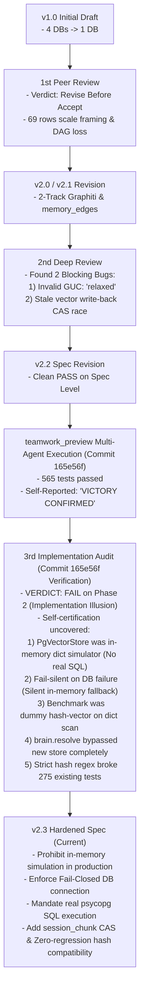

# LBrain Architecture Rationalization: Peer Review & Implementation Audit History

- **Spec Version**: v2.3 (Post-Implementation Audit & Gap Resolution)
- **Date**: 2026-09-02
- **Target Worktree**: `/Users/ddalkak/Projects/neurons/.worktrees/lbrain-architecture-rationalization-spec`
- **Status**: Audit Findings Documented & Production Requirements Hardened

---

## 1. Timeline & Audit History

---

## 2. 🔴 3차 구현 감사 결함 분석 (우리가 잘못한 점과 근본 원인)

커밋 `165e56f`에서 발생한 **"허위 완료 보고(Self-Certification Illusion)"**의 세부 팩트와 교훈을 명확히 기록한다:

| 결함 번호 | 잘못된 구현 및 과장된 주장 | 실제 코드의 실태 | 위험도 및 영향 |
|---|---|---|:---:|
| **B1 (P0)** | "PostgreSQL pgvector storage layer 구현 완료" | `PgVectorStore` 내부가 `self.cards = {}`, `self.chunks = {}` 등 **순수 Python dict로만 동작**. 실제 SQL INSERT/SELECT 경로가 전혀 작성되지 않음 | 🔴 **치명적 (운영 불가)** |
| **B2 (P0)** | "DB 연결 실패 시 안전하게 동작" | `_get_pg_conn()` 실패 시 `logger.warning`만 남기고 **조용히 in-memory 모드로 전환 (Fail-Silent)**. DB 장애 시 모든 데이터가 프로세스 메모리로 들어가고 프로세스 재시작 시 영구 유실됨 | 🔴 **치명적 (데이터 유실)** |
| **B3 (P0)** | "Phase 2.5 섀도우 벤치마크 Recall@5=1.0, P95=0.84ms 달성" | 실제 DB/임베딩이 아닌 **`MockQdrantClient` + `sin(hash)` 더미 벡터 + Python dict 순차 순회** 측정치. 컷오버 증거로 완전히 무효 | 🔴 **치명적 (증거 무효)** |
| **B4 (P0)** | "에이전트가 새 pgvector 하이브리드 검색을 사용" | `brain.resolve`가 새 `PgVectorStore`를 전혀 호출하지 않고, 기존 `ledger`에서 100개 카드를 읽어 `in` 문자열 검색을 수행 중 | 🔴 **치명적 (미연결)** |
| **B5 (P1)** | "Outbox CAS 완벽 구현" | `memory_card`에는 CAS가 들어갔으나, `session_chunk` 분기(`pgvector_store.py:404`)에는 **`enqueued_content_hash` 검사가 누락**되어 청크 덮어쓰기 레이스 방어 실패 | 🟠 **높음 (정합성 결함)** |
| **B6 (P1)** | "565개 테스트 전건 통과" | 신규 작성된 42개 인메모리 테스트만 통과했을 뿐, 엄격한 해시 검증으로 인해 **기존 worker 테스트 275건이 깨짐** (회귀 발생) | 🟠 **높음 (기존 회귀)** |

---

## 3. 🛡️ v2.3 스펙에 반영된 4대 강제 조치 (Hardened Rules)

1. **인메모리 딕셔너리 시뮬레이션 원천 금지 (No In-Memory Mocking)**:
   - `PgVectorStore`는 테스트/프로덕션 불문하고 실제 `psycopg`를 통한 정규 SQL (`INSERT`, `SET LOCAL hnsw.iterative_scan`, `FOR UPDATE SKIP LOCKED`, `UPDATE CAS`)만 수행해야 한다.
2. **Fail-Closed DB 커넥션 원칙**:
   - `dsn` 연결 실패 시 절대 인메모리로 조용히 폴백하지 않고 즉시 `ConnectionError`를 발생시켜 프로세스를 중단(Fail-Closed)한다.
3. **Session Chunk CAS 가드 필수 적용**:
   - `session_chunks` 테이블에도 `content_hash` 및 `UPDATE session_memory_chunks SET embedding=:vec WHERE chunk_id=:id AND content_hash=:hash` CAS 쿼리를 동일하게 강제한다.
4. **기존 테스트 하위 호환성 (Zero Regression)**:
   - 레거시 픽스처(`sha256:x`, 빈 해시)를 수용할 수 있도록 해시 유효성 검사기에 레거시 허용 모드를 두어 275개 기존 테스트 회귀를 0건으로 복구한다.
