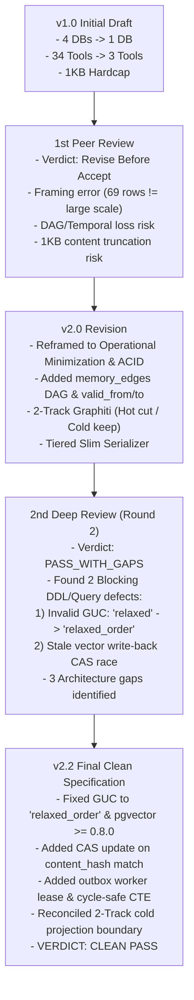

# LBrain Architecture Rationalization: Peer Review Summary & History

- **Spec Version**: v2.2 (Clean PASS Final)
- **Date**: 2026-09-01
- **Status**: Formally Approved for Implementation

---

## 1. Review History & Iteration Timeline

---

## 2. Review Defect Resolution Matrix

| Category | Finding / Defect | Severity | v2.2 Technical Resolution |
|---|---|:---:|---|
| **Query Bug** | `hnsw.iterative_scan = 'relaxed'` (invalid GUC value) | 🔴 **Blocking** | `SET LOCAL hnsw.iterative_scan = 'relaxed_order'` 로 수정하고 `pgvector >= 0.8.0` 의존성 고정 |
| **Data Integrity** | Outbox write-back 시 CAS 부재로 인한 Stale Embedding Race | 🔴 **Blocking** | `UPDATE memory_cards SET embedding=:vec WHERE memory_id=:id AND content_hash=:enq_hash` CAS 가드 강제 |
| **Worker Concurrency** | Outbox 중복 인큐 및 워커 리스(Lease) 결함 | 🟠 **Gap** | `idx_outbox_dedup` 부분 유니크 인덱스 + `claimed_at`, `lease_until`, `worker_id`, `dead_letter` 스키마 추가 |
| **DAG Traversal** | `memory_edges` 재귀 CTE 순환(Cycle) 시 무한 루프 | 🟠 **Gap** | `depth < 5` 상한 및 PostgreSQL 14+ `CYCLE` 탐색 가드 쿼리 패턴 명시 |
| **Framing Precision** | 2-Track 유지 시 "1개 엔진" 문구 모순 | 🟠 **Gap** | "Hot-path PostgreSQL 단일화 + Cold-path 1방향(Eventual) Neo4j 파생 워크벤치"로 명확히 재정의 |
| **Evidence & Budget** | Slim 직렬화 시 바이트 캡 및 증거 체인 명세 | 🟡 **Gap** | Soft Token Budget(250~500), Deterministic Pagination(`has_more`, `next_cursor`), `with_evidence` 체인 명시 |
| **Admin Boundary** | `agent_memory_admin` 물리 격리 및 allowlist 관리 | 🟡 **Gap** | 별도 프로세스/엔드포인트, 독립 서비스 키(`lbrain_admin`), 전역 allowlist 별도 엔트리 고정 |

---

## 3. Final Architecture Decisions

1. **Storage**: Hot-Path는 **PostgreSQL 17+ (`pgvector >= 0.8.0`) 단일 권위 엔진**으로 수렴하며, Neo4j는 비동기 배치 투영(Cold-Path)으로만 읽기 전용 격리 유지.
2. **MCP Interface**: 에이전트 도구는 **`brain.resolve`** (통합 읽기)와 **`memory_candidate_create`** (제안 쓰기) 2개로 완벽히 통합.
3. **Serialization**: 68.5KB의 직렬화 비대화를 해소하기 위해 기본 `slim` (~1.2KB) 모드와 상세 증거 확장 `with_evidence` 모드의 2단계 직렬화 적용.
4. **Safety & Cutover**: Phase 2.5 Dual-Read Shadow 벤치마크(Recall@5 >= 0.95, P95 <= 20ms)를 통과한 후에만 Qdrant 컷오버를 단행하여 무결성 보장.
