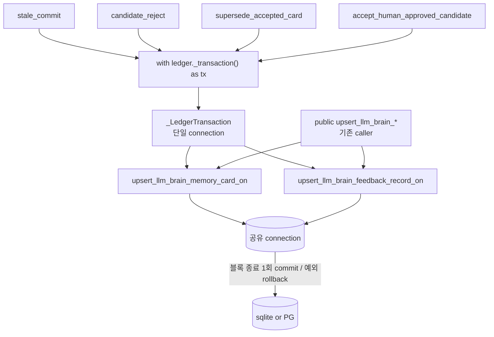

# Brain Steward Restricted-Commit Atomicity Design Spec

## Overview

Brain Steward restricted commit의 다중 ledger write를 **하나의 트랜잭션**으로 묶어 부분 커밋을
없앤다. 새 인프라를 만들지 않고 이미 존재하는 `Ledger._transaction()`/`_LedgerTransaction` seam을
재사용한다.

## Requirements Reference

- Phase 1 source: `specs/steward-commit-atomicity/requirements.md` (사전 승인)
- 핵심: FR1~FR5. 동작 보존 + public ledger API 불변 + sqlite/PG 동일이 최상위 제약.
- 출처: issue #49, ADR-0005(`Ledger._transaction`을 rollback 지점으로 지목).

## Architecture

### 경계

- 트랜잭션 seam은 `Ledger._transaction()`(private, 기존). 중첩 방지 `_transaction_active` 가드 준수.
- upsert 로직은 connection-주입 helper 1벌. public 메서드와 `_LedgerTransaction` 메서드가 공유.
- sqlite/PG의 `__exit__`가 동일 시맨틱(정상=commit, 예외=rollback)이라 코드 한 벌.

## Component Details

### C1. connection-주입 upsert helper (FR3/FR4)
- `_upsert_llm_brain_memory_card_on(connection, card) -> dict`,
  `_upsert_llm_brain_feedback_record_on(connection, record) -> dict`
  (module-level, `ledger_native_memory_mixin.py`).
- 입력: 열린 connection + card/record. 출력: 저장된 dict. **자체적으로 commit/connect 하지 않는다.**
  검증(`validate_*`) + content_hash 계산 + INSERT/ON CONFLICT + SELECT-back 로직을 그대로 담는다.
- 의존: 주입된 connection.

### C2. 기존 public 메서드 위임 (FR4)
- `Ledger.upsert_llm_brain_memory_card`/`upsert_llm_brain_feedback_record`는
  `with self._connect() as conn: return _upsert_*_on(conn, x)` 로 바뀐다. 시그니처/동작/반환 불변.

### C3. `_LedgerTransaction` llm_brain 메서드 (FR1/FR3)
- `_LedgerTransaction.upsert_llm_brain_memory_card(card)` /
  `upsert_llm_brain_feedback_record(record)` 추가. `return _upsert_*_on(self._connection, x)`.
  (기존 `_LedgerTransaction.upsert_memory_card` 패턴과 동일.)

### C4. restricted commit 경로의 트랜잭션 래핑 (FR1/FR2)
- `BrainStewardService.stale_commit`/`candidate_reject`,
  `LLMBrainMemoryService.supersede_accepted_card`/`accept_human_approved_candidate`가
  개별 `self.ledger.upsert_*` 대신 `with self.ledger._transaction() as tx:` 블록 안에서
  `tx.upsert_llm_brain_memory_card(...)`/`tx.upsert_llm_brain_feedback_record(...)`를 순서대로 호출.
- 블록 정상 종료 시 1회 commit, 중간 예외 시 전체 rollback.
- 반환 dict의 schema_version/필드는 기존과 동일(동작 보존).

## Data Flow

### Flow: stale_commit (원자적)
1. `with ledger._transaction() as tx:` 진입(connection 1개).
2. `tx.upsert_llm_brain_memory_card(commit_stale(target))` — target demote.
3. `tx.upsert_llm_brain_memory_card(committed_proposal)` — proposal 종료.
4. `tx.upsert_llm_brain_feedback_record(audit)` — audit.
5. 블록 종료 → 1회 commit. 2~4 중 어디서든 예외 → 전체 rollback(부분 상태 0).

## Error Handling

- 중간 write 예외 → 트랜잭션 rollback, 호출자에 예외 전파(부분 커밋 없음).
- read-only ledger에서 `_transaction()` → 기존 `_guard_writable` + `_transaction`의 read-only 거부로
  write 이전 fail-closed.
- 중첩 트랜잭션 → 기존 `_transaction_active` 가드가 RuntimeError(현 경로는 중첩 없음).
- 검증 실패(invalid card/record)는 helper 안에서 발생 → 트랜잭션 미커밋.

## Testing Strategy

- 동작 보존: 기존 commit 경로 테스트(정상 결과: 카드 상태/큐/audit) 전부 green 유지.
- rollback characterization(ADR-0005): fault injection으로 트랜잭션 중간 write를 실패시키고
  (예: `_LedgerTransaction.upsert_llm_brain_feedback_record`를 monkeypatch해 raise) target이
  demote되지 않고 proposal이 그대로 pending이며 audit이 안 남음을 단언. 정상 경로는 commit 결과 유지.
- 양 백엔드: sqlite 단위 테스트로 시맨틱 검증(PG는 동일 `__exit__` 시맨틱 — 코드 한 벌 근거를 design에
  기록). 전체 `cd worker && uv run pytest -q` green.

## TDD Strategy

모든 milestone red→green→refactor. M3의 rollback test는 fault-injection failing test 먼저. 안전
불변식(부분 커밋 없음, public API 불변) 약화 금지.

## Milestones

- **M1 — connection-주입 upsert helper(FR3/FR4).** done: `_upsert_llm_brain_*_on` 추출, public
  메서드가 위임, 동작/시그니처 불변. evidence: 기존 llm_brain upsert/commit 테스트 green.
- **M2 — 트랜잭션 seam에 llm_brain upsert 노출 + 4경로 래핑(FR1/FR5).** done:
  `_LedgerTransaction`에 두 메서드 추가, stale_commit/candidate_reject/supersede_accepted_card/
  accept_human_approved_candidate가 `_transaction()`으로 묶임. evidence: 정상 경로 결과 불변 테스트
  green.
- **M3 — rollback characterization(FR2).** done: fault-injection으로 부분 커밋이 0임을 증명하는
  테스트. evidence: 중간 실패 시 target 미demote + proposal pending + audit 부재, 정상 경로는 정상
  완결. 전체 suite green.

## Open Questions

없음. 범위 밖(ADR-0005 M2+ / YAGNI): public UnitOfWork/repository port, curation 경로 트랜잭션화,
auto_accept 단일-write 경로.
